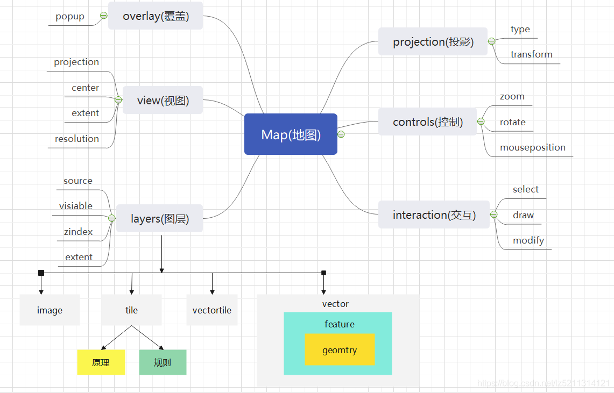
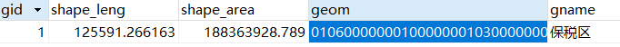
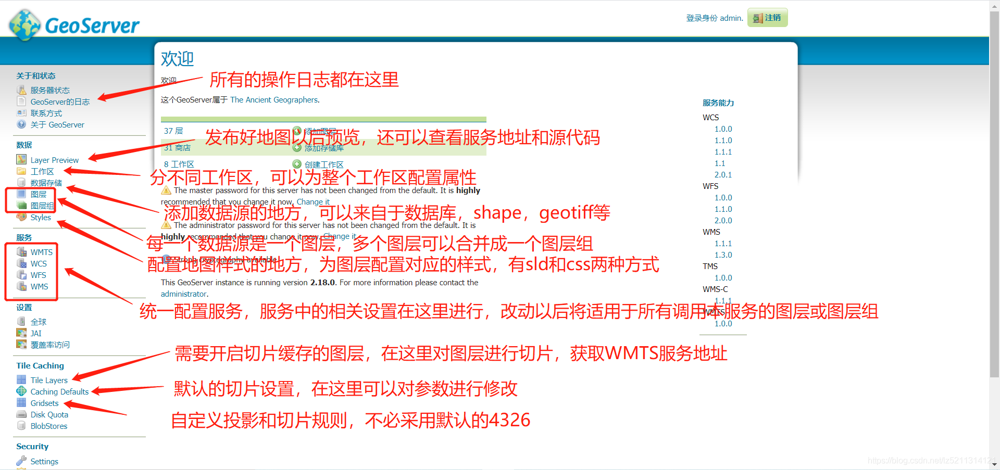
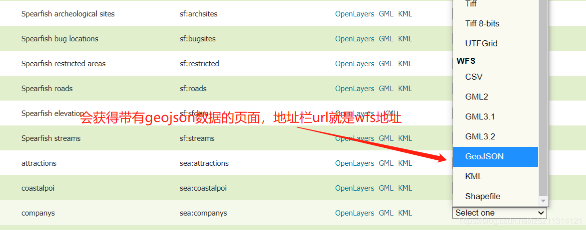

# [GIS系列（一）互联网地图WebGIS技术架构概述](https://blog.csdn.net/lz5211314121/article/details/116231448?spm=1001.2014.3001.5502)

**1.纯前端**

纯前端地图[架构](https://so.csdn.net/so/search?q=%E6%9E%B6%E6%9E%84&spm=1001.2101.3001.7020)依赖于众多的js框架，如果是开源的成型的框架，可以使用[OpenLayers](https://openlayers.org/)，[Leaflet](https://leafletjs.com/)，[Mapbox](https://www.mapbox.com/)等。三维的可以使用[Cesium](https://cesium.com/platform/cesiumjs/)，[Three.js](http://www.webgl3d.cn/)当然，如果你不想借助已有的[框架](https://so.csdn.net/so/search?q=%E6%A1%86%E6%9E%B6&spm=1001.2101.3001.7020)，想自己写

的话，也可以好好学习一下[canvas](https://blog.csdn.net/u012468376/article/details/73350998)，[WebGL](https://so.csdn.net/so/search?q=WebGL&spm=1001.2101.3001.7020)等基础知识，自己编写接口和框架，配合一些服务，来实现纯前端的地图工程。

纯前端的地图工程当然要配合一些纯前端的web工程，因此呢也要学会使用react，vue等前端框架（当然如果你原生js学的不错，JQuery学的不错也是可以的）。其次还需要掌握webpack等

前端构建工具，地图数据源可以采用静态的数据，用Nginx发布成服务调用，当然也可以利用[GeoServer](http://geoserver.org/)。

**2.前后端结合**

这种方式比较麻烦，但是适用于大数据量，并且数据私密性高的情况。首先前端还是利用上文所提到的那几个框架，不同的是，服务端可以部署一些程序对用户提交的地理数据进行处理，比如说，前端利用[Openlayers](https://so.csdn.net/so/search?q=Openlayers&spm=1001.2101.3001.7020)绘制了一个带有属性的feature，我想把这个要素存入数据库，那这样的话，我就可以在前端将其构造成[geojson](https://geojson.org/)(一种地理数据格式)，传到服务端，服务端写SQL再保存到数据库。或者是一些带有地理分析功能的系统

比如缓冲区分析，相交分析，包含，框选查询，点选查询等等，可以在服务端进行。还有例如一些数据格式的转换，也可以利用服务端程序进行。用java来举例子，java有一个开源的地图处理工具Geotools，它可以在服务端进行一些处理，对栅格数据的处理也同样支持。因此前后端结合的项目中，服务端利用java是肯定可行的。当然有些公司利用C#也可以，C#没有开源的专门用于处理地理信息的框架，但他同样也是一个服务端利器，接受请求发送数据也非常牛x。数据库层面多用[PostgreSQL](https://www.postgresql.org/)，空间数据库当中除了它，还有Mysql，SQL server等空间数据库。个人比较推荐PostgreSQL，有两个主要原因，第一，完全开源。第二，可以结合postgis提供的众多函数进行复杂 的空间操作。

前后端结合的项目的特点在于地理数据可以不借助地图服务（GeoServer）发布，调用。而是可以通过SQL语句将数据库当中的数据转化成Geojson，返回前端直接加载。一些栅格影像数据也可以放在服务器固定路径进行。完全不依赖任何地图服务即可完成。

还有另一种前后端结合的方式——基于C和C++的 OpenGL，在服务端将地图利用OpenGL渲染成矢量地图，发布成服务。前端请求访问（据说这是百度地图、高德地图等大型互联网地图企业的技术），具体如何还有待研究，我没经历过这种。

这是给大家分享GIS知识的第一篇文章，在接下来的系列中我会详细的介绍每一部分的技术，分享实战过程中的经验（“坑”）。顾拜~


# [GIS系列（二）OpenLayers入门和详细解读](https://blog.csdn.net/lz5211314121/article/details/116228896?spm=1001.2014.3001.5502)

[OpenLayers](https://so.csdn.net/so/search?q=OpenLayers&spm=1001.2101.3001.7020)是一款开源的前端地图框架。它几乎能够解决绝大部分前端地图开发过程中的需求。这篇文章我为大家详细解读一下OpenLayers。

首先，来看一张图，接下来我介绍的文字大家再阅读的时候可以对照着这幅图来理解。




一副地图的核心当然是地图本身，任何[框架](https://so.csdn.net/so/search?q=%E6%A1%86%E6%9E%B6&spm=1001.2101.3001.7020)和设计都是如此。OpenLayers（以下简称ol）也不例外。map类是整个框架的核心类，其余的类和接口都是围绕着map类来设计的。

      如上图所示map包含了常用的6大方面，首先是view，视图。这个类相当于人的眼睛，它定义了我们怎么样去观察地图，是正着看还是斜着看，近看还是远看，地图一旦呈现我们看哪里？我们能看多大的范围等等，专业术语将，view叫做视图容器，就是我们在一个特定的环境观察一幅地图。那么视图定义好了以后，我们要了解地图由什么组成，基本上有哪些元素就可以呈现出一副地图？答案就是layer，（图层），最简单的举个例子我们随便找一幅图片放在网页上也可以叫地图。所以说地图对象的关键还是图层，一个地图可以包含多个图层，比如说所有的道路，所有的街道，所有的水系等等共同组合叠加成一副地图。有了基础的图层以后实际上我们就可以观察到地图了，但是有的时候数据呈现出来的地图并不是我们想观察的地图，例如我们想清晰的观察我们国家的地理状况，需要西安1980坐标系的地图，结果我们从ol发现只有基于WGS1984坐标系的地图，这个时候就需要用到关键的投影和坐标转换的概念了——projection，负责把投影信息转化成我们需要的投影。到目前为止，我们已经能够看到一副我们需要的地图了。接下来我们想对地图有一些交互，比如说我想通过滚动鼠标滚轮来放大或缩小地图，想通过单击地图弹出一些我想要的信息，还想获取实时鼠标的位置等等，那这个时候就要用到一个基本的地图控制的概念——controls。如果们们不满足与基本的获取一些信息，我们还想手动的添加一些东西，比如画一些图形，测量某些地方的长度和面积等需求，这时候就要用到地图交互接口——interaction。它允许我们绘制，修改，选择一些地图上的要素。到现在为止基本上就介绍完了一些常规的关于地图的接口。哦，对，还差一个overlay，它是干嘛的呢？它是在视图层面之外的一些控件，比如说我们想通过点击地图的某个位置弹框显示该位置的一些信息，就要用到弹窗组件popup（接下来的系列我会详细介绍）。
    
    介绍完几大常用的接口以后，我们来想这么一个问题：我们平常能够观察到的地图，或者说ol官方提供的，arcgis提供的那些地图都是怎么构成的？他们的地图都是一张图片吗？如果说是图片的话，那是怎么样实现形状修改的呢？因此我们不得不探究一个问题，地图资源的类型，到底有哪些？什么样的数据，资源能够展示成地图。我们下文一一来介绍。

首先，图片格式，png，jpg，等，可以被作为地图。简单来说我们用一个地区的遥感影像，或者说我去学校的墙上用手机随手拍了一张地图的照片，拿过来放到网页上都能是一副地图。，是的它只是一张图片，但它也能够显示传达一些信息。因此我们说图片是可以作为地图源的。

第二，诸位可能也都用过电脑上自带的画图画过线段，也都用过word里自带的绘制流程图画过矩形，专业的同学甚至还用过arcgis里面的编辑工具，绘制过一些点线面，那么上述所说的这些统统都叫作矢量图形，它使用计算机画出来的这种图形通常只有一个边界。试想一下，如果我们用这些矢量绘图工具绘制一幅地图放在网页上行不行？当然行，这就是地图的第二个来源——矢量图形。

GIS专业的同学可能了解矢量和栅格的概念。网页上的地图源也只有这两种，矢量or栅格。但是在这个基础上做了扩展。我们再平常使用百度地图高德地图的时候可以发现，当我们刚打开地图的时候只能看到基础的城市轮廓和道路，绿地等关键信息，随着我们不断的放大才渐渐看到了建筑物，小路，那么这种方式又是怎么实现的呢，我们知道图片的分辨率是固定的，当你放大到一定层级的时候就看不清了，但是随着鼠标滚轮的放大我们不仅能看到之前看不到的，还很清楚，怎么回事？答案就是网页此时重新为我们加载了一副新的图片。实际上是提前准备好的图片，专业术语称之为切片。，就是把一张高精度的图片切成几副局部范围的小图片，按照用户的加载需求，分级呈现出来。这叫瓦片（tile）地图。

其实切片是一个概念，他不分数据，换句话说，栅格数据可以切片，矢量数据也可以。原理相似，都是通过[金字塔模型](https://blog.csdn.net/weixin_33991727/article/details/93371845)加载的。

那这样的话，我们对应上图左下部分，一个layer有四种不同的类型，分别是image（图片类型），tile（瓦片类型），vector（矢量类型），vector tile（矢量瓦片），而这4种类型的数据源也被OGC（一个地图组织联盟）定义成了四种地图服务，image对应WMS（web map service）服务，tile对应WMTS（web map tile service）服务，vector对应WFS(web feature service)服务,vector tile目前没有对应什么服务。服务的概念意味着我需要，就会给我提供，也就是当我需要一幅图片作为地图来源的时候，通过调用WMS就应该给我返回图片格式的数据，当调用WFS的时候就应该返回矢量要素作为地图来源。

这篇文章从大方向了解一下OpenLayers的基本组成，核心类，以及地图的一些基本的原理，数据来源。下一篇文章将继续详细介绍常用的接口及配置方法。


# [GIS系列（三）几种互联网地图服务背后的解读（WMS，WFS，WMTS，TMS）](https://blog.csdn.net/lz5211314121/article/details/116456296?spm=1001.2014.3001.5502)

作为一个地图开发者，当然要对互联网地图服务有一个认识。

首先，要知道有这么一个联盟，叫OGC（Open Geospatial Consortium），这个联盟/组织定义了很多关于互联网地图的规则。

然后，开发者，企业，组织机构依照这个规则进行[地理信息系统](https://so.csdn.net/so/search?q=%E5%9C%B0%E7%90%86%E4%BF%A1%E6%81%AF%E7%B3%BB%E7%BB%9F&spm=1001.2101.3001.7020)的开发。

事实上互联网地图的数据源也就那么几个。换句话说，能作为地图数据源的数据格式有限。那让我们先来介绍一下互联网地图的常用数据源，数据格式。

1.  一张图片是肯定可以作为地图数据源的。例如一张tiff格式的遥感影像，作为地图当然可以，另外，我们从arcgis中导出一张jpeg，png格式的地图，再通过网络发布出去当然也行。

那么，第一种地图数据源我们暂且可以概括为image（图片）类型的。

2 .矢量形式的，就像在arcgis里我们用编辑工具绘制的那种第五轮廓的多边形。还有一些不随放大程度改变而失真的SVG图形。这些都是矢量类型的。举个例子就是我们从arcgis中

导出一个shapefile，shp文件，把它发布成互联网地图，也是可以的。这种类型我们归纳为vector（矢量）类型

3.  不知道各位是否思考过一个问题，就是图形数据在数据库中究竟是如何存储的，或者说，有没有字符文字能够描述一个图形。事实上有的，一个shape在数据库中实际上就是一张表

每一个要素（feature）是表中的一行或者多行。shape的属性数据和普通的二维表一样存储，而几何图形信息被存放在一个叫geomtry的字段里。这个字段能够用文字描述图形形状信息。

做过传统业务的同学可能非常清楚，数据库中的表通常都会被转化为json对象返回前端，例如一条数据：

<div class="table-box"><table border="1" cellpadding="1" cellspacing="1" style="width:500px;"><tbody><tr><td>name</td><td>sex</td><td>year</td><td>id</td></tr><tr><td>li</td><td>male</td><td>23</td><td>1</td></tr></tbody></table></div>

转化为json之后是这样的

```json
{   "name":"li",   "sex":"male",   "year":"23",   "id":"1" }
```

同样的，一个shape再导入数据库之后一般是这样的：



那么他转化为json是这样的：

```lua
{"type":"Feature","id":"indexmap_1984.32","geometry":{"type":"MultiPolygon","coordinates":[[[[122.5924457,39.20893603],[122.5924457,39.20889616],[122.59237779,39.20895737],[122.59235704,39.2090558],[122.59235704,39.20916682],[122.5923879,39.20926604],[122.59240432,39.20930654],[122.59244569,39.20931714],[122.5924814,39.20930969],[122.59257018,39.20929116],[122.59259042,39.20921871],[122.59253881,39.2091195],[122.59246644,39.20902658],[122.59245621,39.20898192],[122.5924457,39.20893603]]]]},"geometry_name":"geom","properties":{"gid":1,"gname":"保税区","shape_leng":0E-11,"shape_le_1":110.131221956,"shape_le_2":0.00105811399614,"shape_area":5.85151805058E-8}}
```

ok，这个json有些复杂，不同于往常的json，通过对比我们可以发现，这种格式把数据库表里的图形字段geom里面的010600001.......转化成了

"type":"MultiPolygon","coordinates":\[\[\[\[122.5924457,39.20893603\]........这个看起来像是很多个坐标啊，事实上对于多边形来讲，记录的就是每个顶点的坐标值。

于是，我们就给他命名为GeoJSON（当然这名字不是我起的！），GeoJSON是互联网地理数据传输过程中重要的格式，大家必须掌握。

GeoJSON的强大之处在于它可以作为一种数据格式媒介，和其它几种数据格式进行相互转化，就例如上文提到的可以和数据库表格做转化，他也可以直接和shape格式的文件做转化。非常方便。而且它保存的数据是完整的，数据体积也很小。  那我们暂且就把这一类的地理数据源就叫做GeoJSON类型吧。

4.  那既然提到了json，可别忘了xml啊，xml可是json 的老大哥啊，最早互联网数据传输的格式就是xml，后来人们觉得这种标记语言比较麻烦，数据量也大，才发明的json。于是地理学会的人们为了照顾一些

互联网老年人，也在地理数据方面适配了xml类型的数据，叫做KML，GML，这两种都是用标记语言标记地理数据，如果有朋友喜欢用也是可以的。那么这种类型我们叫做KML，GML类型吧。

综上所述，互联网地图的数据源类型，从大层面上来分就两种，一种是栅格，一种是矢量。栅格数据源一般就是image类型的图片，tiff格式的遥感影像等等。

而矢量数据源的形式多种多样，有GeoJSON，KML，GML，shapefile，svg等等。

在实际的互联网地图应用过程中，人们发现简单的图片和矢量图形不能够满足我们的需求，就比如我想从全世界的地图中找到我的家，如果只是一张图片的话，那这张图片得多大啊！分辨率得多高啊！服务器承受的了么，我打开浏览器得等多长时间能够看到地图？这些真的是实际产生的问题。于是OGC又想到了这样一个解决办法——切片（tile）。

所谓切片，很简单，就是把我们原始的地图切成很多方片，就是拼图里面一格一格的那种图片，我们想看哪就加载哪，不想看就不加载。这样做的话就打打提高了加载效率。加快了浏览速度。并且现在很多地图服务器的切片是有缓存的，能保证下次请求更快捷。

于是，无论是栅格数据也好，矢量数据也好，现在都能够实现这种切片原理了。

对于栅格数据来讲，就是把一张image类型的图片切割成很多张正方形（一般是256x256像素）小图片。根据鼠标位置和滚轮放大级别确定加载哪一张小图片。这个之后我会详细讲解

对于矢量数据来讲，被切割完的数据还是用GeoJSON格式来展现，只不过这时候的GeoJSON里面又多了许多关于切片和级别的描述字段。当然除了GeoJSON之外还有mapbox家提出的.mvt格式

到目前为止，互联网地图的所有的数据源都介绍完了（当然有些不常用的就忽略掉了）

那么，OGC这个组织呢，根据上面讲到过的数据源分别为他们设计了一些服务。

第一种image类型的，图片格式的地图被封装成了叫做WMS的服务。意思是web map  service，网络地图服务。这个最简单也最基础，就是把你的数据源想方设法转化成一张和你数据源长得一样的图片。

供用户浏览，用户可以放大缩小这张图片，但是无论怎么放大缩小，它就只是一张图片。

第二种矢量类型的数据源被封装成了WFS服务。意思是 web feature service 网络要素服务。意思是用户所看到的是要素。是矢量图形，而不是一张图片。那么与图片相比要素有什么好处呢？

大致有这么两点：第一，矢量图形不会随着放大程度的改变而失真，图片做不到。第二，是两要素方便与交互和编辑，修改形状等，这一点图片也做不到。

第三种是image进行切片后的服务，叫做WMTS，全称 web map tile service  网络地图切片服务。WMTS比WMS 好的地方就是它能够加快加载速度，提升加载效率。可是它同时也失去了灵活性，你看的每一个区域都是被提前划分好的，限制在固定条带内的。

对于矢量切片，目前OGC没有提供这样的服务。但是像GeoServer等地图服务器提供了矢量切片的扩展，可以用工具对自己的矢量数据进行切片，然后导出GeoJSON格式的数据加载到地图中。

另外，还值得一提的是，还有一个瓦片服务不是OGC提出的，但也被广大用户所使用，那就是TMS服务，tiled map  service，瓦片地图服务。他和WMTS的主要区别在于，他的小切片地图是正方形的，而WMTS的切片是矩形的。另外就是他们的金字塔横纵坐标是相反的。

# GIS系列（四）GeoServer的介绍和用法

首先，GeoServer是一个地图服务器。

关于地图服务器，其实和普通服务器没啥区别，就是专门用来发布地图的。

实际上，如果你的项目是前后端结合的话，可以不需要地图服务器。

你可以在后端配合Geotools，postgis等直接把地理数据返回前端，前端再进行加载。

但是有的时候，数据量不是很大，或者说项目基本不需要后端。在或者说你是一个纯前端的项目，服务器只需要放置和发布地图。

那这个时候你就要用到Geoserver了。它可以帮助你把地图资源，地图数据源以服务的形式发布。

关于Geoserver如何下载安装我就不介绍了，大家可以看其他博主的教程。

我在这里简单的介绍一下GeoServer的用法：

首先在安装好以后启动http://localhost:8080以后你看到的是这样：



GeoServer的使用逻辑是：1.建立工作区，每做一个项目，或者是项目中的一部分都可以建立一个工作区，工作区的好处在于可以对内部的图层进行许多统一设置，开启服务。而且可以对图层归类。

2.提供数据源，不管你是来自于数据库的表，还是就是一个shapefile，或者geotiff，或者别的什么栅格数据（image，arcgird等）都可以.甚至是你自己建立了一个wms服务，有服务地址，也可以。总之你必须提供一个有效的数据源，或者他的地址。

3.把数据源发布成图层，从数据源到图层只需点击“发布”按钮就可以了。但是，图层属性可以进行大量的调整，并且，图层一点发布，在layer preview页面是可以预览的。

4.如果你需要WMS服务的话，为图层配置样式，在styles里为你的图层配置样式，可以采用sld文件（xml语法），也可以用geoserver的扩展插件css进行样式配置。如果你想以wfs服务发布的话，就不需要配置样式了，wfs服务不会把你的样式返回前端，geojson中本身也不带样式。

5.（这步可有可无）把你发布的几个图层组成一个或多个图层组，图层组可以有统一的wms，wmts服务地址，可以通过一个url请求回来多个图层。当然你如果需要wfs服务的话，这步就不用了，因为图层组是没有wfs服务的。

6.在预览页面查看数据，获取服务地址。在预览页面可以通过查看网页源代码的方式获取服务地址，当然也可以直接复制此时的浏览器url框里面的url，那个就是wms地址。如果想要wfs地址的话，可以点击



点击select one你可以获得很多类型的数据，有些会直接通过浏览器下载到本地，有些会获得网页上的数据，有些会获得服务地址等。

7.如果你发布的地图数据比较多，想提高访问速度，优化用户体验，可以在工作空间内开启wmts服务，这样的话每个图层都可以进行切片，图层组也可以，选择tile layers对图层进行切片，geoserve

提供的默认切片规则是基于4326的，如果你的数据是别的坐标系，比如说你是西安1980的，代号是EPSG:2335，那你就不能用4326切片了，你可以在gridsets里面自己定义切片规则，采用什么投影

显示多少级别等等，都可以在这里设置。

总结一下，GeoServer提供了很多方便的数据发布功能，还封装了OGC提供的几大地图服务。在具体的项目中，可以把GeoServer单独部署在一台服务器上，暴露服务URL供调用。也可以和项目一起部署在同一台服务器上。可以把GeoServer的服务启动做成windows自带的服务那样，开机自启动。

