# 多表查询

## 1、等值链接VS非等值链接

**等值连接**

**结论：**如果有n个表实现多表的查询，则需要至少n-1个链接条件

**练习：**查询员工的`employee_id`,`last_name`,`department_name`,`city`

```sql
SELECT
	emp.`employee_id`,
	emp.`last_name`,
	dept.`department_name`,
	lo.`city` 
FROM
	employees emp,
	departments dept,
	locations lo 
WHERE
	emp.department_id = dept.department_id 
	AND dept.location_id = lo.location_id
```

------

**非等值连接**

**练习：**查出所有员工的工资等级

```sql
SELECT
	e.last_name,
	e.salary,
	j.grade_level 
FROM
	employees e,
	job_grades j
WHERE
 e.`salary` BETWEEN j.lowest_sal AND j.highest_sal
```

## 2、自连接VS非自连接

**练习：**查询员工id，员工姓名及其管理者的id和姓名

由于管理者表和员工表都是同一个表，这里就需要自连接

```sql
SELECT
	e.employee_id,
	e.last_name,
	m.manager_id,
	m.last_name AS manager_name 
FROM
	employees e ,employees m
WHERE
e.manager_id = m.employee_id	
```


## 3、SQL92与99语法如何实现内连接和外连接

**内连接:** 合并具有同一列的两个以上的表的行, **结果集中不包含一个表与另一个表不匹配的行**

**外连接:** 两个表在连接过程中除了返回满足连接条件的行以外**还返回左（或右）表中不满足条件的行 ，这种连接称为左（或右） 外连接**。没有匹配的行时, 结果表中相应的列为空(NULL)。

如果是左外连接，则连接条件中左边的表也称为 主表 ，右边的表称为 从表 。

如果是右外连接，则连接条件中右边的表也称为 主表 ，左边的表称为 从表 。

------

**练习：**查询所有员工的`last_name`,`department_name`

**注意：**mysql不支持SQL92语法中外连接的写法

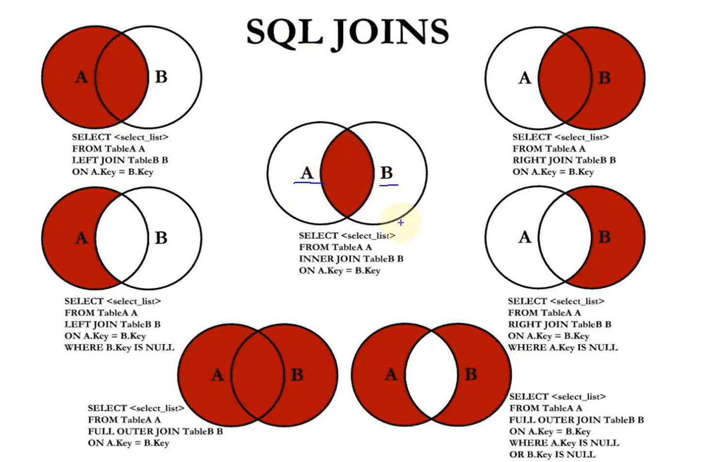

**练习：**查询所有员工的`last_name`,`department_name`信息

**左外连接**

```sql
# 左外连接
SELECT
	e.last_name,
	d.department_name 
FROM
	employees e
	LEFT JOIN departments d ON e.department_id = d.department_id
```

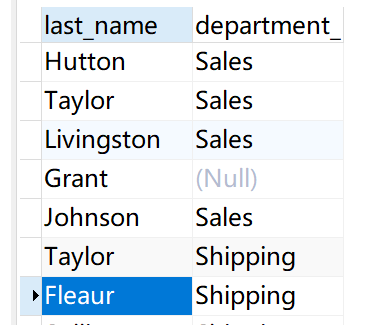

左外连接即上图的

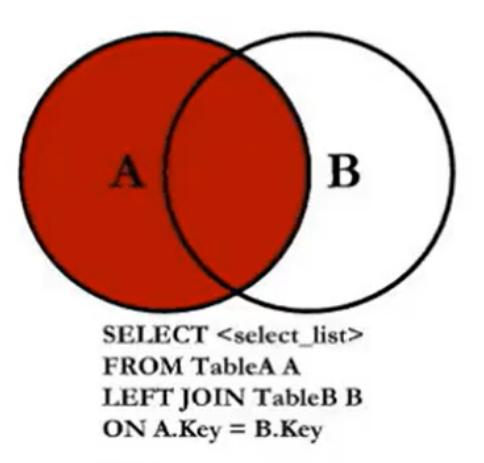

可得到没有部门的Grant的数据。

------

**右外链接**

```sql
# 右外链接
SELECT
	e.last_name,
	d.department_name 
FROM
	employees e
	RIGHT JOIN departments d ON e.department_id = d.department_id
```

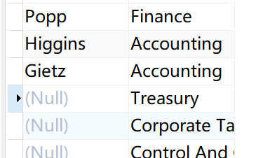

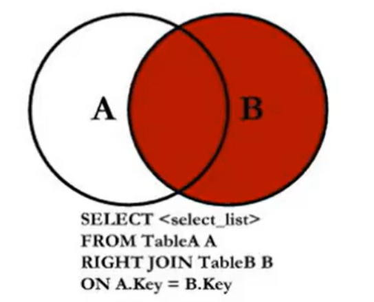

得到了没有人的部门。

------

**全外连接**

```sql
# 右外链接
SELECT
	e.last_name,
	d.department_name 
FROM
	employees e
	full JOIN departments d ON e.department_id = d.department_id
```

**MySQL不支持全外连接，只能用UNION ALL代替**

## 4、UNION操作符

**UNION操作符**


UNION操作符返回两个查询的结果集的并集，去除重复部分

**UNION ALL操作符**

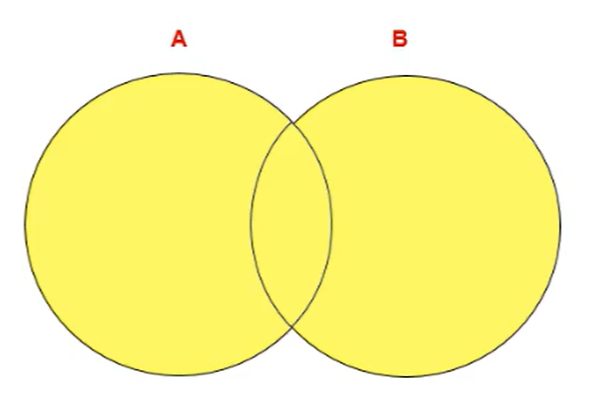

UNION ALL操作符返回两个查询的结果集的并集。对于两个结果集的重复项不去重。

> 注意：执行UNION ALL语句时所需要的资源比UNION语句少。如果明确知道合并数据后的结果数据不存在重复数据，或者不需要去除重复的数据，则**尽量使用UNION ALL语句，以提高数据查询的效率**。


------

**代码实现**

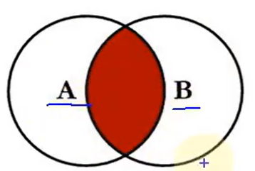

```sql
#中图：内连接 A∩B 

SELECT employee_id,last_name,department_name 

FROM employees e JOIN departments d 

ON e.`department_id` = d.`department_id`; 
```

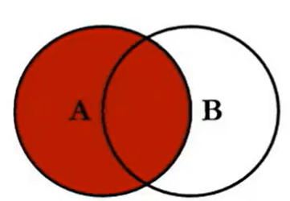

```sql
#左上图：左外连接 

SELECT employee_id,last_name,department_name 

FROM employees e LEFT JOIN departments d 

ON e.`department_id` = d.`department_id`; 
```

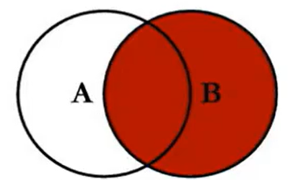

```sql
#右上图：右外连接 

SELECT employee_id,last_name,department_name 

FROM employees e RIGHT JOIN departments d 

ON e.`department_id` = d.`department_id`; 
```

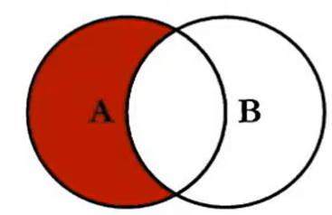

```sql
#左中图：A - A∩B 

SELECT employee_id,last_name,department_name 

FROM employees e LEFT JOIN departments d 

ON e.`department_id` = d.`department_id` 

WHERE d.`department_id` IS NULL 
```

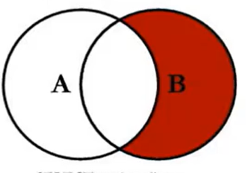

```sql
#右中图：B-A∩B 

SELECT employee_id,last_name,department_name 

FROM employees e RIGHT JOIN departments d 

ON e.`department_id` = d.`department_id` 

WHERE e.`department_id` IS NULL
```

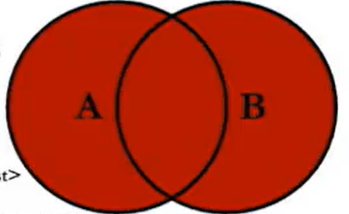

```sql
#左下图
SELECT
	employee_id,
	last_name,
	department_name 
FROM
	employees e
	LEFT JOIN departments d ON e.`department_id` = d.`department_id` 
WHERE
	d.`department_id` IS NULL UNION ALL#没有去重操作，效率高
SELECT
	employee_id,
	last_name,
	department_name 
FROM
	employees e
	RIGHT JOIN departments d ON e.`department_id` = d.`department_id`;
```

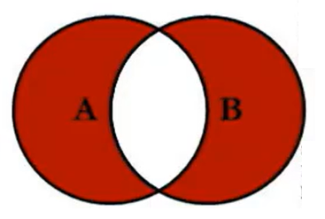

```sql
#右下图
#左中图 + 右中图 A∪B- A∩B 或者 (A - A∩B) ∪ （B - A∩B）
SELECT
	employee_id,
	last_name,
	department_name 
FROM
	employees e
	LEFT JOIN departments d ON e.`department_id` = d.`department_id` 
WHERE
	d.`department_id` IS NULL UNION ALL
SELECT
	employee_id,
	last_name,
	department_name 
FROM
	employees e
	RIGHT JOIN departments d ON e.`department_id` = d.`department_
```

## 练习

【题目】 

```sql
# 1.显示所有员工的姓名，部门号和部门名称。 

# 2.查询90号部门员工的job_id和90号部门的location_id 

# 3.选择所有有奖金的员工的 last_name , department_name , location_id , city 

# 4.选择city在Toronto工作的员工的 last_name , job_id , department_id , department_name 

# 5.查询员工所在的部门名称、部门地址、姓名、工作、工资，其中员工所在部门的部门名称为’Executive’ 

# 6.选择指定员工的姓名，员工号，以及他的管理者的姓名和员工号，结果类似于下面的格式 

employees Emp # manager Mgr# 

kochhar 101 king 100 

# 7.查询哪些部门没有员工 

# 8. 查询哪个城市没有部门 

# 9. 查询部门名为 Sales 或 IT 的员工信息 
```

------

**1.显示所有员工的姓名，部门号和部门名称。** 

```sql
SELECT
	e.last_name,
	d.department_id,
	d.department_name 
FROM
	employees e,
	departments d 
WHERE
	e.department_id = d.department_id
```

------


**2.查询90号部门员工的job_id和90号部门的location_id** 

```sql
SELECT
	e.department_id,
	e.job_id,
	d.location_id 
FROM
	employees e,
	departments d 
WHERE
	e.department_id = d.department_id and e.department_id = 90
```

或

```sql
SELECT
	e.department_id,
	e.job_id,
	d.location_id 
FROM
	employees e,
	JOIN departments d ON e.department_id = d.department_id 
WHERE
	e.department_id = 90
```


------

**3.选择所有有奖金的员工的 last_name , department_name , location_id , city** 

```sql
# 注意：是“有奖金的员工”
SELECT
	e.last_name,
	d.department_name,
	d.location_id,
	l.city 
FROM
	employees e
	JOIN departments d ON e.department_id = d.department_id
	JOIN locations l ON d.location_id = l.location_id 
WHERE
	e.commission_pct IS NOT NULL
```

