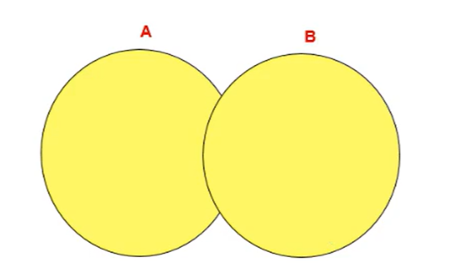

# 多表查询

## 1、等值链接VS非等值链接

**等值连接**

**结论：**如果有n个表实现多表的查询，则需要至少n-1个链接条件

**练习：**查询员工的`employee_id`,`last_name`,`department_name`,`city`

```sql
SELECT
	emp.`employee_id`,
	emp.`last_name`,
	dept.`department_name`,
	lo.`city` 
FROM
	employees emp,
	departments dept,
	locations lo 
WHERE
	emp.department_id = dept.department_id 
	AND dept.location_id = lo.location_id
```

------

**非等值连接**

**练习：**查出所有员工的工资等级

```sql
SELECT
	e.last_name,
	e.salary,
	j.grade_level 
FROM
	employees e,
	job_grades j
WHERE
 e.`salary` BETWEEN j.lowest_sal AND j.highest_sal
```

## 2、自连接VS非自连接

**练习：**查询员工id，员工姓名及其管理者的id和姓名

由于管理者表和员工表都是同一个表，这里就需要自连接

```sql
SELECT
	e.employee_id,
	e.last_name,
	m.manager_id,
	m.last_name AS manager_name 
FROM
	employees e ,employees m
WHERE
e.manager_id = m.employee_id	
```


## 3、SQL92与99语法如何实现内连接和外连接

**内连接:** 合并具有同一列的两个以上的表的行, **结果集中不包含一个表与另一个表不匹配的行**

**外连接:** 两个表在连接过程中除了返回满足连接条件的行以外**还返回左（或右）表中不满足条件的行 ，这种连接称为左（或右） 外连接**。没有匹配的行时, 结果表中相应的列为空(NULL)。

如果是左外连接，则连接条件中左边的表也称为 主表 ，右边的表称为 从表 。

如果是右外连接，则连接条件中右边的表也称为 主表 ，左边的表称为 从表 。

------

**练习：**查询所有员工的`last_name`,`department_name`

**注意：**mysql不支持SQL92语法中外连接的写法


**练习：**查询所有员工的`last_name`,`department_name`信息

**左外连接**

```sql
# 左外连接
SELECT
	e.last_name,
	d.department_name 
FROM
	employees e
	LEFT JOIN departments d ON e.department_id = d.department_id
```


左外连接即上图的


可得到没有部门的Grant的数据。

------

**右外链接**

```sql
# 右外链接
SELECT
	e.last_name,
	d.department_name 
FROM
	employees e
	RIGHT JOIN departments d ON e.department_id = d.department_id
```


得到了没有人的部门。

------

**全外连接**

```sql
# 右外链接
SELECT
	e.last_name,
	d.department_name 
FROM
	employees e
	full JOIN departments d ON e.department_id = d.department_id
```

**MySQL不支持全外连接，只能用UNION ALL代替**

## 4、UNION操作符

**UNION操作符**



UNION操作符返回两个查询的结果集的并集，去除重复部分

**UNION ALL操作符**


UNION ALL操作符返回两个查询的结果集的并集。对于两个结果集的重复项不去重。

> 注意：执行UNION ALL语句时所需要的资源比UNION语句少。如果明确知道合并数据后的结果数据不存在重复数据，或者不需要去除重复的数据，则**尽量使用UNION ALL语句，以提高数据查询的效率**。


------

**代码实现**


```sql
#中图：内连接 A∩B 

SELECT employee_id,last_name,department_name 

FROM employees e JOIN departments d 

ON e.`department_id` = d.`department_id`; 
```


```sql
#左上图：左外连接 

SELECT employee_id,last_name,department_name 

FROM employees e LEFT JOIN departments d 

ON e.`department_id` = d.`department_id`; 
```


```sql
#右上图：右外连接 

SELECT employee_id,last_name,department_name 

FROM employees e RIGHT JOIN departments d 

ON e.`department_id` = d.`department_id`; 
```


```sql
#左中图：A - A∩B 

SELECT employee_id,last_name,department_name 

FROM employees e LEFT JOIN departments d 

ON e.`department_id` = d.`department_id` 

WHERE d.`department_id` IS NULL 
```


```sql
#右中图：B-A∩B 

SELECT employee_id,last_name,department_name 

FROM employees e RIGHT JOIN departments d 

ON e.`department_id` = d.`department_id` 

WHERE e.`department_id` IS NULL
```


```sql
#左下图
SELECT
	employee_id,
	last_name,
	department_name 
FROM
	employees e
	LEFT JOIN departments d ON e.`department_id` = d.`department_id` 
WHERE
	d.`department_id` IS NULL UNION ALL#没有去重操作，效率高
SELECT
	employee_id,
	last_name,
	department_name 
FROM
	employees e
	RIGHT JOIN departments d ON e.`department_id` = d.`department_id`;
```


```sql
#右下图
#左中图 + 右中图 A∪B- A∩B 或者 (A - A∩B) ∪ （B - A∩B）
SELECT
	employee_id,
	last_name,
	department_name 
FROM
	employees e
	LEFT JOIN departments d ON e.`department_id` = d.`department_id` 
WHERE
	d.`department_id` IS NULL UNION ALL
SELECT
	employee_id,
	last_name,
	department_name 
FROM
	employees e
	RIGHT JOIN departments d ON e.`department_id` = d.`department_
```

## 练习

```sql
# 1.显示所有员工的姓名，部门号和部门名称。 

# 2.查询90号部门员工的job_id和90号部门的location_id 

# 3.选择所有有奖金的员工的 last_name , department_name , location_id , city 

# 4.选择city在Toronto工作的员工的 last_name , job_id , department_id , department_name 

# 5.查询员工所在的部门名称、部门地址、姓名、工作、工资，其中员工所在部门的部门名称为’Executive’ 

# 6.选择指定员工的姓名，员工号，以及他的管理者的姓名和员工号，结果类似于下面的格式 

employees Emp # manager Mgr# 

kochhar 101 king 100 

# 7.查询哪些部门没有员工 

# 8. 查询哪个城市没有部门 

# 9. 查询部门名为 Sales 或 IT 的员工信息 
```

------

**1.显示所有员工的姓名，部门号和部门名称。** 

```sql
SELECT
	e.last_name,
	d.department_id,
	d.department_name 
FROM
	employees e,
	departments d 
WHERE
	e.department_id = d.department_id
```

------


**2.查询90号部门员工的job_id和90号部门的location_id** 

```sql
SELECT
	e.department_id,
	e.job_id,
	d.location_id 
FROM
	employees e,
	departments d 
WHERE
	e.department_id = d.department_id and e.department_id = 90
```

或

```sql
SELECT
	e.department_id,
	e.job_id,
	d.location_id 
FROM
	employees e,
	JOIN departments d ON e.department_id = d.department_id 
WHERE
	e.department_id = 90
```


------

**3.选择所有有奖金的员工的 last_name , department_name , location_id , city** 

```sql
# 注意：是“有奖金的员工”
SELECT
	e.last_name,
	d.department_name,
	d.location_id,
	l.city 
FROM
	employees e
	JOIN departments d ON e.department_id = d.department_id
	JOIN locations l ON d.location_id = l.location_id 
WHERE
	e.commission_pct IS NOT NULL
```

------

**4.选择city在Toronto工作的员工的 last_name , job_id , department_id , department_name**

```sql
SELECT
	e.last_name,
	e.job_id,
	e.department_id,
	d.department_name 
FROM
	employees e
	JOIN departments d ON e.department_id = d.department_id
	JOIN locations l ON d.location_id = l.location_id 
WHERE
	l.city = 'Toronto'
```

------

**5.查询员工所在的部门名称、部门地址、姓名、工作、工资，其中员工所在部门的部门名称为’Executive’** 

```sql
# 这个题可以得出结论，join on的表不需要全部和from后面的第一个表（employee）有关联
SELECT
	d.department_name,
	l.street_address,
	e.last_name,
	j.job_id ,
	e.salary
FROM
	employees e
	JOIN departments d ON e.department_id = d.department_id
	JOIN jobs j ON e.job_id = j.job_id
	JOIN locations l on  d.location_id = l.location_id 
WHERE
	d.department_name = 'Executive'
```

------

**6.选择指定员工的姓名，员工号，以及他的管理者的姓名和员工号，结果类似于下面的格式**

| employees | Emp  | manager | Mgr  |
| --------- | ---- | ------- | ---- |
| kochhar   | 101  | king    | 100  |

```sql
# 6.选择指定员工的姓名，员工号，以及他的管理者的姓名和员工号，结果类似于下面的格式
SELECT
	e1.last_name AS employees,
	e1.employee_id AS Emp,
	e2.last_name AS manager,
	e2.employee_id AS Mgr 
FROM
	employees e1,
	employees e2 
WHERE
	e1.manager_id = e2.employee_id
```

------

 **7.查询哪些部门没有员工** 


```sql
# 右外连接
SELECT
	d.department_name
FROM
	employees e
	RIGHT JOIN departments d ON e.department_id = d.department_id 
WHERE
	e.department_id IS NULL
```

------

**8. 查询哪个城市没有部门 **

```sql
SELECT
	l.city 
FROM
	departments d
	RIGHT JOIN locations l on d.location_id = l.location_id
where d.location_id is null
```

------

**9. 查询部门名为 Sales 或 IT 的员工信息 **

```sql
SELECT
	employee_id,
	last_name,
	department_name 
FROM
	employees e,
	departments d 
WHERE
	e.department_id = d.`department_id` 
	AND d.`department_name` IN ( 'Sales', 'IT' );
```

------

# 单行函数

## 1、数值函数

### 1.1、基本函数

| 函数                | 用法                                                         |
| ------------------- | ------------------------------------------------------------ |
| ABS(x)              | 返回x的绝对值                                                |
| SIGN(X)             | 返回X的符号。正数返回1，负数返回-1，0返回0                   |
| PI()                | 返回圆周率的值                                               |
| CEIL(x)，CEILING(x) | 返回大于或等于某个值的最小整数                               |
| FLOOR(x)            | 返回小于或等于某个值的最大整数                               |
| LEAST(e1,e2,e3…)    | 返回列表中的最小值                                           |
| GREATEST(e1,e2,e3…) | 返回列表中的最大值                                           |
| MOD(x,y)            | 返回X除以Y后的余数                                           |
| RAND()              | 返回0~1的随机值                                              |
| RAND(x)             | 返回0~1的随机值，其中x的值用作种子值，相同的X值会产生相同的随机数 |
| ROUND(x)            | 返回一个对x的值进行四舍五入后，最接近于X的整数               |
| ROUND(x,y)          | 返回一个对x的值进行四舍五入后最接近X的值，并保留到小数点后面Y位 |
| TRUNCATE(x,y)       | 返回数字x截断为y位小数的结果                                 |
| SQRT(x)             | 返回x的平方根。当X的值为负数时，返回NULL                     |

**举例**

```sql
SELECT ABS(-123),ABS(32),SIGN(-23),SIGN(43),PI(),CEIL(32.32),CEILING(-43.23),FLOOR(32.32), FLOOR(-43.23),MOD(12,5) FROM DUAL;
```


```sql
SELECT RAND(),RAND(),RAND(10),RAND(10),RAND(-1),RAND(-1)
FROM DUAL;
```


```sql
SELECT
ROUND(12.33),ROUND(12.343,2),ROUND(12.324,-1),TRUNCATE(12.66,1),TRUNCATE(12.66,-1)
FROM DUAL;
```


### 2.2、角度与弧度互换函数

| 函数       | 用法                                  |
| ---------- | ------------------------------------- |
| RADIANS(x) | 将角度转化为弧度，其中，参数x为角度值 |
| DEGREES(x) | 将弧度转化为角度，其中，参数x为弧度值 |

```sql
SELECT RADIANS(30),RADIANS(60),RADIANS(90),DEGREES(2*PI()),DEGREES(RADIANS(90))
FROM DUAL;	
```

### 2.3、三角函数

| 函数       | 用法                                                         |
| ---------- | ------------------------------------------------------------ |
| SIN(x)     | 返回x的正弦值，其中，参数x为弧度值                           |
| ASIN(x)    | 返回x的反正弦值，即获取正弦为x的值。如果x的值不在-1到1之间，则返回NULL |
| COS(x)     | 返回x的余弦值，其中，参数x为弧度值                           |
| ACOS(x)    | 返回x的反余弦值，即获取余弦为x的值。如果x的值不在-1到1之间，则返回NULL |
| TAN(x)     | 返回x的正切值，其中，参数x为弧度值                           |
| ATAN(x)    | 返回x的反正切值，即返回正切值为x的值                         |
| ATAN2(m,n) | 返回两个参数的反正切值                                       |
| COT(x)     | 返回x的余切值，其中，X为弧度值                               |

**举例**

ATAN2(M,N)函数返回两个参数的反正切值。 与ATAN(X)函数相比，ATAN2(M,N)需要两个参数，例如有两个
点point(x1,y1)和point(x2,y2)，使用ATAN(X)函数计算反正切值为ATAN((y2-y1)/(x2-x1))，使用ATAN2(M,N)计
算反正切值则为ATAN2(y2-y1,x2-x1)。由使用方式可以看出，当x2-x1等于0时，ATAN(X)函数会报错，而
ATAN2(M,N)函数则仍然可以计算。
ATAN2(M,N)函数的使用示例如下：

```sql
SELECT
SIN(RADIANS(30)),DEGREES(ASIN(1)),TAN(RADIANS(45)),DEGREES(ATAN(1)),DEGREES(ATAN2(1,1)
)
FROM DUAL;
```


### 2.4、指数与对数

| 函数                 | 用法                                                 |
| -------------------- | ---------------------------------------------------- |
| POW(x,y)，POWER(X,Y) | 返回x的y次方                                         |
| EXP(X)               | 返回e的X次方，其中e是一个常数，2.718281828459045     |
| LN(X)，LOG(X)        | 返回以e为底的X的对数，当X <= 0 时，返回的结果为NULL  |
| LOG10(X)             | 返回以10为底的X的对数，当X <= 0 时，返回的结果为NULL |
| LOG2(X)              | 返回以2为底的X的对数，当X <= 0 时，返回NULL          |

```sql
mysql> SELECT POW(2,5),POWER(2,4),EXP(2),LN(10),LOG10(10),LOG2(4)
-> FROM DUAL;
+----------+------------+------------------+-------------------+-----------+---------+
| POW(2,5) | POWER(2,4) | EXP(2) | LN(10) | LOG10(10) | LOG2(4) |
+----------+------------+------------------+-------------------+-----------+---------+
| 32 | 16 | 7.38905609893065 | 2.302585092994046 | 1 | 2 |
+----------+------------+------------------+-------------------+-----------+---------+
1 row in set (0.00 sec)
```

### 2.5、进制间的转换

| 函数          | 用法                     |
| ------------- | ------------------------ |
| BIN(x)        | 返回x的二进制编码        |
| HEX(x)        | 返回x的十六进制编码      |
| OCT(x)        | 返回x的八进制编码        |
| CONV(x,f1,f2) | 返回f1进制数变成f2进制数 |

```sql
mysql> SELECT BIN(10),HEX(10),OCT(10),CONV(10,2,8)
-> FROM DUAL;
+---------+---------+---------+--------------+
| BIN(10) | HEX(10) | OCT(10) | CONV(10,2,8) |
+---------+---------+---------+--------------+
| 1010 | A | 12 | 2 |
+---------+---------+---------+--------------+
1 row in set (0.00 sec)
```

## 2、字符串函数

| 函数                             | 用法                                                         |
| -------------------------------- | ------------------------------------------------------------ |
| ASCII(S)                         | 返回字符串S中的第一个字符的ASCII码值                         |
| CHAR_LENGTH(s)                   | 返回字符串s的字符数。作用与CHARACTER_LENGTH(s)相同           |
| LENGTH(s)                        | 返回字符串s的字节数，和字符集有关                            |
| CONCAT(s1,s2,......,sn)          | 连接s1,s2,......,sn为一个字符串                              |
| CONCAT_WS(x,s1,s2,......,sn)     | 同CONCAT(s1,s2,...)函数，但是每个字符串之间要加上x           |
| INSERT(str, idx, len,replacestr) | 将字符串str从第idx位置开始，len个字符长的子串替换为字符串replacestr |
| REPLACE(str, a, b)               | 用字符串b替换字符串str中所有出现的字符串a                    |
| UPPER(s) 或 UCASE(s)             | 将字符串s的所有字母转成大写字母                              |
| LOWER(s) 或LCASE(s)              | 将字符串s的所有字母转成小写字母                              |
| LEFT(str,n)                      | 返回字符串str最左边的n个字符                                 |
| RIGHT(str,n)                     | 返回字符串str最右边的n个字符                                 |
| LPAD(str, len, pad)              | 用字符串pad对str最左边进行填充，直到str的长度为len个字符     |
| RPAD(str ,len, pad)              | 用字符串pad对str最右边进行填充，直到str的长度为len个字符     |
| LTRIM(s)                         | 去掉字符串s左侧的空格                                        |
| RTRIM(s)                         | 去掉字符串s右侧的空格                                        |
| TRIM(s)                          | 去掉字符串s开始与结尾的空格                                  |
| TRIM(s1 FROM s)                  | 去掉字符串s开始与结尾的s1                                    |
| TRIM(LEADING s1 FROM s)          | 去掉字符串s开始处的s1                                        |
| TRIM(TRAILING s1 FROM s)         | 去掉字符串s结尾处的s1                                        |
| REPEAT(str, n)                   | 返回str重复n次的结果                                         |
| SPACE(n)                         | 返回n个空格                                                  |
| STRCMP(s1,s2)                    | 比较字符串s1,s2的ASCII码值的大小                             |
| SUBSTR(s,index,len)              | 返回从字符串s的index位置其len个字符，作用与SUBSTRING(s,n,len)、MID(s,n,len)相同 |
| LOCATE(substr,str)               | 返回字符串substr在字符串str中首次出现的位置，作用于POSITION(substrIN str)、INSTR(str,substr)相同。未找到，返回0 |
| ELT(m,s1,s2,…,sn)                | 返回指定位置的字符串，如果m=1，则返回s1，如果m=2，则返回s2，如果m=n，则返回sn |
| FIELD(s,s1,s2,…,sn)              | 返回字符串s在字符串列表中第一次出现的位置                    |
| FIND_IN_SET(s1,s2)               | 返回字符串s1在字符串s2中出现的位置。其中，字符串s2是一个以逗号分<br/>隔的字符串 |
| REVERSE(s)                       | 返回s反转后的字符串                                          |
| NULLIF(value1,value2)            | 比较两个字符串，如果value1与value2相等，则返回NULL，否则返回<br/>value1 |

> 注意：MySQL中，字符串的位置是从1开始的。

**举例**

```sql
mysql> SELECT FIELD('mm','hello','msm','amma'),FIND_IN_SET('mm','hello,mm,amma')
-> FROM DUAL;
+----------------------------------+-----------------------------------+
| FIELD('mm','hello','msm','amma') | FIND_IN_SET('mm','hello,mm,amma') |
+----------------------------------+-----------------------------------+
| 0 | 2 |
+----------------------------------+-----------------------------------+
1 row in set (0.00 sec)
```

```sql
mysql> SELECT NULLIF('mysql','mysql'),NULLIF('mysql', '');
+-------------------------+---------------------+
| NULLIF('mysql','mysql') | NULLIF('mysql', '') |
+-------------------------+---------------------+
| NULL | mysql |
+-------------------------+---------------------+
1 row in set (0.00 sec)
```

## 3、日期和时间函数

### 3.1、获取日期、时间


| 函数                                                         | 用法                           |
| ------------------------------------------------------------ | ------------------------------ |
| CURDATE() ，CURRENT_DATE()                                   | 返回当前日期，只包含年、月、日 |
| CURTIME() ， CURRENT_TIME()                                  | 返回当前时间，只包含时、分、秒 |
| NOW() / SYSDATE() / CURRENT_TIMESTAMP() / LOCALTIME() /LOCALTIMESTAMP() | 返回当前系统日期和时间         |
| UTC_DATE()                                                   | 返回UTC（世界标准时间）日期    |
| UTC_TIME()                                                   | 返回UTC（世界标准时间）时间    |

**举例**

```sql
SELECT
CURDATE(),CURTIME(),NOW(),SYSDATE()+0,UTC_DATE(),UTC_DATE()+0,UTC_TIME(),UTC_TIME()+0
FROM DUAL;
```


### 3.2、日期与时间戳的转换

| 函数                     | 用法                                                         |
| ------------------------ | ------------------------------------------------------------ |
| UNIX_TIMESTAMP()         | 以UNIX时间戳的形式返回当前时间。SELECT UNIX_TIMESTAMP() ->1634348884 |
| UNIX_TIMESTAMP(date)     | 将时间date以UNIX时间戳的形式返回。                           |
| FROM_UNIXTIME(timestamp) | 将UNIX时间戳的时间转换为普通格式的时间                       |

**举例**

```sql
SELECT
CURDATE(),CURTIME(),NOW(),SYSDATE()+0,UTC_DATE(),UTC_DATE()+0,UTC_TIME(),UTC_TIME()+0
FROM DUAL;
mysql> SELECT UNIX_TIMESTAMP(now());
+-----------------------+
| UNIX_TIMESTAMP(now()) |
+-----------------------+
| 1576380910 |
+-----------------------+
1 row in set (0.01 sec)
mysql> SELECT UNIX_TIMESTAMP(CURDATE());
+---------------------------+
| UNIX_TIMESTAMP(CURDATE()) |
+---------------------------+
| 1576339200 |
+---------------------------+
1 row in set (0.00 sec)
mysql> SELECT UNIX_TIMESTAMP(CURTIME());
+---------------------------+
| UNIX_TIMESTAMP(CURTIME()) |
+---------------------------+
| 1576380969 |
+---------------------------+
1 row in set (0.00 sec)
mysql> SELECT UNIX_TIMESTAMP('2011-11-11 11:11:11')
+---------------------------------------+
| UNIX_TIMESTAMP('2011-11-11 11:11:11') |
+---------------------------------------+
| 1320981071 |
+---------------------------------------+
1 row in set (0.00 sec)
mysql> SELECT FROM_UNIXTIME(1576380910);
+---------------------------+
| FROM_UNIXTIME(1576380910) |
+---------------------------+
| 2019-12-15 11:35:10 |
+---------------------------+
1 row in set (0.00 sec)
```

### 3.3、获取月份、星期、星期数、天数等函数

| 函数                                                         | 用法                                            |
| ------------------------------------------------------------ | ----------------------------------------------- |
| YEAR(date) / MONTH(date) / DAY(date) HOUR(time) / MINUTE(time) /SECOND(time) | 返回具体的时间值                                |
| MONTHNAME(date)                                              | 返回月份：January，...                          |
| DAYNAME(date)                                                | 返回星期几：MONDAY，TUESDAY.....SUNDAY          |
| WEEKDAY(date)                                                | 返回周几，注意，周1是0，周2是1，。。。周日是6   |
| QUARTER(date)                                                | 返回日期对应的季度，范围为1～4                  |
| WEEK(date) ， WEEKOFYEAR(date)                               | 返回一年中的第几周                              |
| DAYOFYEAR(date)                                              | 返回日期是一年中的第几天                        |
| DAYOFMONTH(date)                                             | 返回日期位于所在月份的第几天                    |
| DAYOFWEEK(date)                                              | 返回周几，注意：周日是1，周一是2，。。。周六是7 |

**举例**

```sql
SELECT YEAR(CURDATE()),MONTH(CURDATE()),DAY(CURDATE()),
HOUR(CURTIME()),MINUTE(NOW()),SECOND(SYSDATE())
FROM DUAL;
```


```sql
SELECT MONTHNAME('2021-10-26'),DAYNAME('2021-10-26'),WEEKDAY('2021-10-26'),
QUARTER(CURDATE()),WEEK(CURDATE()),DAYOFYEAR(NOW()),
DAYOFMONTH(NOW()),DAYOFWEEK(NOW())
FROM DUAL;
```


### 3.4、日期的操作函数

| 函数                    | 用法                                       |
| ----------------------- | ------------------------------------------ |
| EXTRACT(type FROM date) | 返回指定日期中特定的部分，type指定返回的值 |

EXTRACT(type FROM date)函数中type的取值与含义：


```sql
SELECT EXTRACT(MINUTE FROM NOW()),EXTRACT( WEEK FROM NOW()),
EXTRACT( QUARTER FROM NOW()),EXTRACT( MINUTE_SECOND FROM NOW())
FROM DUAL;
```

### 3.5 时间和秒钟转换的函数

| 函数                 | 用法                                                         |
| -------------------- | ------------------------------------------------------------ |
| TIME_TO_SEC(time)    | 将 time 转化为秒并返回结果值。转化的公式为： 小时*3600+分钟*60+秒 |
| SEC_TO_TIME(seconds) | 将 seconds 描述转化为包含小时、分钟和秒的时间                |

**举例**

```sql
mysql> SELECT TIME_TO_SEC(NOW());
+--------------------+
| TIME_TO_SEC(NOW()) |
+--------------------+
| 78774 |
+--------------------+
1 row in set (0.00 sec)

mysql> SELECT SEC_TO_TIME(78774);
+--------------------+
| SEC_TO_TIME(78774) |
+--------------------+
| 21:52:54 |
+--------------------+
1 row in set (0.12 sec)
```

### 3.6 计算日期和时间的函数

**第1组：**

| 函数                                                         | 用法                                           |
| ------------------------------------------------------------ | ---------------------------------------------- |
| DATE_ADD(datetime, INTERVAL expr type)，ADDDATE(date,INTERVAL expr type) | 返回与给定日期时间相差INTERVAL时间段的日期时间 |
| DATE_SUB(date,INTERVAL expr type)，SUBDATE(date,INTERVAL expr type) | 返回与date相差INTERVAL时间间隔的日期           |

上述函数中type的取值：


**举例：**

```sql
SELECT DATE_ADD(NOW(), INTERVAL 1 DAY) AS col1,DATE_ADD('2021-10-21 23:32:12',INTERVAL
1 SECOND) AS col2,
ADDDATE('2021-10-21 23:32:12',INTERVAL 1 SECOND) AS col3,
DATE_ADD('2021-10-21 23:32:12',INTERVAL '1_1' MINUTE_SECOND) AS col4,
DATE_ADD(NOW(), INTERVAL -1 YEAR) AS col5, #可以是负数
DATE_ADD(NOW(), INTERVAL '1_1' YEAR_MONTH) AS col6 #需要单引号
FROM DUAL;
```

```sql
SELECT DATE_SUB('2021-01-21',INTERVAL 31 DAY) AS col1,
SUBDATE('2021-01-21',INTERVAL 31 DAY) AS col2,
DATE_SUB('2021-01-21 02:01:01',INTERVAL '1 1' DAY_HOUR) AS col3
FROM DUAL;
```

------

**第2组：**

| 函数                         | 用法                                                         |
| ---------------------------- | ------------------------------------------------------------ |
| ADDTIME(time1,time2)         | 返回time1加上time2的时间。当time2为一个数字时，代表的是秒，可以为负数 |
| SUBTIME(time1,time2)         | 是秒，可以为负数返回time1减去time2后的时间。当time2为一个数字时，代表的 |
| DATEDIFF(date1,date2)        | 返回date1 - date2的日期间隔天数                              |
| TIMEDIFF(time1, time2)       | 返回time1 - time2的时间间隔                                  |
| FROM_DAYS(N)                 | 返回从0000年1月1日起，N天以后的日期                          |
| TO_DAYS(date)                | 返回日期date距离0000年1月1日的天数                           |
| LAST_DAY(date)               | 返回date所在月份的最后一天的日期                             |
| MAKEDATE(year,n)             | 针对给定年份与所在年份中的天数返回一个日期                   |
| MAKETIME(hour,minute,second) | 将给定的小时、分钟和秒组合成时间并返回                       |
| PERIOD_ADD(time,n)           | 返回time加上n后的时间                                        |

**举例：**

```sql
SELECT
ADDTIME(NOW(),20),SUBTIME(NOW(),30),SUBTIME(NOW(),'1:1:3'),DATEDIFF(NOW(),'2021-10-
01'),
TIMEDIFF(NOW(),'2021-10-25 22:10:10'),FROM_DAYS(366),TO_DAYS('0000-12-25'),
LAST_DAY(NOW()),MAKEDATE(YEAR(NOW()),12),MAKETIME(10,21,23),PERIOD_ADD(20200101010101,
10)
FROM DUAL;

mysql> SELECT ADDTIME(NOW(), 50);
+---------------------+
| ADDTIME(NOW(), 50) |
+---------------------+
| 2019-12-15 22:17:47 |
+---------------------+
1 row in set (0.00 sec)

mysql> SELECT ADDTIME(NOW(), '1:1:1');
SELECT SUBTIME(NOW(), '1:1:1');
+-------------------------+
| SUBTIME(NOW(), '1:1:1') |
+-------------------------+
| 2019-12-15 21:23:50 |
+-------------------------+
1 row in set (0.00 sec)

mysql> SELECT SUBTIME(NOW(), '-1:-1:-1');
+----------------------------+
| SUBTIME(NOW(), '-1:-1:-1') |
+----------------------------+
| 2019-12-15 22:25:11 |
+----------------------------+
1 row in set, 1 warning (0.00 sec)

mysql> SELECT FROM_DAYS(366);
+----------------+
| FROM_DAYS(366) |
+----------------+
| 0001-01-01 |
+----------------+
1 row in set (0.00 sec)

mysql> SELECT MAKEDATE(2020,1);
+------------------+
| MAKEDATE(2020,1) |
+------------------+
| 2020-01-01 |
+------------------+
1 row in set (0.00 sec)

mysql> SELECT MAKEDATE(2020,32);
+-------------------+
| MAKEDATE(2020,32) |
+-------------------+
| 2020-02-01 |
+-------------------+
1 row in set (0.00 sec)

mysql> SELECT MAKETIME(1,1,1);
+-----------------+
| MAKETIME(1,1,1) |
+-----------------+
| 01:01:01 |
+-----------------+
1 row in set (0.00 sec)

mysql> SELECT PERIOD_ADD(20200101010101,1);
+------------------------------+
| PERIOD_ADD(20200101010101,1) |
+------------------------------+
| 20200101010102 |
+------------------------------+
1 row in set (0.00 sec)

mysql> SELECT TO_DAYS(NOW());
+----------------+
| TO_DAYS(NOW()) |
+----------------+
| 737773 |
+----------------+
1 row in set (0.00 sec)
```

**举例：查询 7 天内的新增用户数有多少？**

```sql
SELECT COUNT(*) as num FROM new_user WHERE TO_DAYS(NOW())-TO_DAYS(regist_time)<=7
```

### 3.7 日期的格式化与解析

| 函数                              | 用法                                       |
| --------------------------------- | ------------------------------------------ |
| DATE_FORMAT(date,fmt)             | 按照字符串fmt格式化日期date值              |
| TIME_FORMAT(time,fmt)             | 按照字符串fmt格式化时间time值              |
| GET_FORMAT(date_type,format_type) | 返回日期字符串的显示格式                   |
| STR_TO_DATE(str, fmt)             | 按照字符串fmt对str进行解析，解析为一个日期 |

**上述非GET_FORMAT 函数中fmt参数常用的格式符：**


**GET_FORMAT函数中date_type和format_type参数取值如下：**


**举例：**

```sql
mysql> SELECT DATE_FORMAT(NOW(), '%H:%i:%s');
+--------------------------------+
| DATE_FORMAT(NOW(), '%H:%i:%s') |
+--------------------------------+
| 22:57:34 |
+--------------------------------+
1 row in set (0.00 sec)
SELECT STR_TO_DATE('09/01/2009','%m/%d/%Y')
FROM DUAL;
SELECT STR_TO_DATE('20140422154706','%Y%m%d%H%i%s')
FROM DUAL;
SELECT STR_TO_DATE('2014-04-22 15:47:06','%Y-%m-%d %H:%i:%s')
FROM DUAL;

mysql> SELECT GET_FORMAT(DATE, 'USA');
+-------------------------+
| GET_FORMAT(DATE, 'USA') |
+-------------------------+
| %m.%d.%Y |
+-------------------------+
1 row in set (0.00 sec)
SELECT DATE_FORMAT(NOW(),GET_FORMAT(DATE,'USA')),
FROM DUAL;

mysql> SELECT STR_TO_DATE('2020-01-01 00:00:00','%Y-%m-%d');
+-----------------------------------------------+
| STR_TO_DATE('2020-01-01 00:00:00','%Y-%m-%d') |
+-----------------------------------------------+
| 2020-01-01 |
+-----------------------------------------------+
1 row in set, 1 warning (0.00 sec)
```


