### 文章目录

- [CSS语法与选择器](https://blog.csdn.net/qq_35925558/article/details/116949424#CSS_3)
- - [1\. CSS简介](https://blog.csdn.net/qq_35925558/article/details/116949424#1_CSS_5)
    - - [层叠样式表](https://blog.csdn.net/qq_35925558/article/details/116949424#_7)
        - [内联样式（行内样式）](https://blog.csdn.net/qq_35925558/article/details/116949424#_15)
        - [内部样式表](https://blog.csdn.net/qq_35925558/article/details/116949424#_25)
        - [外部样式表](https://blog.csdn.net/qq_35925558/article/details/116949424#_40)
    - [2\. CSS基本语法](https://blog.csdn.net/qq_35925558/article/details/116949424#2_CSS_52)
    - - [注释](https://blog.csdn.net/qq_35925558/article/details/116949424#_54)
        - - [css中的注释](https://blog.csdn.net/qq_35925558/article/details/116949424#css_56)
            - [html中的注释](https://blog.csdn.net/qq_35925558/article/details/116949424#html_72)
            - [JS(JavaScript)和JQuery中的注释](https://blog.csdn.net/qq_35925558/article/details/116949424#JSJavaScriptJQuery_86)
        - [基本语法](https://blog.csdn.net/qq_35925558/article/details/116949424#_100)
        - - [选择器](https://blog.csdn.net/qq_35925558/article/details/116949424#_104)
            - [声明块](https://blog.csdn.net/qq_35925558/article/details/116949424#_110)
    - [3\. CSS选择器](https://blog.csdn.net/qq_35925558/article/details/116949424#3_CSS_125)
    - - [通配选择器（Universal selector）](https://blog.csdn.net/qq_35925558/article/details/116949424#Universal_selector_127)
        - [元素选择器（Type selector）](https://blog.csdn.net/qq_35925558/article/details/116949424#Type_selector_139)
        - [类选择器（Class selector）](https://blog.csdn.net/qq_35925558/article/details/116949424#Class_selector_157)
        - [ID选择器（ID selector）](https://blog.csdn.net/qq_35925558/article/details/116949424#IDID_selector_182)
        - [属性选择器（Attribute selector）](https://blog.csdn.net/qq_35925558/article/details/116949424#Attribute_selector_194)
    - [4\. 复合选择器](https://blog.csdn.net/qq_35925558/article/details/116949424#4__222)
    - - [交集选择器](https://blog.csdn.net/qq_35925558/article/details/116949424#_224)
        - [并集选择器（选择器分组）](https://blog.csdn.net/qq_35925558/article/details/116949424#_240)
    - [5\. 关系选择器](https://blog.csdn.net/qq_35925558/article/details/116949424#5__252)
    - - [子元素选择器（Child combinator）](https://blog.csdn.net/qq_35925558/article/details/116949424#Child_combinator_260)
        - [后代元素选择器（Descendant combinator）](https://blog.csdn.net/qq_35925558/article/details/116949424#Descendant_combinator_272)
        - [兄弟元素选择器（Sibling combinator）](https://blog.csdn.net/qq_35925558/article/details/116949424#Sibling_combinator_284)
    - [6\. 伪类选择器](https://blog.csdn.net/qq_35925558/article/details/116949424#6__301)
    - [7\. 伪元素选择器](https://blog.csdn.net/qq_35925558/article/details/116949424#7__385)
    - [8\. CSS Dinner游戏](https://blog.csdn.net/qq_35925558/article/details/116949424#8_CSS_Dinner_429)
    =======
    date: 2022-03-23 10:18:46
    tags: 笔记
---

# 字符实体与语义标签

## 1\. 字符实体

有些时候，在HTML中不能直接书写一些特殊符号，如：

- 多个连续的空格（在网页中编写的多个空格默认情况会自动被浏览器解析为一个空格）
- 比如字母两侧的大于小于号（可能会被认为是标签并解析）

如果我们需要在网页中书写这些特殊的符号，则需要使用html中的实体（转义字符）实体的语法：`&实体的名字;`，如：

<div class="table-box"><table><thead><tr><th align="left">实体名称</th><th align="left">显示结果</th><th>描述</th></tr></thead><tbody><tr><td align="left"><mark><code>&amp;nbsp;</code></mark></td><td align="left"><code></code></td><td>空格</td></tr><tr><td align="left"><mark><code>&amp;gt;</code></mark></td><td align="left">&gt;</td><td>大于号</td></tr><tr><td align="left"><mark><code>&amp;lt;</code></mark></td><td align="left">&lt;</td><td>小于号</td></tr><tr><td align="left"><mark><code>&amp;amp;</code></mark></td><td align="left">&amp;</td><td>与</td></tr><tr><td align="left"><code>&amp;copy;</code></td><td align="left">©</td><td>版权</td></tr><tr><td align="left"><code>&amp;reg;</code></td><td align="left">®</td><td>注册商标</td></tr><tr><td align="left"><code>&amp;trade;</code></td><td align="left">™</td><td>商标</td></tr><tr><td align="left"><code>&amp;times;</code></td><td align="left">×</td><td>乘号</td></tr><tr><td align="left"><code>&amp;divide;</code></td><td align="left">÷</td><td>除号</td></tr><tr><td align="left"><code>&amp;iquest;</code></td><td align="left">¿</td><td>倒问号</td></tr></tbody></table></div>

更多的字符实体，可参考：[HTML 字符实体](https://www.w3school.com.cn/html/html_entities.asp)、[HTML ISO-8859-1 参考手册](https://www.w3school.com.cn/charsets/ref_html_8859.asp)

## 2\. meta标签

以京东网站为例，右键单击，选择`查看网页源代码`

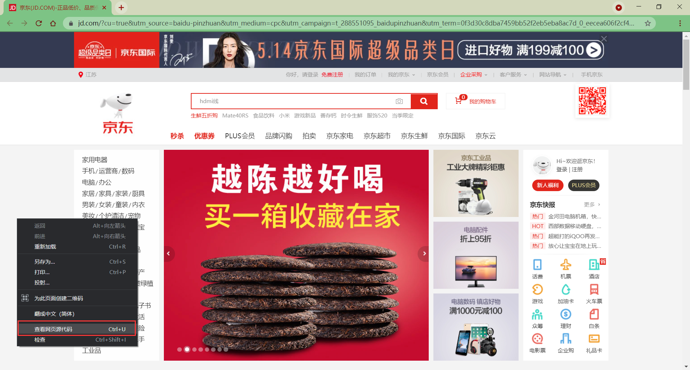

```html
<meta charset="utf8" version='1'/>
<meta name="viewport" content="width=device-width, initial-scale=1.0, maximum-scale=1.0, user-scalable=yes"/>
<meta name="description" content="京东JD.COM-专业的综合网上购物商城,销售家电、数码通讯、电脑、家居百货、服装服饰、母婴、图书、食品等数万个品牌优质商品.便捷、诚信的服务，为您提供愉悦的网上购物体验!"/>
<meta name="Keywords" content="网上购物,网上商城,手机,笔记本,电脑,MP3,CD,VCD,DV,相机,数码,配件,手表,存储卡,京东"/>
```

meta主要用于设置网页中的一些元数据，元数据并不是给用户看的

- charset ：指定网页的字符集
  
- name ：指定的数据的名称
  
    - keywords：表示网站的关键字，可以同时指定多个关键字，关键字间使用`,`隔开
      
    - description：表示网站的描述信息
      
        
    
- content ：指定的数据的内容，会作为搜索结果的超链接上的文字显示

打开Zeal手册（前端开发准备中做过介绍）


发现除了`charset`、`name`、`content`之外，还有一个叫`http-equiv`的属性

```html
If the http-equiv attribute is set, the <meta> element is a pragma directive, providing information equivalent to what can be given by a similarly-named HTTP header.
```

如果设置了`http-equiv`属性，`<meta>`元素就是一个pragma指令，提供的信息相当于一个类似名称的HTTP头所能提供的信息。

点击`http-equiv`的链接，查看其更详细信息。


- `content-security-policy`：允许页面作者为当前页面定义一个内容策略。内容策略主要指定允许的服务器来源和脚本端点，这有助于防范跨站脚本攻击。
- `content-type`：声明文档的MIME类型和字符编码。如果指定，content属性必须有 "`text/html; charset=utf-8` "的值。这相当于一个指定了charset属性的`<meta>`元素，并对文档中的位置有同样的限制。注意：只能在使用`text/html`的文档中使用，不能在使用XML MIME类型的文档中使用。
- `default-style`：设置默认的CSS样式表集的名称。
- `x-ua-compatible`： 如果指定，内容属性必须有 "`IE=edge`"的值。用户代理被要求忽略这个pragma。
- `refresh`：该指令指定页面重新加载及重定向的方式
    - 直到页面应该被重新加载的秒数–只有当content属性包含一个正整数时。
    - 直到页面重定向到另一个页面的秒数–只有当内容属性包含一个正整数，后面跟着字符串’`;url=`’，以及一个有效的URL。

其中我们直接将Examples中的示例代码加入Demo.html中

```html
<meta charset="utf-8">
<!-- Redirect page after 3 seconds -->
<meta http-equiv="refresh" content="3;url=https://www.mozilla.org">
```

对`refresh`进行测试，发现过了3秒钟之后自动跳转到了指定的网站


## 3\. 语义标签

在网页中HTML专门用来负责网页的结构所以在使用html标签时，应该关注的是标签的语义，而不是它的样式

这里先介绍几个基本的语义标签，还有些常用的标签放在后面具体讲解

<div class="table-box"><table><thead><tr><th></th><th align="left">标签</th><th align="left">作用</th><th>描述</th></tr></thead><tbody><tr><td>块元素<br>Block Element</td><td align="left"><mark><code>&lt;h1&gt;</code></mark><br><mark><code>&lt;h2&gt;</code></mark><br><mark><code>&lt;h3&gt;</code></mark><br><mark><code>&lt;h4&gt;</code></mark><br><mark><code>&lt;h5&gt;</code></mark><br><mark><code>&lt;h6&gt;</code></mark></td><td align="left">标题</td><td>一共有六级标题<br>从<code>h1</code> ~ <code>h6</code>重要性递减，<code>h1</code>最重要，<code>h6</code>最不重要<br>h1在网页中的重要性仅次于<code>title</code>标签<br>一般情况下一个页面中只会有一个<code>h1</code><br>一般情况下标题标签只会使用到<code>h1</code> ～ <code>h3</code>，<code>h4</code> ～ <code>h6</code>很少用</td></tr><tr><td></td><td align="left"><code>&lt;hgroup&gt;</code></td><td align="left">标题组</td><td>多层次的标题。它将一组<code>&lt;h1&gt;</code> ～ <code>&lt;h6&gt;</code>元素分组</td></tr><tr><td></td><td align="left"><mark><code>&lt;p&gt;</code></mark></td><td align="left">段落</td><td>页面中的一个段落。由空行或第一行缩进将相邻的文本块分开</td></tr><tr><td></td><td align="left"><code>&lt;blockquote&gt;</code></td><td align="left">短引文</td><td>用缩进表示所包含文本。<br>可以用<code>cite</code>属性表示引文来源，用<code>&lt;cite&gt;</code>元素表示来源的文本表述</td></tr><tr><td>行内元素<br>Inline Element</td><td align="left"><code>&lt;q&gt;</code></td><td align="left">长引文</td><td>用一个简短的内联引号包围文本。<br>大多数浏览器通过在文本周围加上引号来实现。<br>该元素用于不需要段落分隔的短引文；</td></tr><tr><td></td><td align="left"><mark><code>&lt;br&gt;</code></mark></td><td align="left">换行</td><td></td></tr><tr><td></td><td align="left"><code>&lt;em&gt;</code></td><td align="left">强调</td><td>表示强调作用。<code>&lt;em&gt;</code>元素可以嵌套，每一级嵌套表示更高的强调程度<br><mark><code>&lt;i&gt;</code></mark>元素效果与它相同，不过<code>&lt;i&gt;</code>不属于语义标签</td></tr><tr><td></td><td align="left"><code>&lt;strong&gt;</code></td><td align="left">重要</td><td>表示重要性、严肃性或紧迫性。浏览器通常以粗体字呈现内容<br><mark><code>&lt;b&gt;</code></mark>元素效果与它相同，不过<code>&lt;b&gt;</code>不属于语义标签</td></tr></tbody></table></div>

**举例**

```html
<h1>Beetles</h1>
<h2>External morphology</h2>
<h3>Head</h3>
<h4>Mouthparts</h4>
<h3>Thorax</h3>
<h4>Prothorax</h4>
<h4>Pterothorax</h4>
```

**效果**


HTML5 提供的新语义元素有

<table><thead><tr><th align="left">标签</th><th align="left">作用</th><th>描述</th></tr></thead><tbody><tr><td align="left"><mark><code>&lt;header&gt;</code></mark></td><td align="left">页眉</td><td>介绍性的内容</td></tr><tr><td align="left"><mark><code>&lt;footer&gt;</code></mark></td><td align="left">页脚</td><td>通常包含有关作者的信息、版权或文件链接</td></tr><tr><td align="left"><mark><code>&lt;nav&gt;</code></mark></td><td align="left">导航链接</td><td>可以是当前文档内的，也可以是到其他文档的。常见例子是菜单、目录和索引</td></tr><tr><td align="left"><mark><code>&lt;main&gt;</code></mark></td><td align="left">文档主内容</td><td>中心主题直接相关或扩展的内容</td></tr><tr><td align="left"><code>&lt;article&gt;</code></td><td align="left">文章</td><td>自成一体，独立分发，可重复使用</td></tr><tr><td align="left"><code>&lt;section&gt;</code></td><td align="left">文档中的节</td><td>没有一个更具体的语义元素来代表</td></tr><tr><td align="left"><mark><code>&lt;aside&gt;</code></mark></td><td align="left">页面内容以外的内容</td><td>其内容与文档的主要内容只有间接的关系。经常以边栏或呼出框的形式出现</td></tr><tr><td align="left"><mark><code>&lt;mark&gt;</code></mark></td><td align="left">重要或强调的文本</td><td>为参考或记事目的而被标记或突出的文本，表明其相关性和重要性</td></tr><tr><td align="left"><code>&lt;summary&gt;</code></td><td align="left"><code>&lt;details&gt;</code> 标题</td><td>为<code>&lt;details&gt;</code>指定一个摘要、标题或图例。点击<code>&lt;summary&gt;</code>可以切换<code>&lt;details&gt;</code>打开和关闭</td></tr><tr><td align="left"><code>&lt;details&gt;</code></td><td align="left">用户能够查看或隐藏的额外细节</td><td>其中的信息只有被切换到 "打开 "状态时才可见。必须使用<code>&lt;summary&gt;</code>提供一个摘要或标签</td></tr><tr><td align="left"><code>&lt;figure&gt;</code></td><td align="left">自包含内容</td><td>独立的内容，用<code>&lt;figcaption&gt;</code>元素指定一个可选的标题。比如图示、图表、照片、代码清单等</td></tr><tr><td align="left"><code>&lt;figcaption&gt;</code></td><td align="left"><code>&lt;figure&gt;</code> 的标题</td><td>描述其父元素
    <figure>
     其余内容的标题或图例
    </figure></td></tr><tr><td align="left"><code>&lt;time&gt;</code></td><td align="left">定义日期/时间</td><td>可能包括<code>datetime</code>属性，将日期翻译成机器可读的格式，以便获得更好的搜索引擎结果或自定义功能。如提醒</td></tr></tbody></table>

这些新语义标签在视觉效果上基本上没有什么区别

## 4\. 块元素与行内元素

### 块元素（block element）

- 在网页中一般通过块元素来对页面进行布局

### 行内元素（inline element）

- 行内元素主要用来包裹文字
- 一般情况下会在块元素中放行内元素，而不会在行内元素中放块元素
    - 如`<p>`元素中不能放任何的块元素，不过

## 5\. 内容修正

浏览器在解析网页时，会自动对网页中不符合规范的内容进行修正，比如：

- 标签写在了根元素的外部
- `<p>`元素中嵌套了块元素
- 根元素中出现了除`head`和`body`以外的子元素

这个通过浏览器中的`查看网页源代码`并不能看到效果，但是使用F12进行`开发者调试`时是能够看到上述几种情况被修正的结果。

不过虽然浏览器能够对不规范的页面内容进行修正，还是不建议编写不规范的代码，因为这对后期代码维护或团队代码协作将是非常不好的后果和体验。

## 6\. 布局标签

**结构化语义标签**

- `header`表示网页的头部（页眉）
- `main`表示网页的主体部分（一个页面中只会有一个main）
- `footer`表示网页的底部（页脚）
- `nav`表示网页中的导航
- `aside`和主体相关的其他内容（侧边栏）
- `article`表示一个独立的文章
- `section`表示一个独立的区块，上边的标签都不能表示时使用section


- `div` 块元素，没有任何的语义，就用来表示一个区块。目前来讲，div还是主要的布局元素
- `span` 行内元素，没有任何的语义，一般用于在网页中`选中文字`

## 7\. 列表

在html中可以创建列表，html列表一共有三种：

- 有序列表，使用`ol`标签来创建有序列表，使用`li`表示列表项
  
    ```html
    <ol>
        <li>Mix flour, baking powder, sugar, and salt.</li>
        <li>In another bowl, mix eggs, milk, and oil.</li>
        <li>Stir both mixtures together.</li>
        <li>Fill muffin tray 3/4 full.</li>
        <li>Bake for 20 minutes.</li>
    </ol>
    ```
    
    
    
- 无序列表，使用`ul`标签来创建无序列表，使用`li`表示列表项
  
    ```html
    <ul>
        <li>Milk</li>
        <li>Cheese
            <ul>
                <li>Blue cheese
                    <ul>
                        <li>Sweet blue cheese</li>
                        <li>Sour blue cheese</li>
                    </ul>
                </li>
                <li>Feta</li>
            </ul>
        </li>
    </ul>
    ```
    
    
    
    可以看出，列表元素之间是可以互相嵌套的
    
- 定义列表，使用`dl`标签来创建定义列表，使用`dt`表示定义的内容，使用`dd`来对内容进行解释说明
  
    ```html
    <dl>
        <dt>Beast of Bodmin</dt>
        <dd>A large feline inhabiting Bodmin Moor.</dd>
    
        <dt>Morgawr</dt>
        <dd>A sea serpent.</dd>
    
        <dt>Owlman</dt>
        <dd>A giant owl-like creature.</dd>
    </dl>
    ```
    
    
    

## 8\. 超链接

超链接可以让我们从一个页面跳转到其他页面，或者是当前页面的其他的位置

使用`a`标签来定义超链接，`href`属性指定跳转的目标路径，值可以是一个外部网站的地址，也可以写一个内部页面的地址

超链接是也是一个行内元素，在`a`标签中可以嵌套除它自身外的任何元素

### 外部地址

- Linking to an absolute URL：链接一个绝对路径
- Linking to an email address：链接一个email地址
- Linking to telephone numbers：链接电话号码
- Using the download attribute to save a `<canvas>` as a PNG：下载图片

```html
<ul>
  <li><a href="https://www.baidu.com">Website</a></li>
  <li><a href="mailto:example@outlook.com">Email</a></li>
  <li><a href="tel:+123456789">Phone</a></li>
</ul>
```

**效果**


### 内部地址

当我们需要跳转一个服务器内部的页面时，一般我们都会使用相对路径，会以`./`或`../`开头

- `./` 表示当前文件所在目录，可以省略不写
- `../`表示当前文件所在目录的上一级目录

```html
<a href="./test1.html">超链接1</a><br>
<a href="../test2.html">超链接2</a><br>
<a href="./test3/test3.html">超链接3</a><br>
<a href="../test4/test4.html">超链接4</a>
```

**效果**


### 新建页面

`target`属性，用来指定超链接打开的位置可选值：

- `_self`在当前页面中打开超链接，默认值
- `_blank`在新建页面中打开超链接

```html
<a href="./test1.html">超链接1——默认</a><br>
<a href="./test1.html" target="_self">超链接1——当前页面</a><br>
<a href="./test1.html" target="_blank">超链接1——新建页面</a><br>
```


### 锚点跳转

可以使用`javascript:void(0);`来作为`href`的属性，此时点击这个超链接什么也不会发生

可以将`#`作为超链接的路径的占位符使用。

可以直接将超链接的`href`属性设置为`#`，这样点击超链接以后页面不会发生跳转，而是转到当前页面的顶部的位置

可以跳转到页面的指定位置（锚点），只需将`href`属性设置`#目标元素的id属性值`（唯一不重复）

```html
<p> 汉皇重色思倾国，御宇多年求不得。</p>
<p> 杨家有女初长成，养在深闺人未识。 </p>
<p> 天生丽质难自弃，一朝选在君王侧。 </p>
<p><a id="Anchor1" href="#Anchor2"> 回眸一笑百媚生，六宫粉黛无颜色。</a></p>
<p> 春寒赐浴华清池，温泉水滑洗凝脂。 </p>
<p> 侍儿扶起娇无力，始是新承恩泽时。 </p>
<p> 云鬓花颜金步摇，芙蓉帐暖度春宵。 </p>
<p> 春宵苦短日高起，从此君王不早朝。 </p>
<p> 承欢侍宴无闲暇，春从春游夜专夜。 </p>
<p><a id="Anchor2" href="#Anchor3"> 后宫佳丽三千人，三千宠爱在一身。</a></p>
<p> 金屋妆成娇侍夜，玉楼宴罢醉和春。 </p>
<p> 姊妹弟兄皆列土，可怜光彩生门户。 </p>
<p> 遂令天下父母心，不重生男重生女。 </p>
<p> 骊宫高处入青云，仙乐风飘处处闻。 </p>
<p> 缓歌慢舞凝丝竹，尽日君王看不足。 </p>
<p> 渔阳鼙鼓动地来，惊破霓裳羽衣曲。 </p>
<p> 九重城阙烟尘生，千乘万骑西南行。 </p>
<p> 翠华摇摇行复止，西出都门百余里。 </p>
<p> 六军不发无奈何，宛转蛾眉马前死。 </p>
<p> 花钿委地无人收，翠翘金雀玉搔头。 </p>
<p> 君王掩面救不得，回看血泪相和流。 </p>
<p> 黄埃散漫风萧索，云栈萦纡登剑阁。 </p>
<p> 峨嵋山下少人行，旌旗无光日色薄。 </p>
<p> 蜀江水碧蜀山青，圣主朝朝暮暮情。 </p>
<p> 行宫见月伤心色，夜雨闻铃肠断声。 </p>
<p> 天旋地转回龙驭，到此踌躇不能去。 </p>
<p> 马嵬坡下泥土中，不见玉颜空死处。 </p>
<p> 君臣相顾尽沾衣，东望都门信马归。 </p>
<p> 归来池苑皆依旧，太液芙蓉未央柳。 </p>
<p> 芙蓉如面柳如眉，对此如何不泪垂。 </p>
<p> 春风桃李花开夜，秋雨梧桐叶落时。 </p>
<p> 西宫南苑多秋草，落叶满阶红不扫。 </p>
<p> 梨园弟子白发新，椒房阿监青娥老。 </p>
<p> 夕殿萤飞思悄然，孤灯挑尽未成眠。 </p>
<p><a id="Anchor3" href="#Anchor4"> 迟迟钟鼓初长夜，耿耿星河欲曙天。 </a></p>
<p> 鸳鸯瓦冷霜华重，翡翠衾寒谁与共。 </p>
<p> 悠悠生死别经年，魂魄不曾来入梦。 </p>
<p> 临邛道士鸿都客，能以精诚致魂魄。 </p>
<p> 为感君王辗转思，遂教方士殷勤觅。 </p>
<p> 排空驭气奔如电，升天入地求之遍。 </p>
<p> 上穷碧落下黄泉，两处茫茫皆不见。 </p>
<p> 忽闻海上有仙山，山在虚无缥渺间。 </p>
<p> 楼阁玲珑五云起，其中绰约多仙子。 </p>
<p> 中有一人字太真，雪肤花貌参差是。 </p>
<p> 金阙西厢叩玉扃，转教小玉报双成。 </p>
<p> 闻道汉家天子使，九华帐里梦魂惊。 </p>
<p> 揽衣推枕起徘徊，珠箔银屏迤逦开。 </p>
<p> 云鬓半偏新睡觉，花冠不整下堂来。 </p>
<p><a id="Anchor4" href="#Anchor5"> 风吹仙袂飘飖举，犹似霓裳羽衣舞。 </a></p>
<p> 玉容寂寞泪阑干，梨花一枝春带雨。 </p>
<p> 含情凝睇谢君王，一别音容两渺茫。 </p>
<p> 昭阳殿里恩爱绝，蓬莱宫中日月长。 </p>
<p> 回头下望人寰处，不见长安见尘雾。 </p>
<p> 惟将旧物表深情，钿合金钗寄将去。 </p>
<p> 钗留一股合一扇，钗擘黄金合分钿。 </p>
<p> 但令心似金钿坚，天上人间会相见。 </p>
<p> 临别殷勤重寄词，词中有誓两心知。 </p>
<p> 七月七日长生殿，夜半无人私语时。 </p>
<p><a id="Anchor5" href="#Anchor6"> 在天愿作比翼鸟，在地愿为连理枝。 </a></p>
<p> 天长地久有时尽，此恨绵绵无绝期。 </p>

<!-- Heading to link to -->
<a href="#">回到顶部</a>
```

**效果**

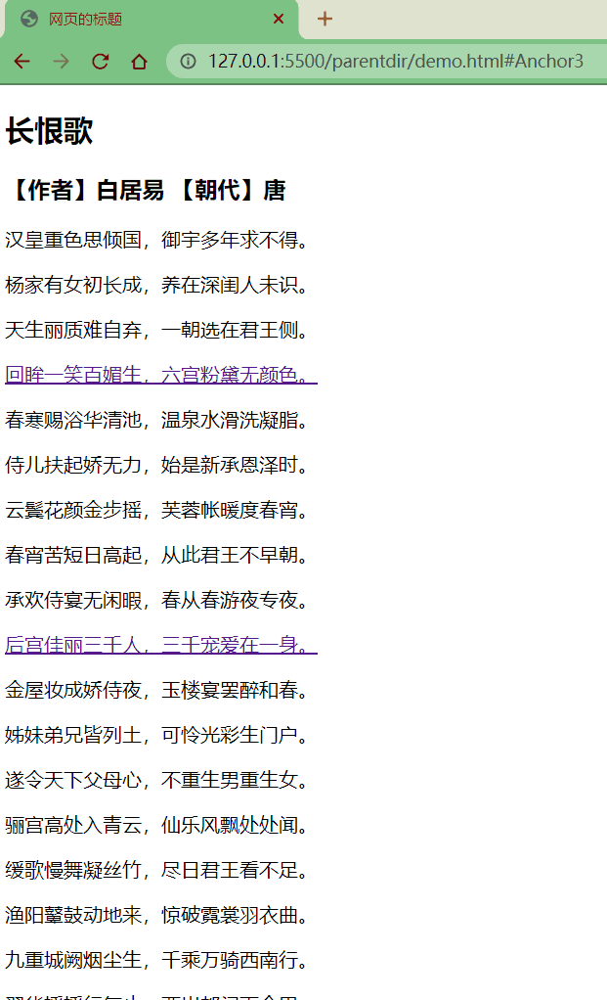

## 9\. 图片

图片标签用于向当前页面中引入一个外部图片

`img`标签是一个自结束标签，这种元素属于替换元素（块和行内元素之间，具有两种元素的特点）

**属性**

- `src`：属性指定的是外部图片的路径（路径规则和超链接是一样的）
- `alt`：图片的描述，这个描述默认情况下不会显示，有些浏览器会在图片无法加载时显示，搜索引擎会根据alt中的内容来识别图片
- `width`：图片的宽度（单位是像素）
- `height` ：图片的高度（单位是像素）
- 宽度和高度中如果只修改了一个，则另一个会等比例缩放

**注意**

- 一般情况在pc端，不建议修改图片的大小，需要多大的图片就裁多大
- 但是在移动端，经常需要对图片进行缩放（大图缩小）

**举例**

```html


```

**效果**


### 图片格式

#### jpeg（jpg）

- 支持的颜色比较丰富
- 不支持透明效果
- 不支持动图
- 一般用来显示照片

#### gif

- 支持的颜色比较单一
- 支持简单透明
- 支持动图

#### png

- 支持的颜色丰富
- 支持复杂透明
- 不支持动图
- 专为网页而生

#### webp

- 这种格式是谷歌新推出的专门用来表示网页中的图片的一种格式
- 具备其他图片格式的所有优点，而且文件还特别的小
- 缺点：兼容性不好

#### base64

- 将图片使用base64编码，这样可以将图片转换为字符，通过字符的形式来引入图片
  
    ```html
    <img width="300" src="data:image/png;base64,AAABAAEAICAAAAEAIACoEAAAFgAAACgAAAAgAAAAQAAAAAEAIAAAAAAAABAAAAAAAAAAAAAAAAAAAAAAAAAxVfz/MVX8/zFV/P8xVfz/MVX8/zFV/P8xVfz/MVX8/zFV/P8xVfz/MVX8/zFV/P8xVfz/MVX8/zFV/P8xVfz/MVX8/zFV/P8xVfz/MVX8/zFV/P8xVfz/MVX8/zFV/P8xVfz/MVX8/zFV/P8xVfz/MVX8/zFV/P8xVfz/MVX8/zFV/P8xVfz/MVX8/zFV/P8xVfz/MVX8/zFV/P8xVfz/MVX8/zFV/P8xVfz/MVX8/zFV/P8xVfz/MVX8/zFV/P8xVfz/MVX8/zFV/P8xVfz/MVX8/zFV/P8xVfz/MVX8/zFV/P8xVfz/MVX8/zFV/P8xVfz/MVX8/zFV/P8xVfz/MVX8/zFV/P8xVfz/MVX8/zFV/P8xVfz/MVX8/zFV/P8xVfz/MVX8/zFV/P8xVfz/MVX8/zFV/P8xVfz/MVX8/zFV/P8xVfz/MVX8/zFV/P8xVfz/MVX8/zFV/P8xVfz/MVX8/zFV/P8xVfz/MVX8/zFV/P8xVfz/MVX8/zFV/P8xVfz/MVX8/zFV/P8xVfz/MVX8/zFV/P8xVfz/MVX8/zFV/P8xVfz/MVX8/zFV/P8xVfz/MVX8/zFV/P8xVfz/MVX8/zFV/P8xVfz/MVX8/zFV/P8xVfz/MVX8/zFV/P8xVfz/MVX8/zFV/P8xVfz/MVX8/zFV/P8xVfz/MVX8/zFV/P8xVfz/MVX8/zFV/P8xVfz/MVX8/zFV/P8xVfz/MVX8/zFV/P8xVfz/MVX8/zda/P9qhPz/mKr9/7bC/f/Fz/7/ydL+/8HM/v+tu/3/jaH9/156/P8zV/z/MVX8/zFV/P8xVfz/MVX8/zFV/P8xVfz/MVX8/zFV/P8xVfz/MVX8/zFV/P8xVfz/MVX8/zFV/P8xVfz/MVX8/zFV/P8xVfz/MVX8/z9h/P+gsP3/8fP+/+ru/v+Zqv3/PV/8/zFV/P8xVfz/MVX8/zFV/P8xVfz/MVX8/zFV/P8xVfz/MVX8/zFV/P8xVfz/MVX8/zFV/P8xVfz/MVX8/zFV/P9lgPz/6+/+///s7/7/Y378/zFV/P8xVfz/MVX8/zFV/P8xVfz/MVX8/zFV/P8xVfz/MVX8/zFV/P8xVfz/MVX8/zFV/P8xVfz/aoT8//r6/v///v7+/+Po/v/R2f7/y9T+/9rg/v/3+f7j6P7/MVX8/zFV/P8xVfz/MVX8/zFV/P8xVfz/MVX8/zFV/P8xVfz/MVX8/zFV/P8xVfz/MVX8/0Zm/P/w8/7/5+v+/4ab/f9AYvz/MVX8/zFV/P8xVfz/MVX8/zVY/P9kf/z/tsP9//39/vT2/v8xVfz/MVX8/zFV/P8xVfz/MVX8/zFV/P8xVfz/MVX8/zFV/P8xVfz/MVX8/zFV/P8xVfz/sL79/87W/v8/Yfz/MVX8/zFV/P8xVfz/MVX8/zFV/P8xVfz/MVX8/zFV/P8xVfz/ZYD8//L0/v//n7D9/zFV/P8xVfz/MVX8/zFV/P8xVfz/MVX8/zFV/P8xVfz/MVX8/zFV/P8xVfz/MVX8/0Bh/P/6+/7v8v7/QmP8/zFV/P8xVfz/MVX8/zFV/P8xVfz/MVX8/zFV/P8xVfz/MVX8/zFV/P8xVfz/TWz8/3GJ/P8yVvz/MVX8/zFV/P8xVfz/MVX8/zFV/P8xVfz/MVX8/zFV/P8xVfz/MVX8/zFV/P8xVfz/e5L8/5qr/f8xVfz/MVX8/zFV/P8xVfz/MVX8/zFV/P8xVfz/MVX8/zFV/P8xVfz/MVX8/zFV/P8xVfz/MVX8/zFV/P8xVfz/MVX8/zFV/P8xVfz/MVX8/zFV/P8xVfz/MVX8/zFV/P8xVfz/MVX8/zFV/P+mtv3/XHn8/zFV/P8xVfz/MVX8/zFV/P8xVfz/MVX8/zFV/P8xVfz/MVX8/zFV/P8xVfz/MVX8/zFV/P8xVfz/MVX8/zFV/P8xVfz/MVX8/zFV/P8xVfz/MVX8/zFV/P8xVfz/MVX8/zFV/P8xVfz/MVX8/7/L/f87Xfz/MVX8/zFV/P8xVfz/MVX8/zFV/P8xVfz/MVX8/zFV/P8xVfz/MVX8/zFV/P8xVfz/MVX8/zFV/P8xVfz/MVX8/zFV/P8xVfz/MVX8/zFV/P8xVfz/MVX8/zFV/P8xVfz/MVX8/zFV/P8xVfz/ydL++/v+/zFV/P8xVfz/MVX8/zFV/P8xVfz/MVX8/zFV/P8xVfz/MVX8/zFV/P8xVfz/MVX8/zFV/P8xVfz/MVX8/zFV/P8xVfz/MVX8/zFV/P8xVfz/MVX8/zFV/P8xVfz/MVX8/zFV/P8xVfz/MVX8/zFV/P/Ezv79/f7/M1b8/zFV/P8xVfz/MVX8/zFV/P8xVfz/MVX8/zFV/P8xVfz/MVX8/zFV/P8xVfz/MVX8/zFV/P8xVfz/MVX8/zFV/P8xVfz/MVX8/zFV/P8xVfz/MVX8/zFV/P8xVfz/MVX8/zFV/P8xVfz/MVX8/7G//f9HZ/z/MVX8/zFV/P8xVfz/MVX8/zFV/P8xVfz/MVX8/zFV/P8xVfz/MVX8/zFV/P8xVfz/MVX8/zFV/P8xVfz/MVX8/zFV/P8xVfz/MVX8/zFV/P8xVfz/MVX8/zFV/P8xVfz/MVX8/zFV/P8xVfz/kqX9/22H/P8xVfz/MVX8/zFV/P8xVfz/MVX8/zFV/P8xVfz/MVX8/zFV/P8xVfz/MVX8/zFV/P8xVfz/MVX8/zFV/P8xVfz/MVX8/zFV/P8xVfz/MVX8/zFV/P8xVfz/MVX8/zFV/P8xVfz/MVX8/zFV/P9kf/z/pbX9/zFV/P8xVfz/MVX8/zFV/P8xVfz/MVX8/zFV/P8xVfz/MVX8/zFV/P8xVfz/MVX8/zFV/P8xVfz/MVX8/zFV/P8xVfz/MVX8/zFV/P8xVfz/MVX8/zFV/P8xVfz/MVX8/zFV/P8xVfz/MVX8/zRX/P/v8v7s7/7/Nln8/zFV/P8xVfz/MVX8/zFV/P8xVfz/MVX8/zFV/P8xVfz/MVX8/zFV/P8xVfz/MVX8/zFV/P8xVfz/MVX8/zFV/P8xVfz/MVX8/zFV/P8xVfz/MVX8/zFV/P8xVfz/MVX8/zFV/P8xVfz/MVX8/6Ky/f+Inf3/MVX8/zFV/P8xVfz/MVX8/zFV/P8xVfz/MVX8/zFV/P8xVfz/MVX8/zFV/P8xVfz/MVX8/zFV/P8xVfz/MVX8/zFV/P8xVfz/MVX8/zFV/P8xVfz/MVX8/zFV/P8xVfz/MVX8/zFV/P8xVfz/RWb8//f4/vH0/v9Kafz/MVX8/zFV/P8xVfz/MVX8/zFV/P8xVfz/MVX8/zFV/P8xVfz/PV/8/1Jw/P8xVfz/MVX8/zFV/P8xVfz/MVX8/zFV/P8xVfz/MVX8/zFV/P8xVfz/MVX8/zFV/P8xVfz/MVX8/zFV/P8xVfz/kKT9/9vh/v9DZPz/MVX8/zFV/P8xVfz/MVX8/zFV/P8xVfz/MVX8/1Fv/P/m6/7//v7+/3aO/P8xVfz/MVX8/zFV/P8xVfz/MVX8/zFV/P8xVfz/MVX8/zFV/P8xVfz/MVX8/zFV/P8xVfz/MVX8/zFV/P8zVvz/xM79/+fr/v9viPz/MVX8/zFV/P8xVfz/MVX8/zRX/P+Emf3/8/X+xc/+/zFV/P8xVfz/MVX8/zFV/P8xVfz/MVX8/zFV/P8xVfz/MVX8/zFV/P8xVfz/MVX8/zFV/P8xVfz/MVX8/zFV/P87Xfz/ztf+///i5/7/sL79/5+w/f+ywP3/6u3+//+uvP3/MVX8/zFV/P8xVfz/MVX8/zFV/P8xVfz/MVX8/zFV/P8xVfz/MVX8/zFV/P8xVfz/MVX8/zFV/P8xVfz/MVX8/zFV/P83Wvz/sL79//7+/v//3OL+/0Vl/P8xVfz/MVX8/zFV/P8xVfz/MVX8/zFV/P8xVfz/MVX8/zFV/P8xVfz/MVX8/zFV/P8xVfz/MVX8/zFV/P8xVfz/MVX8/zFV/P8xVfz/aYP8/9Pb/v//9fb+/5yu/f84W/z/MVX8/zFV/P8xVfz/MVX8/zFV/P8xVfz/MVX8/zFV/P8xVfz/MVX8/zFV/P8xVfz/MVX8/zFV/P8xVfz/MVX8/zFV/P8xVfz/MVX8/zFV/P8xVfz/MVX8/1d0/P+Spf3/t8T9/8fR/v/Dzv7/qrn9/3uS/P88Xvz/MVX8/zFV/P8xVfz/MVX8/zFV/P8xVfz/MVX8/zFV/P8xVfz/MVX8/zFV/P8xVfz/MVX8/zFV/P8xVfz/MVX8/zFV/P8xVfz/MVX8/zFV/P8xVfz/MVX8/zFV/P8xVfz/MVX8/zFV/P8xVfz/MVX8/zFV/P8xVfz/MVX8/zFV/P8xVfz/MVX8/zFV/P8xVfz/MVX8/zFV/P8xVfz/MVX8/zFV/P8xVfz/MVX8/zFV/P8xVfz/MVX8/zFV/P8xVfz/MVX8/zFV/P8xVfz/MVX8/zFV/P8xVfz/MVX8/zFV/P8xVfz/MVX8/zFV/P8xVfz/MVX8/zFV/P8xVfz/MVX8/zFV/P8xVfz/MVX8/zFV/P8xVfz/MVX8/zFV/P8xVfz/MVX8/zFV/P8xVfz/MVX8/zFV/P8xVfz/MVX8/zFV/P8xVfz/MVX8/zFV/P8xVfz/MVX8/zFV/P8xVfz/MVX8/zFV/P8xVfz/MVX8/zFV/P8xVfz/MVX8/zFV/P8xVfz/MVX8/zFV/P8xVfz/MVX8/zFV/P8xVfz/MVX8/zFV/P8xVfz/MVX8/zFV/P8xVfz/MVX8/zFV/P8xVfz/MVX8/zFV/P8xVfz/MVX8/zFV/P8xVfz/MVX8/zFV/P8xVfz/MVX8/zFV/P8xVfz/MVX8/zFV/P8xVfz/MVX8/zFV/P8xVfz/MVX8/zFV/P8xVfz/MVX8/zFV/P8xVfz/MVX8/zFV/P8xVfz/AAAAAAAAAAAAAAAAAAAAAAAAAAAAAAAAAAAAAAAAAAAAAAAAAAAAAAAAAAAAAAAAAAAAAAAAAAAAAAAAAAAAAAAAAAAAAAAAAAAAAAAAAAAAAAAAAAAAAAAAAAAAAAAAAAAAAAAAAAAAAAAAAAAAAAAAAAAAAAAAAAAAAAAAAAA=" />
    ```
    
    图片格式的选择
    
- 图片效果一样的，选文件小的
  
- 图片效果不一样的，选图片效果好的
  
- 尽可能的兼顾和平衡图片效果和文件大小
  

## 10\. 内联格式

内联框架`iframe`，用于向当前页面中引入一个其他页面，

- `src`指定要引入的网页的路径
- `frameborder`指定内联框架的边框

**举例**

```html
<iframe src="https://www.qq.com" width="800" height="600" frameborder="0"></iframe>
```

**效果**

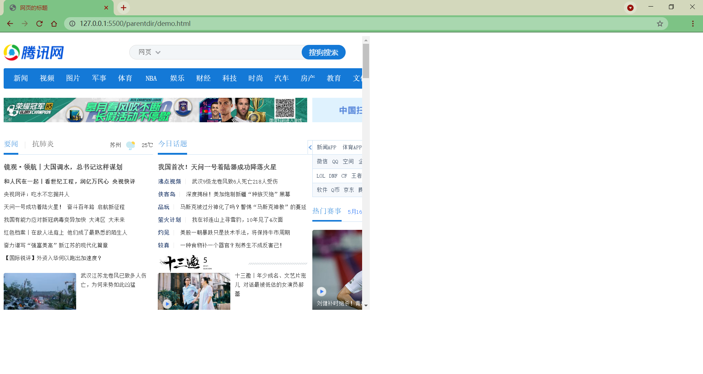

## 11\. 音视频

### 音频

`audio`标签用来向页面中引入一个外部的音频文件

音视频文件引入时，默认情况下不允许用户自己控制播放停止

**属性**：

- `controls`是否允许用户控制播放
- `autoplay`音频文件是否自动播放
    - 如果设置了`autoplay`，则音乐在打开页面时会自动播放
    - 但是目前来讲大部分浏览器都不会自动对音乐进行播放
- `loop`音乐是否循环播放

```html
<audio src="./source/audio.mp3" controls autoplay loop></audio>
```


### source

除了通过`src`属性来指定外部文件的路径以外，还可以通过`<source>`元素来指定文件的路径

```html
<audio controls autoplay loop>
    对不起，您的浏览器不支持播放音频！请升级浏览器！
	<source src="./source/audio.mp3">
	<source src="./source/audio.ogg">
</audio>
```

IE11下，能够正常播放


IE8下，出现我们自定义的提示信息


### embed

IE8下不支持`audio`元素，但是可以使用 `<embed>` 元素在文档中的指定位置嵌入外部内容。

这个内容是由外部应用程序或其他互动内容的来源提供的，如浏览器插件。

```html
<embed src="./source/audio.mp3">
```


### 视频

使用`video`标签来向网页中引入一个视频，使用方式和`audio`基本上是一样的

```html
<video controls>
    <source src="https://interactive-examples.mdn.mozilla.net/media/cc0-videos/flower.webm" type="video/webm">
    <source src="https://interactive-examples.mdn.mozilla.net/media/cc0-videos/flower.mp4" type="video/mp4">
    <embed src="https://interactive-examples.mdn.mozilla.net/media/cc0-videos/flower.mp4" type="video/mp4">
</video>
```

IE11下，能够正常播放


IE8下，也能正常播放


### 其他

通过`iframe`和`embed`的方式引入视频。以某艺为例，提供了视频链接的HTML代码和通用代码


```html
<iframe
        src="http://open.iqiyi.com/developer/player_js/coopPlayerIndex.html?vid=0c53ddd55f262c6d416afa9d1f49dc55&tvId=1008748400&accessToken=2.ef9c39d6c7f1d5b44768e38e5243157d&appKey=8c634248790d4343bcae1f66129c1010&appId=1368&height=100%&width=100%"
        frameborder="0" allowfullscreen="true" width="100%" height="100%"></iframe>
```

不过，`embed`需要flash的支持

```html
<embed
       src="//player.video.iqiyi.com/0c53ddd55f262c6d416afa9d1f49dc55/0/0/v_19rrcuh1jw.swf-albumId=1008748400-tvId=1008748400-isPurchase=0-cnId=undefined"
       allowFullScreen="true" quality="high" width="480" height="350" align="middle" allowScriptAccess="always"
       type="application/x-shockwave-flash"></embed>
```
>>>>>>> 199378b451086eb9cab56a1f8011b1341cbf3f7e

# CSS语法与选择器

## 1\. CSS简介

### 层叠样式表

网页实际上是一个多层的结构，通过CSS可以分别为网页的每一个层来设置样式，而最终我们能看到只是网页的最上边一层

总之一句话，CSS用来设置网页中元素的样式

使用CSS来修改元素样式的方式大致可以分为3种

### 内联样式（行内样式）

在标签内部通过`style`属性来设置元素的样式

```html
<p style="color:red;font-size:60px;">内联样式（行内样式）</p>
```

问题：使用内联样式，样式只能对一个标签生效。如果希望影响到多个元素，必须在每一个元素中都复制一遍；并且当样式发生变化时，我们必须要一个一个的修改，非常的不方便。（注意：开发时绝对不要使用内联样式）

### 内部样式表

将样式编写到`head`中的`style`标签里然后通过css的选择器来选中元素并为其设置各种样式可以同时为多个标签设置样式，并且修改时只需要修改一处即可。内部样式表更加方便对样式进行复用

```css
<style>
p{
    color:green; 
    font-size:50px;
}
</style>
```

问题：我们的内部样式表只能对一个网页起作用，它里边的样式不能跨页面进行复用

### 外部样式表

可以将css样式编写到一个外部的CSS文件中，然后通过`link`标签来引入外部的CSS文件

```html
<link rel="stylesheet" href="./style.css">
```

外部样式表需要通过`link`标签进行引入，意味着只要想使用这些样式的网页都可以对其进行引用使样式，可以在不同页面之间进行复用

将样式编写到外部的CSS文件中，可以使用到浏览器的缓存机制，从而加快网页的加载速度，提高用户的体验。

## 2\. CSS基本语法

### 注释

#### css中的注释

只能使用`/*`和`*/`包裹。即不管是单行注释，还是多行注释，都是以`/*`开头，以`*/`结尾

```css
/* css中的单行注释 */

/* 
css中的多行注释
css中的多行注释
css中的多行注释
*/
```

我们对比下其他几种前端语言的注释

#### html中的注释

只能使用`<!--`和`-->`包裹。即不管是单行注释，还是多行注释，都是以`<!--`开头，以`-->`结尾

```html
<!-- html中的单行注释 -->

<!-- 
html中的多行注释
html中的多行注释
html中的多行注释
-->
```

#### JS(JavaScript)和JQuery中的注释

单行注释使用`//`。多行注释使用`/*`和`*/`包裹，以`<!--`开头，以`-->`结尾

```js
/* JS(JavaScript)和JQuery中的单行注释*/

/*
JS(JavaScript)和JQuery中的多行注释
JS(JavaScript)和JQuery中的多行注释
JS(JavaScript)和JQuery中的多行注释
*/
```

### 基本语法

`选择器 声明块`

#### 选择器

通过选择器可以选中页面中的指定元素

- 比如`p`的作用就是选中页面中所有的`p`元素声明块

#### 声明块

通过声明块来指定要为元素设置的样式

- 声明块由一个一个的声明组成，声明是一个名值对结构
<<<<<<< HEAD

- 一个样式名对应一个样式值，名和值之间以`:`连接，以`;`结尾
  =======
  
- 一个样式名对应一个样式值，名和值之间以`:`连接，以`;`结尾
  
>>>>>>> 199378b451086eb9cab56a1f8011b1341cbf3f7e

```css
h1{
    color: green;
}
```

## 3\. CSS选择器

### 通配选择器（Universal selector）

- 作用：选中页面中的所有元素
- 语法：`*`
- 例子：`*{}`

```css
*{
    color: red;
}
```

### 元素选择器（Type selector）

也叫类型选择器、标签选择器

- 作用：根据标签名来选中指定的元素
- 语法：`elementname{}`
- 例子：`p{}` `h1{}` `div{}`

```css
p{
    color: red; 
}

h1{
    color: green;
}
```

### 类选择器（Class selector）

- 作用：根据元素的class属性值选中一组元素
- 语法：`.classname`
- 例子：`.blue{}`

```css
.blue{
    color: blue;
}
.size{
    font-size: 20px;
}
```

`class`是一个标签的属性，它和`id`类似，不同的是`class`

- 可以重复使用，
- 可以通过`class`属性来为元素分组，
- 可以同时为一个元素指定多个`class`属性

```html
<p class="blue size"> 类选择器（Class selector）</p>
```

### ID选择器（ID selector）

- 作用：根据元素的`id`属性值选中一个元素
- 语法：`#idname{}`
- 例子：`#box{}` `#red{}`

```css
#red{
    color: red;
}
```

### 属性选择器（Attribute selector）

- 作用：根据元素的属性值选中一组元素
- 语法1：`[属性名]` 选择含有指定属性的元素
- 语法2：`[属性名=属性值]` 选择含有指定属性和属性值的元素
- 语法3：`[属性名^=属性值]` 选择属性值以指定值开头的元素
- 语法4：`[属性名$=属性值]` 选择属性值以指定值结尾的元素
- 语法5：`[属性名*=属性值]` 选择属性值中含有某值的元素
- 例子：`p[title]{}` `p[title=e]{}` `p[title^=e]{}` `p[title$=e]{}` `p[title*=e]{}`

```css
p[title]{
    color: orange;
}
p[title=e]{
    color: orange;
}
p[title^=e]{
    color: orange;
}
p[title$=e]{
    color: orange;
}
p[title*=e]{
    color: orange;
}
```

## 4\. 复合选择器

### 交集选择器

- 作用：选中同时复合多个条件的元素
- 语法：`选择器1选择器2选择器3选择器n{}`
- 注意点：交集选择器中如果有元素选择器，必须使用元素选择器开头

```css
div.red{
    font-size: 30px;
}

.a.b.c{
    color: blue;
}
```

### 并集选择器（选择器分组）

- 作用：同时选择多个选择器对应的元素
- 语法：`选择器1,选择器2,选择器3,选择器n{}`
- 例子：`#b1,.p1,h1,span,div.red{}`

```css
h1,span{
    color: green;
}
```

## 5\. 关系选择器

- 父元素：直接包含子元素的元素叫做父元素
- 子元素：直接被父元素包含的元素是子元素
- 祖先元素：直接或间接包含后代元素的元素叫做祖先元素；一个元素的父元素也是它的祖先元素
- 后代元素：直接或间接被祖先元素包含的元素叫做后代元素；子元素也是后代元素
- 兄弟元素：拥有相同父元素的元素是兄弟元素

### 子元素选择器（Child combinator）

- 作用：选中指定父元素的指定子元素
- 语法：`父元素 > 子元素`
- 例子：`A > B`

```css
div.box > p > span{
    color: orange;
}
```

### 后代元素选择器（Descendant combinator）

- 作用：选中指定元素内的指定后代元素
- 语法：`祖先 后代`
- 例子：`A B`

```css
div span{
    color: skyblue;
}
```

### 兄弟元素选择器（Sibling combinator）

- 作用：选择下一个兄弟
- 语法：`前一个 + 下一个` `前一个 + 下一组`
- 例子1：`A1 + A2`（Adjacent sibling combinator）
- 例子2： `A1 ~ An`（General sibling combinator）

```css
p + span{
    color: red;
}

p ~ span{
    color: red;
}
```

## 6\. 伪类选择器

伪类（不存在的类，特殊的类）

伪类用来描述一个元素的特殊状态，比如：第一个子元素、被点击的元素、鼠标移入的元素.…

伪类一般情况下都是使用`:`开头

- `:first-child` 第一个子元素
- `:last-child` 最后一个子元素
- `:nth-child()` 选中第n个子元素
  <<<<<<< HEAD
  - n：第n个，n的范围0到正无穷
  - 2n或even：选中偶数位的元素
  - 2n+1或odd：选中奇数位的元素
    =======
    - n：第n个，n的范围0到正无穷
    - 2n或even：选中偶数位的元素
    - 2n+1或odd：选中奇数位的元素
>>>>>>> 199378b451086eb9cab56a1f8011b1341cbf3f7e

以上这些伪类都是根据所有的子元素进行排序的

- `:first-of-type` 同类型中的第一个子元素
- `:last-of-type` 同类型中的最后一个子元素
- `:nth-of-type()` 选中同类型中的第n个子元素

这几个伪类的功能和上述的类似，不同点是他们是在同类型元素中进行排序的

- `:not()`否定伪类，将符合条件的元素从选择器中去除

```css
/* ul下所有li，黑色 */
ul>li {
    color: black;
}

/* ul下第偶数个li，黄色 */
ul>li:nth-child(2n) {
    color: yellow;
}

/* ul下第奇数个li，绿色 */
ul>li:nth-child(odd) {
    color: green;
}

/* ul下第一个li，红色 */
ul>li:first-child {
    color: red;
}

/* ul下最后一个li，黄色 */
ul>li:last-child {
    color: orange;
}
```

<<<<<<< HEAD


- `:link` 未访问的链接
- `:visited` 已访问的链接
  - 由于隐私的原因，所以`visited`这个伪类只能修改链接的颜色
  =======
  

- `:link` 未访问的链接
- `:visited` 已访问的链接
  
    - 由于隐私的原因，所以`visited`这个伪类只能修改链接的颜色
>>>>>>> 199378b451086eb9cab56a1f8011b1341cbf3f7e
- `:hover` 鼠标悬停的链接
- `:active` 鼠标点击的链接

```css
/* unvisited link */
a:link {
  color: red;
}

/* visited link */
a:visited {
  color: yellow;
}

/* mouse over link */
a:hover {
  color: green;
}

/* selected link */
a:active {
  color: blue;
}
```

<<<<<<< HEAD

=======

>>>>>>> 199378b451086eb9cab56a1f8011b1341cbf3f7e

## 7\. 伪元素选择器

伪元素，表示页面中一些特殊的并不真实的存在的元素（特殊的位置）

伪元素使用`::`开头

- `::first-letter` 表示第一个字母
- `::first-line` 表示第一行
- `::selection` 表示选中的内容
- `::before` 元素的开始
- `::after` 元素的最后
- `::before`和`::after` 必须结合`content`属性来使用

```css
/* 段落首字母设置大小为30px */
p::first-letter{
    font-size: 30px;
}

/* 段落第一行设置为黄色背景 */
p::first-line{
    background-color: yellow;
}

/* 段落选中的部分变绿色 */
p::selection{
    background-color: green；
}

/* div前加上内容 */
div::before{
    content: 'BEFORE';
    color: red;
}

/* div后加上内容 */
div::after{
    content: 'AFTER';
    color: blue;
}
```

<<<<<<< HEAD

=======

>>>>>>> 199378b451086eb9cab56a1f8011b1341cbf3f7e

## 8\. CSS Dinner游戏

官方地址：[CSS Diner - Where we feast on CSS Selectors!](https://flukeout.github.io/)

<<<<<<< HEAD
CSS Dinner是一个帮助初学者快速熟悉css各种选择器的网页游戏
=======
CSS Dinner是一个帮助初学者快速熟悉css各种选择器的网页游戏

# 样式继承与其他概念

## 1\. 继承

样式的继承，我们为一个元素设置的样式，同时也会应用到它的后代元素上

继承是发生在祖先后后代之间的，继承的设计是为了方便我们的开发

利用继承，我们可以将一些通用的样式，统一设置到共同的祖先元素上。这样只需设置一次即可让所有的元素都具有该样式

注意，并不是所有的样式都会被继承：

- 比如背景相关的，布局相关等的这些样式都不会被继承。


我们可以再Zeal手册中，搜索`background-color`属性，可以看到一个定义的表格。其中就说明了其不可被继承性


## 2\. 选择器的权重

当我们通过不同的选择器，选中相同的元素，并且为相同的样式设置不同的值时，此时就发生了样式的冲突。

发生样式冲突时，应用哪个样式由选择器的权重（优先级）决定选择器的权重


比较优先级时，需要将所有的选择器的优先级进行相加计算，最后优先级越高，则越优先显示（分组选择器是单独计算的）

选择器的累加不会超过其最大的数量级，类选择器再高也不会超过ID选择器

如果优先级计算后相同，此时则优先使用靠下的样式

可以在某一个样式的后边添加`!important`，则此时该样式会获取到最高的优先级，甚至超过内联样式，注意：在开发中一定要慎用！


```html
<style>
    #box1{
        /* ID选择器 */
        background-color: orange;
    }
    div{
        /* 元素选择器 */
        background-color: yellow;
    }
    .red{
        /* 类选择器 */
        background-color: red;
    }
</style>
<!-- 内联选择器 -->
<div id="box1" class="red" style="background-color: skyblue;">选择器的权重</div> 
```


## 3\. 长度单位像素

我们先来看下某度上关于像素（pixel,缩写px）的介绍

> 像素是指由图像的小方格组成的，这些小方块都有一个明确的位置和被分配的色彩数值，小方格颜色和位置就决定该图像所呈现出来的样子。
>
> 可以将像素视为整个图像中不可分割的单位或者是元素。不可分割的意思是它不能够再切割成更小单位抑或是元素，它是以一个单一颜色的小格存在 \[1\] 。每一个点阵图像包含了一定量的像素，这些像素决定图像在屏幕上所呈现的大小。

也就是说，显示器屏幕实际上是由一个一个的小点（单位色块，即像素）构成的


**问题1：像素和分辨率有什么关系呢？**

`分辨率 = 水平方向像素 * 垂直方向像素`

#### 屏幕分辨率

例如，屏幕分辨率是1920×1080，则该屏幕水平方向有1920个像素，垂直方向有1080个像素

- 不同屏幕的像素大小是不同的，也就是说像素大小不像我们现行的长度单位（如米/m）那样有着固定的国际标准
- 所以同样的像素大小在不同的设备上显示效果是不一样的，像素越小的屏幕显示的效果越清晰

#### 图像分辨率

例如，一张图片分辨率是300x200，则该图片在屏幕上按1:1缩放时，水平方向有300个像素，垂直方向有200个像素点

- 图片分辨率越高，1:1缩放时面积越大
- 图片分辨率越低，1:1缩放时面积越小

同一台设备像素大小是不变的，那把图片放大超过100%时占的像素点就多了，但是图像也会变得模糊


**问题2：屏幕实现图片放大或缩小的原理是什么呢？**

- 其实是设备通过算法对图像进行了像素补足；
- 同理，把图片按小于100%缩放时，也是通过算法将图片像素减少

### 百分比

也可以将属性值设置为相对于其父元素属性的百分比，可以使子元素跟随父元素（暂且先理解成父元素，后面会详细说）的改变而改变

### em

em是相对于元素的字体大小来计算的，`1em = <self>.font-size * 10`，也就说em值会根据元素本身的字体大小的改变而改变

### rem

rem是相对于根元素的字体大小来计算，`1em = <root>.font-size * 10`，也就说em值会根据根元素的字体大小的改变而改变

```html
<style>
    * {
        font-size: 24px;
    }
    
    .box1{
        width: 200px; 
        height: 200px;
        background-color: orange;
    }

    .box2{
        width: 50%; 
        height: 50%; 
        background-color: aqua;
    }
    
    .box3{
        font-size: 20px;
        width: 10em;
        height: 10em;
        background-color: greenyellow;
    }
    
    .box4 {
        font-size: 20px;
        width: 10rem; /*当时用rem时，不管怎么改本元素的font-size都是不会变的。需要定义root元素的font-size才可以 */
        height: 10rem;
        background-color: red;
    }
</style>

<div class="box1">
    <div class="box2"></div>
</div>

<div class="box3"></div>

<div class="box4"></div>
```


## 4\. 颜色单位

**人眼能够识别多少种颜色？**

> 正常人有三种视椎细胞，是三色视觉者（红绿蓝），总共能看到大约100万种颜色

> 男的大约130万 女的大约180万

> 大概有经验的油漆工人辨别1000种左右，再高就难以分辨了。
>
> 比如红色，可以分为50个等级，邻近的两个等级能够别出来，说明他的眼睛辨别能力就很不错了。
>
> 过去的老工人，凭肉眼可辨别50种黑色，当然都要有特定的样板色做对比。


我引用了网上的一些答案，也是众说纷纭。不过我的理解是

- 人眼能至少接收100多万种颜色，因人而异
- 但最多只能够对1000多种颜色做出识别，因人而异


**css中的颜色名称**

我们生活中会使用各种颜色名称去描述看到的各种颜色，在css中当然也可以直接使用颜色名来设置颜色，比如：red、orange、yellow、blue、green等等


其中有140 种颜色名称是所有浏览器都支持的，但是有个问题，就是在css中直接使用颜色名非常不方便

而且世界上有无数种颜色，人眼也不能分辨出所有颜色，更不可能对每一种颜色都进行命名

而且就算能够有办法对那么多种颜色进行命名，我们也不可能一个一个的去记或去查这种对应关系。试问下，有多少人看一眼某个颜色，就能够在调色板上快速准确的定位那个颜色或者直接叫出那种颜色的名称？这显然不现实，至少现在如此


另外，那么css中还可以怎么调和出更多的颜色呢？

在介绍css的颜色单位之前，我们首先来了解下光的三原色，因为css的颜色单位就是按照光的三原色来调和的

> 发现光的色散奥妙之后，牛顿开始推论：既然白光能被分解及合成，那么这七种色光是否也可以被分解或合成。于是，纷繁的实验和不停的计算充斥着他日后的生活。
>
> 一段时间后，牛顿通过计算，得出了一个结论：七种色光中只有红、绿、蓝三种色光无法被分解，于是也就谈不到合成了。
>
> 而其他四种色光均可由这三种色光以不同比例相合而成。于是红、绿、蓝则被称为“三原色光”或“光的三原色”（注意，这有别于我们熟知的三原色“红黄蓝”）。
>
> 牛顿通过计算得出上述结论后，未能完成实验，便与世长辞。


这里再科普下光的三原色和颜料的三原色的区别

> **颜料三原色**（CMYK）：品红、黄、青(天蓝)。色彩三原色可以混合出所有颜料的颜色，同时相加为黑色，黑白灰属于无色系。
>
> **光学三原色**（RGB）：红、绿、蓝(靛蓝)。光学三原色混合后，组成显示屏显示颜色，三原色同时相加为白色，白色属于无色系（黑白灰）中的一种。


那看到这里有人会问了，**css为什么不按照颜料的三原色来调和呢？**

因为道理很简单，聪明的小伙伴应该已经知道答案了。上面我们也说过，屏幕是由像素组成的，每个像素就是一个单位色块。而这个单位色块之所以能显示颜色，就是靠发光来实现的


既然光是由三种色光组成的，任何一种颜色均可以由这三种颜色调和出来的，那么为什么我们不能用三原色来表示一种颜色呢？

### RGB值

RGB通过三原色的不同浓度来调配出不同的颜色

- 语法：`RGB(red, green, blue)`
- 范围：每一种颜色的范围在0 ~ 255（0% ~ 100%）之间

### RGBA

就是在rgb的基础上增加了一个a表示不透明度

- `1`表示完全不透明
- `0`表示完全透明
- `.5`半透明

### 十六进制的RGB值

就是RGB值的十六进制写法

- 语法：`#RRGGBB`
- 范围：每一种颜色的范围在00 ~ ff 之间

如果颜色两位两位重复可以进行简写，如`#aabbcc` => `#abc`

在vscode中，我们可以看到其会对颜色进行预览展示。并且将鼠标移至color处悬浮，会智能的弹出一个rgb调色板，方便我们进行调色


如果我们看到某种颜色，非常喜欢，那么在哪里才能买得到呢？ 怎么知道这个颜色的rgb值呢？


我们可以直接搜索黄色，哦不是，取色器！有些录制软件也会自带取色功能，如FastStone Capture

下载地址：[FastStone Capture - Download](https://faststone-capture.en.softonic.com/)


# 盒模型

## 1\. 文档流（normalflow）

网页是一个多层的结构，一层摁着一层


通过CSS可以分别为每一层来设置样式，作为用户来讲只能看到最顶上一层

这些层中，最底下的一层称为文档流

文档流是网页的基础我们所创建的元素默认都是在文档流中进行排列

对于我们来元素主要有两个状态

- 在文档流中
- 不在文档流中（脱离文档流）

那么元素在文档流中有什么特点，我们接着往下看

## 2\. [块元素](https://so.csdn.net/so/search?q=%E5%9D%97%E5%85%83%E7%B4%A0&spm=1001.2101.3001.7020)

- 块元素会在页面中独占一行
- 默认宽度是父元素的全部（会把父元素撑满）
- 默认高度是被内容撑开（子元素）


## 3\. 行内元素

- 行内元素不会独占页面的一行，只占自身的大小
- 行内元素在页面中左向右水平排列（书写习惯一致）
- 如果一行之中不能容纳下所有的行内元素，则元素会换到第二行继续自左向右排列
- 行内元素的默认宽度和高度都是被内容撑开


## 4\. [盒子模型](https://so.csdn.net/so/search?q=%E7%9B%92%E5%AD%90%E6%A8%A1%E5%9E%8B&spm=1001.2101.3001.7020)

> 网页设计中常听的属性名：内容(content)、内边距(padding)、边框(border)、外边距([margin](https://so.csdn.net/so/search?q=margin&spm=1001.2101.3001.7020))， CSS盒子模型都具备这些属性。
>
> 这些属性我们可以用日常生活中的常见事物——盒子作一个比喻来理解，所以叫它盒子模型。
>
> CSS盒子模型就是在网页设计中经常用到的CSS技术所使用的一种思维模型。[1](https://blog.csdn.net/qq_35925558/article/details/117171189#fn1)

### 盒模型、盒子模型、框模型（box [model](https://so.csdn.net/so/search?q=model&spm=1001.2101.3001.7020)）

CSS将页面中的所有元素都设置为了一个矩形的盒子


将元素设置为矩形的盒子后，对页面的布局就变成将不同的盒子摆放到不同的位置

每一个盒子都由以下几个部分组成：

- 内容区（content）
- 内边距（padding）
- 边框（border）
- 外边距（margin）


### 内容区（content）

内容区是盒子模型的中心，它呈现了盒子的主要信息内容，这些内容可以是文本、图片等多种类型


元素中的所有的子元素和文本内容都在内容区中

- `width和height` 设置排列内容区的大小
- `width` 设置内容区的宽度
- `height` 设置内容区的高度

**示例**

```css
.box1{
    width: 200px; 
    height: 200px; 
    background-color: #bfa;
}
```

**效果**


### 边框（border）

边框属于盒子边缘，边框里边属于盒子内部，出了边框都是盒子的外部


注意：边框的大小会影响到整个盒子的大小

- `border-width` 边框的宽度：默认3px
    - `border-top-width` 上边框的宽度
    - `border-right-width` 右边框的宽度
    - `border-bottom-width` 下边框的宽度
    - `border-left-width` 左边框的宽度
- `border-color` 边框的颜色：默认使用color的颜色值
- `border-top-color` 上边框的颜色
- `border-right-color` 右边框的颜色
- `border-bottom-color` 下边框的颜色
- `border-left-color` 左边框的颜色
- `border-style` 边框的样式：没有默认值，必须指定
    - `border-top-style` 上边框的样式
    - `border-right-style` 右边框的样式
    - `border-bottom-style` 下边框的样式
    - `border-left-style` 左边框的样式

**示例**

```css
.box1{
    border-width: 10px;
    border-color: red;
    /* 
    	solid  实线 
    	dotted 点状虚线 
    	dashed 虚线 
    	double 双线 
    */
    border-style: solid;
}
```

**效果（solid）**


**效果（dotted）**


**效果（dashed）**


**效果（double）**


不论是`border-width` 、 `border-color` 、`border-style` 还是其衍生出来的属性写法，都可以指定每个方向的边框情况

设定几个值就决定了对应方向的宽度、颜色或样式

- 四个值：`上 右 下 左`
- 三个值：`上 左右 下`
- 两个值：`上下 左右`
- 一个值：`上下左右`

其实不管设置几个值，只要记住：其顺序是按顺时针方向设置的，剩下的可以由矩形的对称性推导出来

`border`：简写属性，通过该属性可以同时设置边框所有的相关样式，并且没有顺序要求

- `border-top` 上边框的宽度、颜色和样式
- `border-right` 右边框的宽度、颜色和样式
- `border-bottom` 下边框的宽度、颜色和样式
- `border-left` 左边框的宽度、颜色和样式

```css
.box1{ 
	border: 10px red solid;
}
```

### 内边距(padding）

内边距，也叫填充，是内容区和边框之间的空间

- `padding-top` 上内边距
- `padding-right` 右内边距
- `padding-bottom`下内边距
- `padding-left` 左内边距

padding内边距的简写属性，可以同时指定四个方向的内边距，规则和边框中属性值设置一样

注意：内边距的设置会影响到盒子的大小，背景颜色会延伸到内边距上

**示例**

```html
<style>
    .outer{
        width: 200px;
        height: 200px;
        border: 10px orange solid;
        padding-right: 100px;
        padding-bottom: 100px;
        padding-left: 100px;
    }

    .inner {
        width: 200px;
        height: 200px;
        background-color: greenyellow;
    }
</style>

<div class="outer">
    <div class="inner"></div>
</div>
```

**效果**


可以看出，当内外div宽度和高度一样时，由于outer设置了一个padding属性，其盒子大小被“撑大了”

盒子可见框的大小，由内容区、内边距和边框共同决定，所以在计算盒子大小时，需要将这三个区域加到一起计算

### 外边距（margin）

外边距，也叫空白边，位于盒子的最外围，是添加在边框外周围的空间。空白边使盒子之间不会紧凑地连接在一起，是CSS 布局的一个重要手段

注意：外边距不会影响盒子可见框的大小，但是外边距会影响盒子的位置和占用空间

一共有四个方向的外边距：

- `margin-top` 上外边距
    - 设置正值，元素自身向下移动
    - 设置负值，元素自身向上移动
- `margin-right` 右外边距
    - 设置正值，其右边的元素向右移动
    - 设置负值，其右边的元素向左移动
    - 上述说法并不准确，对于块元素，设置`margin-right`不会产生任何效果
- `margin-bottom` 下外边距
    - 设置正值，其下边的元素向下移动
    - 设置负值，其下边的元素向上移动
    - 上述说法并不准确，对于块元素，会有垂直方向上的边距重叠问题（后面会细说）
- `margin-left` 左外边距
    - 设置正值，元素自身向右移动
    - 设置负值，元素自身向左移动

元素在页面中是按照自左向右的顺序排列的，所以默认情况下

- 如果我们设置的左和上外边距则会移动元素自身
- 而设置下和右外边距会移动其他元素

**示例1**

```css
.box1 {
    width: 200px;
    height: 200px;
    background-color: #bfa;
    border: 10px orange solid;

    margin-top: 100px;
    margin-right: 100px;
    margin-bottom: 100px;
    margin-left: 100px;
}
```

**效果**


**示例2**

```css
.box1 {
    width: 200px;
    height: 200px;
    background-color: #bfa;
    border: 10px orange solid;
    margin-bottom: 100px;

}

.box2 {
    width: 200px;
    height: 200px;
    background-color: #bfa;
    border: 10px red solid;
    margin-top: 100px;
}
```

**效果**


## 5\. 水平方向布局

元素在其父元素中水平方向的位置由以下几个属性共同决定

- `margin-left`
- `border-left`
- `padding-left`
- `width`
- `padding-right`
- `border-right`
- `margin-right`

一个元素在其父元素中，水平布局必须要满足以下的等式

`margin-left + border-left + padding-left + width + padding-right + border-right + margin-right = 其父元素的宽度`

以上等式必须满足，如果相加结果使等式不成立，则称为过渡约束


则等式会自动调整调整的情况：

- 如果这七个值中没有`auto`的情况，则浏览器会自动调整`margin-right`值以使等式满足
  
    `100 + 0 + 0 + 200 + 0 + 0 + 0 = 800` ==> `100 + 0 + 0 + 200 + 0 + 0 + 500 = 800`
    
- 如果这七个值中有`auto`的情况，则会自动调整`auto`值以使等式成立
  
    这七个值中有三个值可以设置为`auto` ：`width`、`margin-left`、`maring-right`
    
    1. 如果某个值为auto，则会自动调整`auto`的那个值以使等式成立  
        `200 + 0 + 0 + auto + 0 + 0 + 200 = 600` ==> `200 + 0 + 0 + 400 + 0 + 0 + 200 = 800`
        
        `auto + 0 + 0 + 200 + 0 + 0 + 200 = 600` ==> `400 + 0 + 0 + 200 + 0 + 0 + 200 = 800`
        
        `200 + 0 + 0 + 200 + 0 + 0 + auto = 600` ==> `200 + 0 + 0 + 200 + 0 + 0 + 400 = 800`
        
    2. 如果宽度为`auto`，则宽度会调整到最大，其他`auto`的外边距会自动设置为0
       
        `auto + 0 + 0 + auto + 0 + 0 + 200 = 600` ==> `0 + 0 + 0 + 600 + 0 + 0 + 200 = 800`
        
        `200 + 0 + 0 + auto + 0 + 0 + auto = 600` ==> `200 + 0 + 0 + 600 + 0 + 0 + 0 = 800`
        
        `auto + 0 + 0 + auto + 0 + 0 + auto = 600` ==> `0 + 0 + 0 + 800 + 0 + 0 + 0 = 800`
        
    3. 如果外边距都为`auto`，则`auto`的外边距会自动均分以使等式成立
       
        `auto + 0 + 0 + 200 + 0 + 0 + auto = 600` ==> `300 + 0 + 0 + 200 + 0 + 0 + 300 = 800`
        


**示例**

```html
<style>
    .box1 {
        width: 200px;
        height: 200px;
        background-color: #bfa;
        border: 10px orange solid;
        /* 下列条件等价于 margin: 0 auto */
        margin-left: auto;
        margin-right: auto;
    }
</style>
<div class="box1"></div>
```

**效果**


## 6\. 垂直方向布局

### 元素溢出

子元素是在父元素的内容区中排列的，如果子元素的大小超过了父元素，则子元素会从父元素中溢出


使用`overflow`/`overflow-x`/`overflow-y`属性来设置父元素如何处理溢出的子元素

可选值：`visible`/`hidden`/`scroll`/`auto`

`visible` 溢出内容会在父元素外部位置显示，默认值

**示例**

```html
<style>
    .box1 {
        width: 200px;
        height: 200px;
        background-color: #bfa;
        border: 10px orange solid;
        overflow: visible; /* 默认值 */
    }
</style>
<div class="box1">
    Lorem ipsum dolor sit amet consectetur adipisicing elit. Asperiores aspernatur illo inventore
    deleniti laudantium quaerat excepturi sed quidem tempore? Eaque, cumque porro. Fuga quam error cupiditate quasi
    eveniet in numquam!
</div>
```

**效果**


`hidden` 溢出内容会被裁剪，不会显示

**示例**

```html
<style>
    .box1 {
        width: 200px;
        height: 200px;
        background-color: #bfa;
        overflow: hidden; /* 隐藏溢出内容 */
    }
</style>
<div class="box1">
    Lorem ipsum dolor sit amet consectetur adipisicing elit. Asperiores aspernatur illo inventore
    deleniti laudantium quaerat excepturi sed quidem tempore? Eaque, cumque porro. Fuga quam error cupiditate quasi
    eveniet in numquam!
</div>
```

**效果**


`scroll` 生成两个滚动条，通过滚动条来查看完整的内容

**示例**

```html
<style>
    .box1 {
        width: 200px;
        height: 200px;
        background-color: #bfa;
        overflow: scroll;
    }
</style>
<div class="box1">
    Lorem ipsum dolor sit amet consectetur adipisicing elit. Asperiores aspernatur illo inventore
    deleniti laudantium quaerat excepturi sed quidem tempore? Eaque, cumque porro. Fuga quam error cupiditate quasi
    eveniet in numquam!
</div>
```

**效果**


`auto` 根据需要生成滚动条

**示例**

```html
<style>
    .box1 {
        width: 200px;
        height: 200px;
        background-color: #bfa;
        overflow: auto;
    }
</style>
<div class="box1">
    Lorem ipsum dolor sit amet consectetur adipisicing elit. Asperiores aspernatur illo inventore
    deleniti laudantium quaerat excepturi sed quidem tempore? Eaque, cumque porro. Fuga quam error cupiditate quasi
    eveniet in numquam!
</div>
```

**效果**

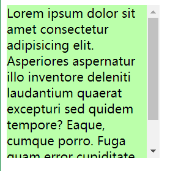

### 边距折叠

垂直外边距的重叠（折叠）：相邻的垂直方向外边距会发生重叠现象

#### 兄弟元素

兄弟元素间的相邻，垂直外边距会取两者之间的较大值（两者都是正值）

特殊情况：

- 如果相邻的外边距一正一负，则取两者的和
- 如果相邻的外边距都是负值，则取两者中绝对值较大的

**示例**

```css
.box1,.box2{ 
    width:200px; 
    height:200px; 
    font-size:100px;
}

.boxl{
    background-color: #bfa;
    /*设置一个下外边距*/
    margin-bottom: 100px;
}

.box2{
    background-color: orange;
    /*设置一个上外边距*/
    margin-top: 100px;
}
```

**效果**


**疑问**

当浏览器缩放比例是100%时，我们使用[FastStone Capture](https://faststone-capture.en.softonic.com/)工具自带的刻度尺测量，发现“兄弟”之间似乎没有我们想象的那么“亲近”

两者的垂直方向间距是125px，我们明明上下元素设置的都是100px啊，这是为什么呢？

> 在网页布局中，通过谷歌浏览器或火狐浏览器预览时，发现我们定义的盒模型width，height，margin，padding 值都是不准确的
>
> 谷歌、火狐浏览器 缩放为80% 时，margin值才正确[2](https://blog.csdn.net/qq_35925558/article/details/117171189#fn2)

**总结**

兄弟元素之间的外边距的重叠，对于开发是有利的，所以我们不需要进行处理


#### 父子元素

父子元素间相邻外边距，子元素会传递给父元素（上外边距）

**示例**

```css
.box3{
width：200px;
    height:200px;
    background-color: #bfa;
}

.box4{
    width: 100px; 
    height: 100px;
    background-color: orange; 
    /* margin-top: 100px; */
}
```

**效果**

不加margin-top  
  
加margin-top  


父子外边距的折叠会影响到页面的布局，必须要进行处理


**处理方式1**

1、我们转换思路，将对子元素的调整转为对父元素的调整

```css
.box3 {
    width: 200px;
    height: 200px;
    background-color: #bfa;
    padding-top: 100px; /* 不调整子元素的margin，而是转而调整父元素的padding */
}

.box4 {
    width: 100px;
    height: 100px;
    background-color: orange;
    /* margin-top: 100px; */
}
```

**效果**

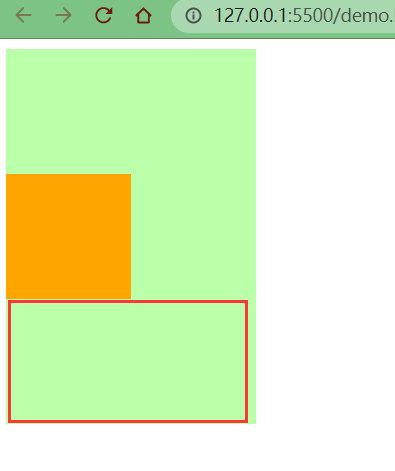

可以看到父元素位置虽然正确了，但是高度却被“撑大了”。我们之前说过，padding属性会影响元素的大小

2、这里我们还需要计算并手动调整下父元素的高度

```css
.box3 {
    width: 200px;
    height: 100px; /* height: 200px; */
    background-color: #bfa;
    padding-top: 100px; 
}

.box4 {
    width: 100px;
    height: 100px;
    background-color: orange;
}
```

**效果**


**处理方式2**

1、我们仍然保留子元素的`margin-top`属性，但是给父元素加一个上边框

```css
.box3 {
    width: 200px;
    height: 200px;
    background-color: #bfa;
    border-top: 1px rebeccapurple solid; /* 在父元素上加一个border-top（上边框） */
}

.box4 {
    width: 100px;
    height: 100px;
    background-color: orange;
    margin-top: 100px; /* 不删除，保留 */
}
```

**效果**


2、但是因为加了1px的边框，所以父元素盒子的高度也增加了1px。那我们就需要手动调整父元素的高度，同时让边框颜色与父元素盒子颜色保持一致

```css
.box3 {
    width: 200px;
    height: 199px; /* height: 200px; */
    background-color: #bfa;
    border-top: 1px #bfa solid; 
}

.box4 {
    width: 100px;
    height: 100px;
    background-color: orange;
    margin-top: 100px;
}
```


但是我们没有发现一个问题不难发现一个问题，子元素也往下移动了1px的距离

因为父元素高度少了1px，而子元素的margin-top是从边框下面开始算的

所以，凭借大家朴素的情感，哪个应该怎么判？ 应该怎么改？


改法也很简单，margin-top减去一个像素即可

```css
.box3 {
    width: 200px;
    height: 199px;
    background-color: #bfa;
    border-top: 1px #bfa solid; 
}

.box4 {
    width: 100px;
    height: 100px;
    background-color: orange;
    margin-top: 99px; /* margin-top: 100px; */
}
```

**效果**


同时，我们用刻度尺测量，父子元素底部是在一条水平线上的


### 脱离文档流

上述示例2中，使用了border属性，就让子元素的外边距不去传递给父元素了，这是为什么呢？

> margin (子元素远离父元素边框)[3](https://blog.csdn.net/qq_35925558/article/details/117171189#fn3)
>
> 如果父盒子没有设置border框着，那么他的子元素无法利用margin-top 来远离父元素的上边框
>
> 如果使用了margin-top会使子元素和父元素一起往下移
>
> （子想离，父不设置border边框 则离得是流 不是父盒子）


应该是border让元素脱离了文档流（margin塌陷）


好吧好吧，至于什么是margin塌陷，我也是问了度娘，有兴趣的可以自行百度，这里就不再赘述了


## 7\. 行内元素的盒模型

- 行内元素不支持设置宽度和高度
  
    ```css
    .s1 {
        /* 行内元素设置了宽高也没用，不会生效 */
        width: 100px;
        height: 100px;
        background-color: yellow;
    }
    ```
    
    
    
- 行内元素可以设置`padding`，但是垂直方向`padding`不会影响页面的布局
  
    ```css
    .s1 {
        /* 下方的div元素并没有因span设置了padding属性，而受到位置上的影响 */
        padding: 100px;
        background-color: yellow;
    }
    
    .box1 {
        width: 200px;
        height: 200px;
        background-color: #bfa;
    }
    ```
    
    
    
- 行内元素可以设置`border`，垂直方向的`border`不会影响页面的布局
  
    ```css
    .s1 {
        border: 10px orange solid;
        background-color: yellow;
    }
    
    .box1 {
        width: 200px;
        height: 200px;
        background-color: #bfa;
    }
    ```
    
    
    
- 行内元素可以设置`margin`，垂直方向的`margin`不会影响页面的布局
  
    ```css
    .s1 {
        margin: 100px;
        background-color: yellow;
    }
    
    .box1 {
        width: 200px;
        height: 200px;
        background-color: #bfa;
    }
    ```
    
    
    

如果我就是想要行内元素对页面布局产生影响呢？


那就拉出去枪毙了！ 那也是有办法的！

`display`用来设置元素显示的类型

- `inline`将元素设置为行内元素
  
- `block`将元素设置为块元素
  
    ```css
    .s1 {
        margin: 100px;
        background-color: yellow;
        /* 将行内元素设置为块元素 */
        display: block; 
    }
    ```
    
    
    
- `inline-block` 将元素设置为行内块元素行内块，既可以设置宽度和高度又不会独占一行
  
    ```css
    .s1 {
        margin: 100px;
        background-color: yellow;
        /* 将行内元素设置为行内块元素，兼顾行内元素和块元素的特点 */
        display: inline-block; 
    }
    ```
    
    
    
- `table`将元素设置为一个表格
  
- `none`元素不在页面中显示
  
    ```css
    .s1 {
        margin: 100px;
        background-color: yellow;
        /* 将行内元素设置为none：不显示 */
        display: none; 
    }
    ```
    
    
    

不显示是不显示了，但是原来属于s1的位置也没了


`visibility`用来设置元素的显示状态

- `visible`默认值，元素在页面中正常显示
  
- `hidden`元素在页面中隐藏不显示，但是依然占据页面的位置
  
    ```css
    .s1 {
        margin: 100px;
        background-color: yellow;
        display: block;
        visibility: hidden; 
    }
    ```
    
    
    


## 8\. 浏览器的默认样式

通常情况，浏览器都会为元素设置一些默认样式

默认样式的存在会影响到页面的布局，通常情况下编写网页时必须要去除浏览器的默认样式（PC端的页面）

> 在当今网页设计/开发实践中，使用CSS来为语义化的(X)HTML标记添加样式风格是重要的关键。
>
> 在设计师们的梦想中都存在着这样的一个完美世界：所有的浏览器都能够理解和适用多有CSS规则，并且呈现相同的视觉效果(没有兼容性问题)。
>
> 但是，我们并没有生活在这个完美的世界，现实中发生的失窃却总是恰恰相反，很多CSS样式在不同的浏览器中有着不同的解释和呈现。
>
> 当今流行的浏览器(如:Firefox、Opera、Internet Explorer、Chrome、Safari等等)中，有一些都是以自己的方式去理解CSS规范，这就会导致有的浏览器对CSS的解释与设计师的CSS定义初衷相冲突，使得网页的样子在某些浏览器下能正确按照设计师的想法显示
>
> 而且有些浏览器却并没有按照设计师想要的样子显示出来，这就导致浏览器的兼容性问题。
>
> 更糟的是，有的浏览器完全无视CSS的一些声明和属性。[4](https://blog.csdn.net/qq_35925558/article/details/117171189#fn4)

我们可以尝试编写css样式，以去除浏览器的默认样式

**示例**

html代码

```html
<div class="box1"></div>
<p>我是一个段落</p>
<p>我是一个段落</p>
<p>我是一个段落</p>
<ul>
<1i>列表项1</1i>
<1i>列表项2</1i>
<1i>列表项3</1i>
</ul>
```

css代码

```css
.box1{
    width: 100px;
    height: 100px; 
    border: 1px solid black;
}
```

**效果**

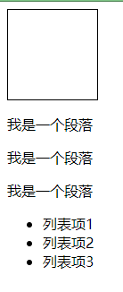

**F12看盒子默认样式**

1. 
   
2. 段落之间有16px的默认行距
   
    
    
3. 列表外有16px的上下外边距和40px的左内边距，而且每项列表前有一个小黑点
   
    
    

**去除默认样式**

1. 去除与浏览器的边缘间距
   
    ```css
    body {
        margin: 0;
    }
    ```
    
    
    
2. 去除段落之间行距
   
    ```css
    p {
        margin: 0;
    } 
    ```
    
    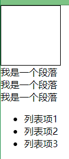
    
3. 去除列表的上下外边距和左内边距
   
    ```css
    ul {
        margin: 0;
        padding: 0;
    }
    ```
    
    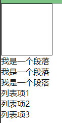
    
    我们只是去除了列表的内外边距，但是发现前面的黑点也消失了，真的如此吗？
    
    
    
    我们先给`ul`加上一个`margin-left`
    
    ```css
    ul {
        margin: 0;
        padding: 0;
        margin-left: 16px;
    }
    ```
    
    
    
    看来黑点并没有自动清除，而只是“缩进”了浏览器的左侧
    
4. 去除列表前的黑点
   
    ```css
    ul {
        margin: 0;
        padding: 0;
        margin-left: 16px;
        list-style: none;
    }
    ```
    
    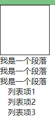
    
    再将之前加的16px的`margin-left`样式去除
    
    ```css
    ul {
        margin: 0;
        padding: 0;
        /* margin-left: 16px; */
        list-style: none;
    }
    ```
    
    
    
    到这里似乎就大功告成了，但是我们会发现写法似乎 很完美 有点麻烦
    
    ```css
    body {
        margin: 0;
    }
    
    p {
        margin: 0;
    }
    
    ul {
        margin: 0;
        padding: 0;
        list-style: none;
    }
    ```
    
    有没有简化空间了呢？
    
    答案是肯定的，我们前面介绍过通配选择器的概念，可以直接简化成一个
    
5. 简化写法
   
    ```css
    * {
        margin: 0;
        padding: 0;
        list-style: none;
    }
    ```
    
    效果是一样的
    
    
    

去除浏览器的默认样式的需求是非常普遍的，我们难道每次都需要手动去除浏览器的默认样式？

这样岂不是很麻烦，难道官方就没有想到解决方案吗？

答案也是肯定的，有！


> 正因为上述冲突和问题依然存在于这个”不完美的世界”，所以一些设计师想到了一种避免浏览器兼容性问题的方法，那就是CSS [Reset](https://so.csdn.net/so/search?q=Reset&spm=1001.2101.3001.7020)
>
> 什么是CSS Reset？
>
> 我们可以把它叫做CSS重设，也有人叫做CSS复位、默认CSS、CSS重置等。
>
> CSS重设就是先定义好一些CSS样式，来让所有浏览器都按照同样的规则解释CSS，这样就能避免发生这种问题。[4](https://blog.csdn.net/qq_35925558/article/details/117171189#fn4)

下方两种css样式，我们引入其中一个即可

### reset样式

官方地址：[reset.css](https://meyerweb.com/eric/tools/css/reset/)

```html
<link rel="stylesheet" href="assets/reset.css">
```

**效果**

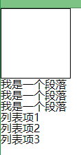

我们可以看到reset.css的作用就是将各个内外边距置为0，将一些样式置为none

```css
/* http://meyerweb.com/eric/tools/css/reset/ 
   v2.0 | 20110126
   License: none (public domain)
*/

html, body, div, span, applet, object, iframe,
h1, h2, h3, h4, h5, h6, p, blockquote, pre,
a, abbr, acronym, address, big, cite, code,
del, dfn, em, img, ins, kbd, q, s, samp,
small, strike, strong, sub, sup, tt, var,
b, u, i, center,
dl, dt, dd, ol, ul, li,
fieldset, form, label, legend,
table, caption, tbody, tfoot, thead, tr, th, td,
article, aside, canvas, details, embed, 
figure, figcaption, footer, header, hgroup, 
menu, nav, output, ruby, section, summary,
time, mark, audio, video {
	margin: 0;
	padding: 0;
	border: 0;
	font-size: 100%;
	font: inherit;
	vertical-align: baseline;
}
/* HTML5 display-role reset for older browsers */
article, aside, details, figcaption, figure, 
footer, header, hgroup, menu, nav, section {
	display: block;
}
body {
	line-height: 1;
}
ol, ul {
	list-style: none;
}
blockquote, q {
	quotes: none;
}
blockquote:before, blockquote:after,
q:before, q:after {
	content: '';
	content: none;
}
table {
	border-collapse: collapse;
	border-spacing: 0;
}
```

### normalize样式

官方地址：[normalize.css](https://necolas.github.io/normalize.css/8.0.1/normalize.css)

```css
<link rel="stylesheet" href="assets/normalize.css">
```

**效果**


这里并没有去除所有样式，因为normalize的作用不同于reset。reset是将所有默认样式去除，而normalize是将所有默认样式统一，这样在不同的浏览器里显示效果也是统一的

至于文件内容就不再这里赘述了，感兴趣的可以仔细研究

* * *

**参考资料**

* * *

1. CSS盒子模型：[https://baike.baidu.com/item/CSS盒子模型/9814562?fr=aladdin](https://baike.baidu.com/item/CSS%E7%9B%92%E5%AD%90%E6%A8%A1%E5%9E%8B/9814562?fr=aladdin) [↩︎](https://blog.csdn.net/qq_35925558/article/details/117171189#fnref1)
   
2. 谷歌、火狐浏览器 缩放为80% 时，margin值才正确：[https://www.cnblogs.com/taohuaya/p/7642742.html](https://www.cnblogs.com/taohuaya/p/7642742.html) [↩︎](https://blog.csdn.net/qq_35925558/article/details/117171189#fnref2)
   
3. margin（子元素远离父元素边框）：[https://www.cnblogs.com/FlFtFw/p/9627026.html](https://www.cnblogs.com/FlFtFw/p/9627026.html) [↩︎](https://blog.csdn.net/qq_35925558/article/details/117171189#fnref3)
   
4. 目前比较全的CSS重设(reset)方法总结：[https://www.cnblogs.com/hnyei/archive/2011/10/04/2198779.html](https://www.cnblogs.com/hnyei/archive/2011/10/04/2198779.html) [↩︎](https://blog.csdn.net/qq_35925558/article/details/117171189#fnref4) [↩︎](https://blog.csdn.net/qq_35925558/article/details/117171189#fnref4:1)

# 盒模型补充

## 1\. 盒子大小

默认情况下，盒子可见框的大小由内容区、内边距和边框共同决定

`box-sizing`用来设置盒子尺寸的计算方式（设置width和height的作用）

```css
.box {
    width: 200px;
    height: 200px;
    background-color: yellow;
    border: 10px red solid;
    /* box-sizing: content-box; */
    box-sizing: border-box;
}
```

可选值：

- `content-box`默认值，宽度和高度用来设置内容区的大小
  
    
    
- `border-box` 宽度和高度用来设置整个盒子可见框的大小
  
    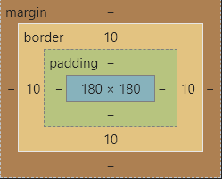
    

`width`和`height`指的是内容区、内边距和边框的总大小

## 2\. 轮廓

`outline`用来设置元素的轮廓线，用法和`border`一模一样

轮廓和边框不同点是，轮廓不会影响到可见框的大小

**边框**

```css
.box {
    width: 200px;
    height: 200px;
    background-color: yellow;
    border: 10px red solid;
}
```

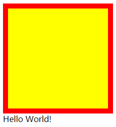

**轮廓**

```css
.box {
    width: 200px;
    height: 200px;
    background-color: yellow;
    outline: 10px red solid;
}
```

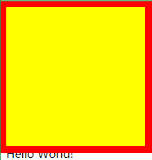

可以很明显看到`outline`与`border`的区别

我们一般不会直接这么设置轮廓，而是下面这种场景

```css
.box:hover {
    outline: 10px red solid;
}
```


从上面的动态图也可以很清晰地看出，`outline`属性并没有改变盒子的布局

## 3\. 阴影

> `box-shadow`属性用于在一个元素的框架周围添加阴影效果
>
> 你可以设置多个由逗号分隔的效果
>
> 一个盒状阴影由相对于元素的X和Y的偏移量、模糊和扩散半径以及颜色来描述

`box-shadow`用来设置元素的阴影效果，阴影不会影响页面布局

```css
.box {
    width: 200px;
    height: 200px;
    background-color: yellow;
    box-shadow: 10px 10px orange;
}
```


```css
box-shadow: 10px 10px 5px orange;
```

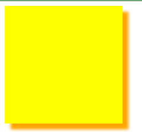

```css
box-shadow: 10px 10px 5px rgba(0, 0, 0, .2);
```

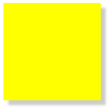

- 第一个值-水平偏移量：设置阴影的水平位置
    - 正值向右移动
    - 负值向左移动
- 第二个值-垂直偏移量：设置阴影的垂直位置
    - 正值向下移动
    - 负值向上移动
- 第三个值-阴影的模糊半径
- 第四个值-阴影的颜色

## 4\. 圆角

> `border-radius`属性使一个元素的外边框边缘的角变圆
>
> 你可以设置一个半径来做圆角，或者设置两个半径来做椭圆角

`border-radius` 用来设置圆角，圆角设置的是圆的半径大小

- `border-top-left-radius`
- `border-top-right-radius`
- `border-bottom-left-radius`
- `border-bottom-right-radius`

```css
border-radius: 20px;
```


```css
border-top-right-radius: 50px 100px;
```

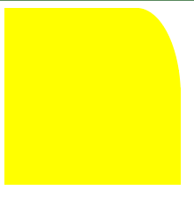

`border-radius` 可以分别指定四个角的圆角

- 四个值：`左上` `右上` `右下` `左下`
- 三个值：`左上` `右上/左下` `右下`
- 两个值：`左上/右下` `右上/左下`
- 一个值：`左上/右上/右下/左下`

这里同样不需要死记硬背，只要记住遵循顺时针方向和矩形中心点对称原则

与`border`不同的是，`border`是从`上`开始顺时针设置，而圆角是从`左上`开始

### 圆

原理很简单，就是绘制正方形，并将四个圆角半径设置为正方形的一半

```css
.box {
    width: 200px;
    height: 200px;
    background-color: yellow;
    border-radius: 50%;
}
```


### 椭圆

只需要对上述样式对一点点的改动，设置`width`和`height`属性不相等即可

```css
.box {
    width: 300px;
    height: 200px;
    background-color: yellow;
    border-radius: 50%;
}
```

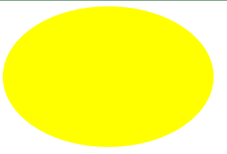


# 浮动

## 1\. 浮动的简介

通过浮动可以使一个元素向其父元素的左侧或右侧移动

使用`float`属性来设置于元素的浮动

- `none` 默认值，元素不浮动
- `left` 元素向左浮动
- `right` 元素向右浮动

注意

- 元素设置浮动以后，水平布局的等式便不需要强制成立
- 元素设置浮动以后，会完全从文档流中脱离，不再占用文档流的位置，所以元素下边的还在文档流中的元素会自动向上移动

## 2\. 浮动的特点

1. 浮动元素会完全脱离文档流，不再占据文档流中的位置
   
2. 设置浮动以后，元素会向父元素的左侧或右侧移动
   
3. 浮动元素默认不会从父元素中移出
   
    ```html
    <style>
        .box1 {
            width: 100px;
            height: 100px;
            background-color: orange;
            float: left;
        }
    
        .box2 {
            width: 200px;
            height: 200px;
            background-color: red;
        }
    </style>
    
    <div class="box1"></div>
    <div class="box2"></div>
    ```
    
    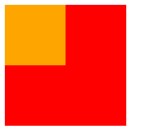
    
4. 浮动元素向左或向右移动时，不会超过前边的浮动元素（先来后到的顺序）
   
    ```html
    <style>
        .box1 {
            width: 200px;
            height: 200px;
            background-color: orange;
            float: left;
        }
    
        .box2 {
            width: 200px;
            height: 200px;
            background-color: red;
            float: left;
        }
    
        .box3 {
            width: 200px;
            height: 200px;
            background-color: yellow;
            float: left;
        }
    </style>
    
    <div class="box1"></div>
    <div class="box2"></div>
    <div class="box3"></div>
    ```
    
    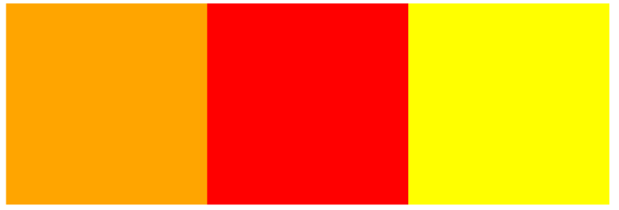
    
5. 浮动元素不会超过上边的浮动的兄弟元素，最多就是和它一样高
   
    ```html
    <style>
        .box1 {
            width: 300px;
            height: 300px;
            background-color: orange;
            float: left;
        }
    
        .box2 {
            width: 400px;
            height: 400px;
            background-color: red;
            float: left;
        }
    
        .box3 {
            width: 300px;
            height: 300px;
            background-color: yellow;
            float: right;
        }
    </style>
    
    <div class="box1"></div>
    <div class="box2"></div>
    <div class="box3"></div>
    ```
    
    
    
6. 如果浮动元素的上边是一个没有浮动的块元素，则浮动元素无法上移
   
    ```html
    <style>
        .box1 {
            width: 200px;
            height: 200px;
            background-color: orange;
        }
    
        .box2 {
            width: 200px;
            height: 200px;
            background-color: red;
            float: left;
        }
    </style>
    
    <div class="box1"></div>
    <div class="box2"></div>
    ```
    
    
    
7. 浮动元素不会盖住文字，文字会自动环绕在浮动元素的周围，所以我们可以利用浮动来设置文字环绕图片的效果
   
    
    

简单总结：

- 浮动目前来讲它的主要作用就是让页面中的元素可以水平排列，通过浮动可以制作一些水平方向的布局
- 元素设置浮动以后，将会从文档流中脱离，从文档流中脱离后，元素的一些特点也会发生变化

## 3\. 脱离文档流的特点

块元素：

- 块元素不再独占页面的一行
- 脱离文档流以后，块元素的宽度和高度默认都被内容撑开

```html
<style>
    .box1 {
        background-color: orange;
        /* float: left; */
    }
</style>

<div class="box1">hello</div>
```


行内元素：

- 行内元素脱离文档流以后会，特点和块元素一样

```html
<style>
    span {
        width: 200px;
        height: 200px;
        background-color: orange;
        float: left;
    }
</style>

<span>I am a Span</span>
```


脱离文档流之后的特点很像行内块元素，不过存在一些差异

```html
<style>
    span {
        width: 200px;
        height: 200px;
        background-color: orange;
        /* display: inline-block; */
        float: left;
    }
</style>

<span>I am a Span</span>
<span>I am a Span</span>
```

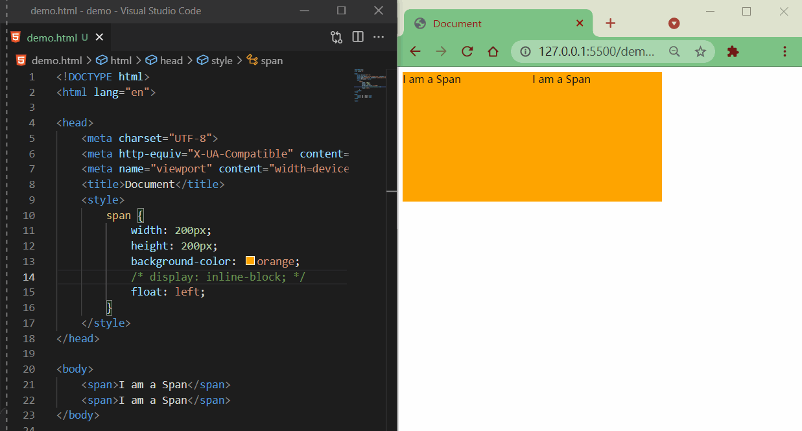

## 4\. 简单布局

**整体样式**

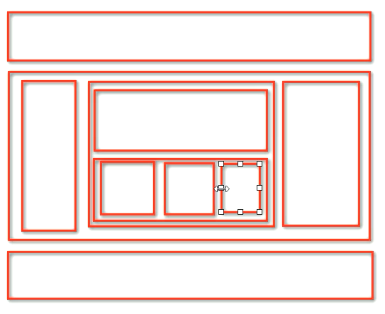

**目的**

1. 熟悉布局（块元素、浮动）
2. 公共css部分复用
3. 复习语义标签

**代码**

html代码

```html
<!-- 页眉 -->
<header></header>
<!-- 主体 -->
<main>
    <!-- 左边栏 -->
    <nav></nav>
    <!-- 中心 -->
    <article>
        <!-- 内容上 -->
        <div class="top"></div>
        <!-- 内容下 -->
        <div class="bottom">
            <!-- 内容左 -->
            <div class="left"></div>
            <!-- 内容中 -->
            <div class="middle"></div>
            <!-- 内容右 -->
            <div class="right"></div>
        </div>
    </article>
    <!-- 右边栏 -->
    <aside></aside>
</main>
<!-- 页脚 -->
<footer></footer>
```

css代码

```css
/* 公共部分 */
header,
main,
footer {
    width: 1000px;
    margin: 10px auto;
}

main nav,
main article,
main aside {
    float: left;
    /* 虽然设置浮动了，但整体大小是被内容撑开的，所以设置一个高度 */
    height: 100%;
}

.bottom .left,
.bottom .middle,
.bottom .right {
    float: left;
    width: 220px;
    height: 100%;
}

/* ==========整体布局-上========== */
header {
    height: 100px;
    background-color: silver;
}

/* ==========整体布局-中========== */
main {
    height: 400px;
    background-color: #bfa;
}


/* ------左边栏------ */
main nav {
    width: 150px;
    background-color: red;
}

/* ------中心------ */
main article {
    width: 680px;
    background-color: green;
    margin: 0 10px;
}

/* ---上--- */
article .top {
    height: 190px;
    background-color: yellow;
    margin-bottom: 10px;
}

/* ---下--- */
article .bottom {
    height: 200px;
    background-color: orange;
}


/* 左 */
.bottom .left {
    background-color: lightblue;
}

/* 中 */
.bottom .middle {
    background-color: gray;
    margin: 0 10px;
}

/* 右 */
.bottom .right {
    background-color: wheat;
}

/* ------右边栏------ */
main aside {
    width: 150px;
    background-color: blue;
}

/* ==========整体布局-下========== */
footer {
    height: 100px;
    background-color: tomato;
}
```

**效果**

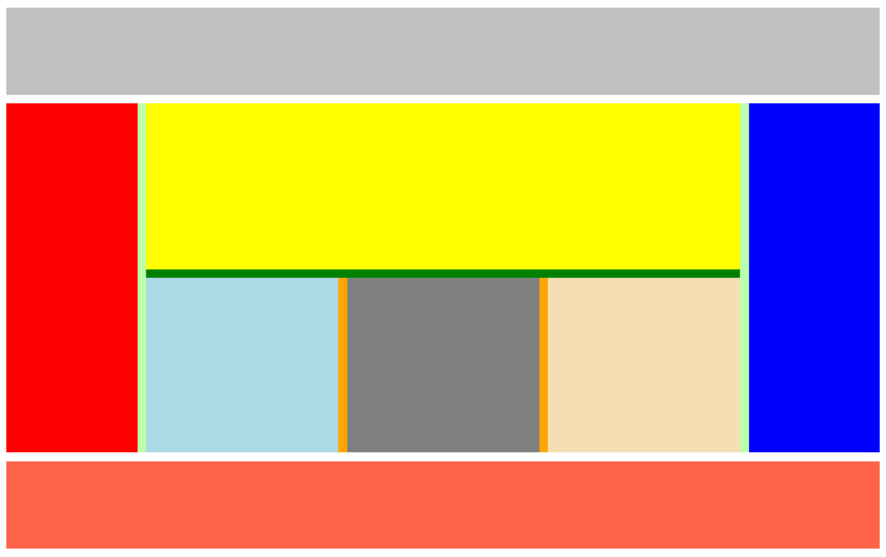

## 5\. 练习：w3school导航条

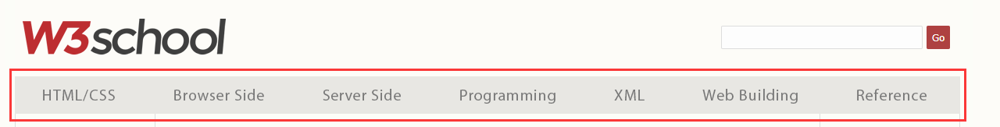

去除默认样式，引入reset.css

```html
<link rel="stylesheet" href="css/reset.css">
```

css样式

```css
/* 去除默认样式 */
a {
    text-decoration: none;
}

/* ul整体布局 */
.menu {
    width: 1211px;
    height: 48px;
    background-color: #E8E7E3;
    margin: 100px auto;
}

/* li整体布局 */
.nav {
    /* 浮动li元素 */
    float: left;
    width: 173px;
    line-height: 48px;
}

.nav a {
    /* 注意点：升级为块元素，使之继承父类宽高
    否则鼠标悬浮在li元素上时，鼠标“箭头”不会进入a元素变成“小手” */
    display: block;
    /* 内容水平居中 */
    text-align: center;
    /* 字体样式 */
    font-size: 14px;
    color: #777777;
    font-family: Verdana, Arial, '微软雅黑', '宋体';
}

/* 超链接悬浮效果 */
.nav a:hover {
    background-color: #3F3F3F;
    color: #E8E7E3;
}
```

html代码

```html
<ul class="menu">
    <li class="nav"><a href="#">HTML/CSS</a></li>
    <li class="nav"><a href="#">Browser Side</a></li>
    <li class="nav"><a href="#">Server Side</a></li>
    <li class="nav"><a href="#">Programming</a></li>
    <li class="nav"><a href="#">XML</a></li>
    <li class="nav"><a href="#">Web Building</a></li>
    <li class="nav"><a href="#">Reference</a></li>
</ul>
```

效果

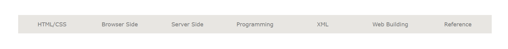
>>>>>>> 199378b451086eb9cab56a1f8011b1341cbf3f7e


# 高度塌陷与BFC

## 1\. 高度塌陷

在浮动布局中，父元素的高度默认是被子元素撑开的

当子元素浮动后，其会完全脱离文档流，子元素从文档流中脱离将会无法撑起父元素的高度，导致父元素的高度丢失

父元素高度丢失以后，其下的元素会自动上移，导致页面的布局混乱


所以高度塌陷是浮动布局中比较常见的一个问题，这个问题我们必须要进行处理！


别急，我们接着往下看

## 2\. BFC

BFC（Block Formatting Context）块级格式化环境

- BFC是一个CSS中的一个隐含的属性，可以为一个元素开启BFC
- 开启BFC该元素会变成一个独立的布局区域

元素开启BFC后的特点：

- 不会被浮动元素覆盖
- 父子元素外边距不会重叠
- 可以包含浮动的元素


可以通过一些特殊方式来开启元素的BFC：

- 设置为浮动（不推荐）：很明显下方元素被覆盖了，总不能让所有元素都浮动吧
  
    
    
- 设置为行内块元素（不推荐）：不再独占一行，宽度变了，同时与下方元素产生了一点空隙
  
    
    
- 设置`overflow`为非`visible`值：既没有覆盖元素，也保持了独占一方的特性（保持了宽度），与下方元素也保持了最初的间隙
  
    常用的方式为元素设置`overflow:hidden`（`overflow:auto`也是ok的） 开启其BFC， 以使其可以包含浮动元素
    
    `overflow:scroll` 会有滚动条，可能并不需要的，所以不太推荐
    
    
    
    不过，这种方式也存在一定问题，如下，`overflow`并没有完全清除div2布局上受到的影响
    
    
    

**总结**

- 可以通过变成浮动元素，来防止自身被浮动元素覆盖（有点“以毒攻毒”那味了）
- 可以设置行内块，来防止自身及其他元素被浮动元素覆盖（如果说浮动是“独善其身”，那行内块就有点“兼济天下”的意思）
- 可以设置`overflow`属性，包含浮动元素（既“独善其身”，又“兼济天下”，但仍有缺陷）


我们可以打开`Zeal`手册（《02-前端开发准备》有介绍），查看关于BFC的说明文档


打开`Block formatting context`模块后，可以看到有很多开启BFC的方式


我这里大概翻译了一下，并整理了一份表格，应该看起来更直观一点（有些概念因为还没有学习，翻译和理解有误的地方还望谅解）

<div class="table-box"><table><thead><tr><th>元素或属性</th><th>说明</th></tr></thead><tbody><tr><td><code>&lt;html&gt;</code></td><td>文档根元素</td></tr><tr><td><mark><code>float: left</code></mark><br><mark><code>float: right</code></mark></td><td>浮动元素（<code>float</code>不为<code>none</code>）</td></tr><tr><td><mark><code>position: absolut</code></mark><br><mark><code>position: fixed</code></mark></td><td>绝对定位元素</td></tr><tr><td><mark><code>display: inline-block</code></mark></td><td>行内块元素</td></tr><tr><td><code>display: table-cell</code></td><td>表格单元，默认值</td></tr><tr><td><code>display: table-caption</code></td><td>表格标题，默认值</td></tr><tr><td><code>display: table</code><br><code>display: table-row</code><br><code>display: table-row-group</code><br><code>display: table-header-group</code><br><code>display: table-footer-group</code><br><code>display: inline-table</code></td><td>匿名的表格单元，分别是HTML表格、表行、表体、表头和表脚的默认值</td></tr><tr><td><mark><code>overflow: hidden</code></mark><br><mark><code>overflow:&nbsp;scroll</code></mark><br><mark><code>overflow:&nbsp;auto</code></mark></td><td><code>overflow</code>不为<code>visible</code>和<code>clip</code>的块元素</td></tr><tr><td><code>display: flow-root</code></td><td></td></tr><tr><td><code>contain: layout</code><br><code>contain: content</code><br><code>contain: paint</code></td><td></td></tr><tr><td><code>display: flex</code><br><code>display: inline-flex</code>的直接子元素</td><td>Flex项，如果它们本身既不是<code>flex</code>，也不是<code>grid</code>或<code>table</code>容器</td></tr><tr><td><code>display: grid</code><br><code>display: inline-grid</code>的直接子元素</td><td>Grid项，如果它们本身既不是<code>flex</code>，也不是<code>grid</code>或<code>table</code>容器</td></tr><tr><td><code>column-count</code>不为<code>auto</code><br><code>column-width</code>不为<code>auto</code></td><td>Multicol容器，包含<code>column-count: 1</code></td></tr><tr><td><code>column-span: all</code></td><td>应该总是创建一个新的格式化上下文，即使<code>column-span: all</code>元素不在multicol容器中</td></tr></tbody></table></div>


但是，注意不管哪种方式，多多少少都会有些隐患、缺陷或者说“副作用”


## 3\. clear

我们这里设计三个兄弟元素，对前两个元素进行`float`的浮动属性设置，看下效果


由于box1的浮动，导致box3位置上移也就是box3受到了box1浮动的影响，位置发生了改变（注意，这里文字并没有被覆盖，《09-浮动》一节说过浮动的特点，其中第7点就是“文字环绕”的问题）


如果我们不希望某个元素因为其他元素浮动的影响而改变位置，可以通过`clear`属性来清除浮动元素对当前元素所产生的影响

`clear`作用：清除浮动元素对当前元素所产生的影响（本质是为元素添加一个`margin-top`属性，值由浏览器自动计算）

可选值：

- `left` 清除左侧浮动元素对当前元素的影响
- `right` 清除右侧浮动元素对当前元素的影响
- `both` 清除两侧中影响较大一侧元素的影响（注意，这里不是同时清除两侧的影响）


## 4\. after

我们学习了上面知识后，了解了高度塌陷问题的解决方式，其中主要有

- 通过`overflow: hidden`等可以为元素开启BFC
  
    
    
- 通过`clear: both`等可以清除浮动对元素产生的影响
  
    
    

同时也了解到，这两种方式都有一定的弊端和隐患。那有没有一种更好的方式去解决高度塌陷的问题呢？

答案当然是：有！


我们直接上效果图


**Q1：这里使用了一个伪元素选择器`::after`，那有人会问了，跟在box2下直接定义一个box3有什么区别呢？**

A：我们知道，网页的结构思想是：结构+表现+行为。在box2下直接定义一个box3，属于结构；而使用伪元素选择器，属于表现

而高度塌陷问题属于表现问题，定义box3的目的是为了撑起box1的内容，属于表现，而不是结构，所以在css中定义`::after`更符合网页的编程思想

**Q2：为什么需要使用`display: block`呢？**

A：因为默认情况下，`::after`伪元素是一个行内元素，如果不转为块元素，将仍然撑不起box1的高度


## 5\. clearfix

我们在前面《06-盒模型》一节中说过垂直布局中边距重叠的问题：相邻的垂直方向外边距会发生重叠现象


如上图所示，子元素设置了一个`margin-top`之后，父元素跟随子元素一起进行了移动

即我们之前说的父子元素间相邻外边距，子元素会传递给父元素（上外边距）

聪明的小伙伴已经想到了，用刚才说的伪元素选择器啊


好，我们先来看下效果


貌似是没有任何变化，到底是什么地方不对呢？


我们再来回顾下使用`after`伪元素的心路历程：

- 使用无内容的box3撑起box1 ==》表现代替结构（`::after`代替box3）
- `clear`清除浮动对元素产生的影响（还记得`clear`的原理么？）


其实就是给元素设置了一个`margin-top`属性，不过这个在开发者工具中是看不到的

既然如此，就相当于在box2下面添加一个box3，然后给box3设置一个`margin-top`属性

到此为止，

∵ 相邻的垂直方向外边距 这个条件仍然满足

∴ 会发生重叠现象这个结论也依然成立

具体点就是，父子元素间相邻外边距，子元素会传递给父元素（上外边距），表现为box1和box2同步往下移动

那我们应该怎么做才能解决这个问题？ 凭你们朴素的情感，应该怎么判？ 当然就是让上述条件不满足呗！

怎么能够不满足？当然是让两个元素垂直外边距不相邻啊！

好，多说无益，我们直接上代码看效果！


我们用了`before`伪元素选择器，目的当然是让box1和box2的外边距不相邻，但是好像并没有效果

我们再换成`display: inline-block`属性看看


好像是解决了父元素布局的问题，但是子元素怎么还往下跑了一段距离？ 是谁给的勇气？

因为`inline-block`兼顾行内元素和块元素的特点，既可以设置宽高也不独占一行

在没有设置宽高时，会存在一个默认高度，所以`inline-block`仍然行不通

还有一个属性，`display: table`


Bingo！实现了我们最终想要的效果

**Q1：为什么没有使用clear属性？**

A：不是说了吗？`clear`是为了清除浮动对布局的影响，我们现在没有浮动的元素啊，我们要讨论的也不是浮动的问题

**Q2：display不是还有一个`none`属性么，为什么不用呢？**

A：`none`属性是不占据位置，但是也不能让元素相邻的外边距分离啊

**Q3：为什么`table`值就可以呢？**

A：这个问题问的非常好，算是问到点上了！我们上面在讲开启BFC的一些方法的时候，也提到了该属性。而且，应该牢记的是，元素开启BFC后的其中一个特点就是 父子元素外边距不会重叠。当然，这里也需要合理选择伪元素选择器，使其外边距不相邻才行

另外，总结一下：

- 高度塌陷问题，一般用`::after`
- 外边距重叠问题，一般用`::before`

不知道到这里，大家能不能想明白这两件事情


那么问题来了，有没有一个两全其美的办法，既可以解决高度塌陷，又可以解决外边距重叠呢？


当然有！`clearfix` 这个样式就可以同时解决高度塌陷和外边距重叠的问题

当你在遇到这些问题时，直接使用`clearfix`这个类即可，他就可以帮你轻松搞定css中的两大难题

```css
.clearfix::before,
.clearfix::after{
    content: '';
    display: table;
    clear: both;
}
```

其中`.clearfix::before`是为了解决外边距重叠问题

```css
.clearfix::before{
    content: '';
    display: table;
}
```

`.clearfix::after`是为了解决高度塌陷问题

```css
.clearfix::after{
    content: '';
    display: table;
    clear: both;
}
```

两者合在一起，就可以完美地解决高度塌陷和外边距重叠这两大“世纪难题”了


# 定位的简介

**需求分析**


按照我们之前所学知识，可以怎么实现呢？

应该来说不难，很容易实现

```css
.box2 {
    width: 200px;
    height: 200px;
    background-color: yellow;
    /* 左外边距、上外边距 */
    margin-left: 200px;
    margin-top: -200px;
}

.box3 {
    width: 200px;
    height: 200px;
    background-color: orange;
    /* 上外边距 */
    margin-top: 200px;
}
```

我们分别给box2和box3添加了外边距之后，就可以达到需求效果


当然也可以使用浮动来解决上述问题，但稍微麻烦一点

不管怎样，问题也是显而易见。我们实际开发中，页面上的元素可能很多，这样改必然是 牵一发而动全身

那么仅仅靠我们之前学习的布局知识，不足以轻松应对这种场景

那么就势必需要一个方便我们处理这种场景的办法，它就是定位


呸！不是！糟老头子

**定位（position）**

定位是一种更加高级的布局手段

通过定位可以将元素摆放到页面的任意位置

使用`position`属性来设置定位

| 可选值     | 含义                             |
| ---------- | -------------------------------- |
| `static`   | 不开启定位，元素是静止的，默认值 |
| `relative` | 开启元素的相对定位               |
| `absolute` | 开启元素的绝对定位               |
| `fixed`    | 开启元素的固定定位               |
| `sticky`   | 开启元素的粘滞定位               |


## 1. 相对定位


当元素的position属性值设置为`relative`时，则开启了元素的相对定位

### 偏移量（offset）

当元素开启相对定位以后，可以通过偏移量来设置元素的位置

<div class="table-box"><table><thead><tr><th align="left">offset属性</th><th align="left">含义</th></tr></thead><tbody><tr><td align="left"><code>top</code></td><td align="left">定位元素和定位位置的上边距离</td></tr><tr><td align="left"><code>bottom</code></td><td align="left">定位元素和定位位置的下边距离</td></tr><tr><td align="left"><code>left</code></td><td align="left">定位元素和定位位置的左侧距离</td></tr><tr><td align="left"><code>right</code></td><td align="left">定位元素和定位位置的右侧距离</td></tr></tbody></table></div>

定位元素垂直方向的位置由`top`和`bottom`两个属性控制，通常情况下只会使用其中之一

- `top`值越大，定位元素越靠下
- `bottom`值越大，定位元素靠上

定位元素水平方向的位置由`left`和`right`两个属性控制，通常情况下只会使用其中之一

- `left`越大，定位元素越靠右
- `right`越大，定位元素越靠左

ok，介绍完相对布局，我们的需求是不是变得so easy！


```css
.box2 {
    width: 200px;
    height: 200px;
    background-color: yellow;
    /* 开启相对定位 */
    position: relative;
    top: -200px;
    left: 200px;
}
```

我们给box2设置相对定位，就得到了我们想要的页面效果


可以看出，使用了相对定位后，只会移动自身的布局位置，而不会对已存在的其他元素产生任何影响

现在我们所举的例子不是很明显，但当页面布局比较复杂，特别是页面元素很多的时候，其优越性就可以大大体现出来


### 相对定位的特点

1. 当元素开启相对定位以后，如果不设置偏移量元素，则元素不会发生任何变化（这里注意，不仅仅是位置）
   
2. 相对定位是参照于元素在文档流中的位置进行定位的（可以理解为相对于自身原始位置）
   
3. 相对定位会提升元素的层级（表现为可以覆盖其他元素）
   
4. 相对定位不会改变元素的性质：块还是块，行内还是行内
   


**Q1：如果给上述三个div都设置相对定位，那么它们的层级关系会是什么样的呢？或者说谁会被谁覆盖呢？**

A：百闻不如一见，光说不练假把式，我们直接进行测试验证


可以看到覆盖关系是：box3 >> box2 >> box1

我们再稍微调整下box3和box2的前后位置


会发现覆盖关系变成了：box2 >> box3 >> box1

可以大概猜测：在页面文档流中，越靠下的元素开启相对定位后，其层级越高 （这里也只是我个人的揣测，待后续学习中验证）（在后续学习中已得到验证：没有设置层级或层级`z-index`设置相同值时，优先显示靠下的元素）

**Q2：相对定位的第三个特点相对定位会提升元素的层级，是不是就类似于浮动一样脱离了文档流？**

A：我们可以对比下，浮动和相对定位的区别

- 参考系不同：浮动的参考系是其父元素；相对定位是相对于自身
- 可移动方向不同：浮动只能左右移动；相对定位是上下左右移动
- 影响不同：浮动会影响页面布局（包括下方元素位置影响和高度塌陷问题）；相对定位不对影响页面布局
- 性质不同：浮动会改变元素的性质（不再独占一行，其宽高都会被内容撑开）；相对定位不会改变元素的性质
- 文字环绕：浮动不会覆盖文字；相对定位可以覆盖文字（这个可以自行验证，不再赘述）

当然，浮动和相对定位也有其相似之处

- 浮动和相对定位都是移动位置（貌似是废话）
- 浮动和相对定位不会从父元素中移出

可以看出，浮动和相对定位的区别是更多的

最后回答一点：浮动脱离了文档流，不再占据页面位置；相对定位仍然占据页面位置（所以怎么能够叫 脱离文档流 呢？）


**Q3：相对定位的第四个特点相对定位不会改变元素的性质：块还是块，行内还是行内，但是上述例子中元素开启相对定位后好像就不再独占一行了，这个怎么理解？**

A：相比于浮动元素的特点，相对定位不会改变元素的性质其实是一个相对不容易理解的问题。但其实也不难，可以把相对定位认为是元素的灵魂出窍。其位置发生改变以后，布局并没有产生影响，因为它的肉体（结构）仍然占据着原来的那个位置。只是其灵魂（内容）发生了移动。


**Q4：相对定位的第四个特点中块还是块，行内还是行内，意味着行内元素也可以使用相对定位是吗？**

A：眼见为实，耳听为虚，直接看示例效果


善于思考是好事，但也别忘了自动动手，丰衣足食。自己实操一遍，胜过千言万语


## 2\. [绝对定位](https://so.csdn.net/so/search?q=%E7%BB%9D%E5%AF%B9%E5%AE%9A%E4%BD%8D&spm=1001.2101.3001.7020)


当元素的`position`属性值设置为`absolute`时，则开启了元素的绝对定位

### 绝对定位的特点

1. 开启绝对定位后，如果不设置偏移量，元素的位置不会发生变化
2. 开启绝对定位后，元素会从文档流中脱离
3. 绝对定位会改变元素的性质：行内变成块，块的宽高被内容撑开（与相对定位相反）
4. 绝对定位会使元素提升一个层级
5. 绝对定位元素是相对于其包含块进行定位的（与相对定位不同）


### 包含块（containing block）

正常情况下：

- 包含块就是离当前元素最近的开启了定位的祖先块元素
- 如果所有的祖先元素都没有开启定位，则`html（根元素、初始包含块）`就是它的包含块

```html
<body>
    <!-- 如果box1开启定位，则box2的包含块是box1，否则就是body -->
    <div class="box1">
        <div class="box2"></div>
    </div>

    <!-- 如果box3开启定位，则em的包含块是box3，否则就是body -->
    <div class="box3">
        <span>
            <em>hello</em>
        </span>
    </div>
</body>
```

**示例**

```html
<div class="box2">2
    <div class="box3">3
        <div class="box4">4</div>
    </div>
</div>
```


- 不给box2、box3开起定位，box4的包含块是`html`
- 只给box3开启定位之后，box4的包含块是box3
- 只给box2开启定位之后，box4的包含块是box2
- 给box2、box3都开起定位之后，box4的包含块是box3

注意：这里上述的条件是开启定位，也就是说只要`position`不是`static`（默认值），那么就满足了其成为包含块的必要条件

上述示例中，我们给其祖先元素都设置了相对定位。其实改成其他几种定位方式也是可行的，我们可以看下面示例


这里就不一一举例了，大家可以对另外几种定位方式进行验证


### 水平方向的布局

我们之前说过，水平方向的布局等式：

`margin-left + border-left + padding-left + width + padding-right + border-right + margin-right = 其父元素的宽度`

当使用绝对定位时，需要添加`left`和`right`两个值（此时规则和之前一样，只是多添加了两个值）

`left + margin-left + border-left + padding-left + width + padding-right + border-right + margin-right + right = 其父元素的宽度`

当发生过度约束时

- 如果9个值中没有`auto`，则自动调整`right`值以使等式满足（之前7个值是`margin-right`）
- 如果9个值中有`auto`，则自动调整`auto`的值以使等式满足

可设置`auto`的值：`margin-left`/`margin-right` /`width`/`left`/`right`

因为`left`和`right`的值默认是`auto`，所以如果没有设置`left`和`right`，当等式不满足时，则会自动调整这两个值


### 水平居中

```html
<style>
    .box1 {
        width: 500px;
        height: 500px;
        background-color: #bfa;
        position: relative;
    }

    .box2 {
        width: 100px;
        height: 100px;
        background-color: orange;
        /* 左右外边距设置为auto */
        margin-left: auto;
        margin-right: auto;
        /* 绝对定位 */
        position: absolute;
        left: 0;
        right: 0;
    }
</style>

<div class="box1">
    <div class="box2"></div>
</div>
```


### 垂直方向的布局

垂直方向布局的等式的也必须要满足

`top + margin-top + border-top + padding-top + height + padding-bottom + border-bottom + margin-bottom + top = 其父元素的高度`

### 垂直居中

```css
.box2 {
    width: 100px;
    height: 100px;
    background-color: orange;
    /* 左右外边距设置为auto */
    margin-top: auto;
    margin-bottom: auto;
    /* 绝对定位 */
    position: absolute;
    top: 0;
    bottom: 0;
}
```


### 水平垂直居中

目前，我们可以根据绝对定位进行元素的水平垂直双方向居中，所以这个方法只是其中之一

```css
.box2 {
    width: 100px;
    height: 100px;
    background-color: orange;
    /* 左右外边距设置为auto */
    margin: auto;
    /* 绝对定位 */
    position: absolute;
    top: 0;
    bottom: 0;
    left: 0;
    right: 0;
}
```


### 小结

- 水平布局等式：`left + margin-left + border-left + padding-left + width + padding-right + border-right + margin-right + right = 其父元素的宽度`
- 垂直布局等式：`top + margin-top + border-top + padding-top + height + padding-bottom + border-bottom + margin-bottom + top = 其父元素的高度`
- 上述等式的过度约束规则与《06-盒模型》中介绍的规则基本一致
- 只是在没有`auto`时，会自动调整`top`/`bottom`/`left`/`right`


## 3\. 固定定位


将元素的`position`属性设置为`fixed`，则开启了元素的固定定位

### 固定定位的特点

固定定位也是一种绝对定位，所以固定定位的大部分特点都和绝对定位一样

唯一不同的是，固定定位永远参照于浏览器的视口（viewport，可视窗口）进行定位，不会随网页的滚动条滚动

**示例**


我们再给`body`设置一个较大的高度，让浏览器滚动起来，看下效果


会发现，box4并没有因为滚动而发生未知的变化，这也验证了上述知识，同时也应该明白了视口的概念

我们再对比下绝对定位


相信到这里，大家应该又进一步地理解了固定定位与绝对定位的区别

因为固定定位跟绝对定位除了具有上述差别之后，其他的特点跟绝对定位是一样的，所以这里便不再赘述了

## 4\. 粘滞定位


将元素的`position`属性设置为`sticky`，则开启了元素的固定定位

这次，我们换个方式，直接来看粘滞定位的效果


大家可以看到，右侧边栏部分在一定的情况下是固定的，滚动到上方一定位置开始发生变动

我们先带着这个疑问，打开`Zeal`官方手册，找到`position`中`sticky`的相关描述


> The element is positioned according to the normal flow of the document, and then offset relative to its nearest scrolling ancestor and containing block (nearest block-level ancestor), including table-related elements, based on the values of top, right, bottom, and left. The offset does not affect the position of any other elements.
>
> This value always creates a new stacking context. Note that a sticky element “sticks” to its nearest ancestor that has a “scrolling mechanism” (created when overflow is hidden, scroll, auto, or overlay), even if that ancestor isn’t the nearest actually scrolling ancestor. This effectively inhibits any “sticky” behavior (see the GitHub issue on W3C CSSWG).

不要慌，这里大概翻译一下（我这里稍微进行了下省略精简和整理总结）

- 该元素是根据文档流进行定位的，即相对于包含块进行偏移
- 偏移量不会影响任何其他元素的位置
- 粘性元素总是“粘”到其最近的具有“滚动机制”的祖先元素（当`overflow`为`hidden`、`scroll`、`auto`、`overlay`时创建），即使该祖先不是最近的实际滚动祖先

这里可能最后一点比较难理解，别着急，我们接着往下看

**示例**

我们拿之前的`w3cschool顶部导航栏`进行下魔改

```css
/* 设置一个高度 */
body {
    height: 3000px;
}

.menu {
    width: 1211px;
    height: 48px;
    background-color: #E8E7E3;
    margin: 100px auto;
    /* 开启粘滞定位 */
    position: sticky;
    top: 10px;
}
```


因为在视频中老师并没有对`sticky`属性做过多的介绍，只是要求我们了解一下，因为在实际开发中，也是结合js去实现的，所以我这里同样也就不再深入带大家一起看了

### 粘滞定位的特点

- 粘滞定位和相对定位的特点基本一致（视频中说是和相对定位一致，不过我对比了一下，很多特点是不同的，感觉倒是和固定定位更相似，这里存疑）
- 不同的是粘滞定位可以在元素到达某个位置时将其固定

* * *

需要注意的是，`sticky`属性并不兼容IE（PS：不过微软官方已经宣布将在2022年停止对IE的维护，IE将成为历史。虽然我们经常诟病IE，但作为当年浏览器的一霸，在废弃多年后，不知道还会不会有所怀念，毕竟它代表着我们不断逝去的青春）


## 5\. 几种定位的对比

我们通过上面的学习，知道`position`属性有五个可选值

但`static`是默认值，即不开启定位，所以我们只需要对比4种定位方式即可

<div class="table-box"><table><thead><tr><th align="left">定位方式</th><th align="center">是否不设置偏移量，元素不会发生改变</th><th align="center">是否脱离文档流</th><th align="center">是否改变元素性质</th><th align="center">是否提升元素层级</th><th>参考系</th></tr></thead><tbody><tr><td align="left"><code>relative</code>（相对定位）</td><td align="center">√</td><td align="center">×</td><td align="center">×</td><td align="center">√</td><td>参照于元素在文档流中的位置</td></tr><tr><td align="left"><code>absolute</code>（绝对定位）</td><td align="center">×</td><td align="center">√</td><td align="center">√</td><td align="center">√</td><td>参照于其包含块</td></tr><tr><td align="left"><code>fixed</code>（固定定位）</td><td align="center">×</td><td align="center">√</td><td align="center">√</td><td align="center">√</td><td>参照于浏览器的视口</td></tr><tr><td align="left"><code>sticky</code>（粘滞定位）</td><td align="center">×</td><td align="center">√</td><td align="center">√</td><td align="center">√</td><td>参照于浏览器的视口</td></tr></tbody></table></div>

## 6\. 补充：元素层级

对于开启了定位元素，可以通过`z-index`属性来指定元素的层级

- `z-index`需要一个整数作为参数，值越大元素的层级越高，元素的层级越高越优先显示
- 如果元素的层级一样，则优先显示靠下的元素
- 祖先的元素的层级再高，也不会盖住后代元素


**示例**

```html
<style>
    div {
        font-size: 40px;
    }

    .box1 {
        width: 200px;
        height: 200px;
        background-color: #bfa;
        position: absolute;
        top: 0;
        left: 0;
    }

    .box2 {
        width: 200px;
        height: 200px;
        background-color: orange;
        position: absolute;
        top: 50px;
        left: 50px;
    }

    .box3 {
        width: 200px;
        height: 200px;
        background-color: salmon;
        position: absolute;
        top: 100px;
        left: 100px;
    }

    .box4 {
        width: 100px;
        height: 100px;
        background-color: skyblue;
        position: absolute;
        bottom: 0;
        left: 0;
    }
</style>

<div class="box1">1</div>
<div class="box2">2</div>
<div class="box3">3
    <div class="box4">4</div>
</div>
```


### 存疑问题

**Q：浮动也有层级概念吗？如果有，浮动和定位的层级关系是什么样的？**

A：null / none / undefined 调了一下，出现几种现象

- 给`float`设置`z-index`多大都没用，还是会被覆盖
- 默认情况，没有设置`z-index`或设置`z-index`大小≥0时，浮动层级没有定位的层级高
- 设置`z-index`<0时，浮动层级可以定位的层级高

浮动层级（不知道有没有这个概念，本身就是存疑问题，现在这种情况看起来应该是没有这个概念了）


## 7\. 总结

一般情况下，

- 页面的整体结构大多采用浮动、块进行布局
- 页面某些模块结构一般采用定位进行微调


## 8\. 练习：京东[轮播](https://so.csdn.net/so/search?q=%E8%BD%AE%E6%92%AD&spm=1001.2101.3001.7020)图

**css代码**

```css
/* 整体居中 */
.box {
    width: 590px;
    height: 470px;
    /* 水平垂直双方向居中 */
    margin: auto;
    position: absolute;
    top: 0;
    bottom: 0;
    left: 0;
    right: 0;
}

/* ======轮播图Start====== */

.img_list li {
    /* 每个轮播图绝对定位，让其重叠 */
    position: absolute;
}

.img_list li:nth-child(1) {
    /* 目前还没有学习js，暂时做成静态切换层级 */
    z-index: 1;
}

/* 全局图像大小 */
.img_list img {
    /* 我这里之所以要设置宽高，是因为下载的图片大小不全是一样大的 */
    /* 但是一般情况下，这些图片都会裁剪成统一大小，所以可以不用设置 */
    width: 590px;
    height: 470px;
}

/* ======轮播图End====== */

/* ======轮播圆Start====== */

.circle_list {
    height: 20px;
    /* 开启绝对定位 */
    position: absolute;
    bottom: 20px;
    left: 30px;
    z-index: 2;
    /* 参考京东原网页，整体字体设置样式，这种设置方式还不太懂 */
    /* 其实也可以不设置，不过每个轮播圆之间的间距跟原来就不太一样了 */
    font-size: 0;
    text-align: center;
}

/* 轮播圆细节 */
.circle_list .circle {
    /* 这里设置display: inline-block; 也是一样的 */
    float: left;
    height: 8px;
    width: 8px;
    background-color: rgba(255, 255, 255, .4);
    margin-right: 4px;
    /* 画圆，这个按照课程中的画法，按照网页源代码调出来的有点问题 */
    background-clip: content-box;
    border: 3px transparent solid;
    border-radius: 50%;
}

/* 轮播圆悬浮效果 */
.circle_list .circle:hover,
.circle_list .circle:nth-child(1) {
    background-color: #fff;
    border: 3px rgba(0, 0, 0, .1) solid;
}

/* ======轮播圆End====== */
```

**html代码**

```html
<div class="box">
    <ul class="img_list">
        <li><a href="#"></a></li>
        <li><a href="#"></a></li>
        <li><a href="#"></a></li>
        <li><a href="#"></a></li>
        <li><a href="#"></a></li>
        <li><a href="#"></a></li>
        <li><a href="#"></a></li>
        <li><a href="#"></a></li>
    </ul>
    <!-- 我这里结构并没有完全按照课程中的结构来，但实现效果是一样的 -->
    <ul class="circle_list">
        <li class="circle"></li>
        <li class="circle"></li>
        <li class="circle"></li>
        <li class="circle"></li>
        <li class="circle"></li>
        <li class="circle"></li>
        <li class="circle"></li>
        <li class="circle"></li>
    </ul>
</div>
```

别忘了，引入`reset`样式

**效果**


等到后面学习了js，就可以实现自动轮播了，到时候再补充完善

**主要运用**

- 水平垂直双方向居中（水平垂直方向等式）
- `absolute`开启绝对定位，使其重叠，达到隐藏效果
- `z-index`设置层级，实现图片轮播
- `border-radius`画圆，`transparent`边框透明，`background-clip:content-box`隐藏边框


# 字体

## 1\. 字体相关的样式

我们前面讲过字体的两个属性

- `color`用来设置字体颜色
  
- `font-size`字体的大小
  - `em` 相当于当前元素的一个`font-size`
    - `rem` 相对于根元素的一个`font-size`

当然，字体的属性并不止这些

## 2\. font-family

`font-family` 字体族（字体的格式）


- `serif` 衬线字体
  
    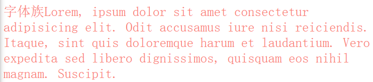
    
- `sans-serif` 非衬线字体
  
    
- `monospace` 等宽字体
  
    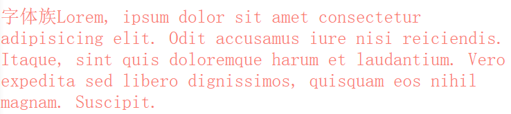
    
- `cursive` 手写体
  
    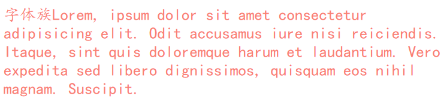
    
- `fantasy` 梦幻字体
  
    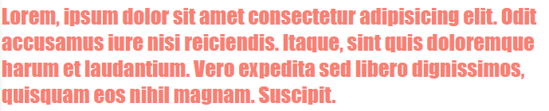
    

上述字体均不表示具体的某种字体，而是字体的分类

我们经常使用的一些字体，如`微软雅黑`、`黑体`、`楷体`、`宋体`、`Consolas`等，才是具体的某种字体

也就是说，`font-family` 指定字体的类别，浏览器会自动使用该类别下的字体

`font-family`可以同时指定多个字体，多个字体间使用`，`隔开

字体生效时优先使用第一个，第一个无法使用则使用第二个，以此类推

```css
font-family: 'Courier New', Courier, monospace
```

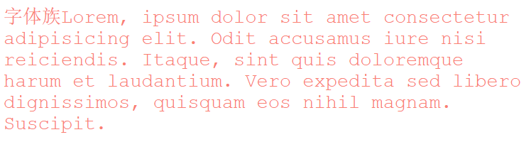

## 3\. 几种字体

我是乱分类的，随便看看就好

### 手写体

**Indie Flower**

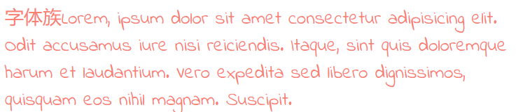

**Ink Free**

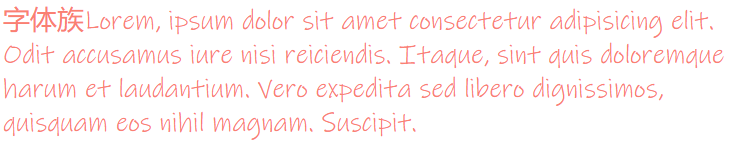

**Nanum Pen**

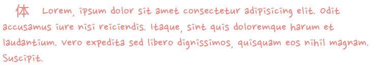

**MV Boli**

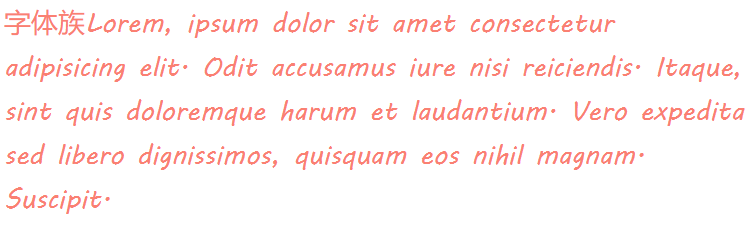

**Segoe Print**

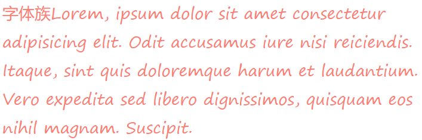

**Shadows Into**

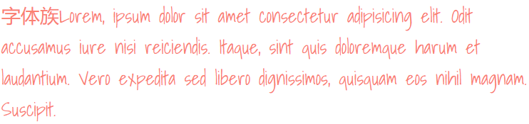

### 艺术体

**Barrio**


**Julius Sans One**

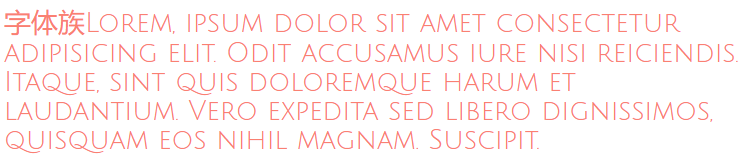

**Lobster**

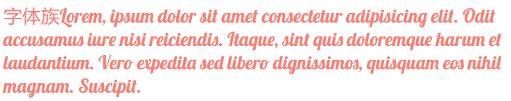

**Monoton**

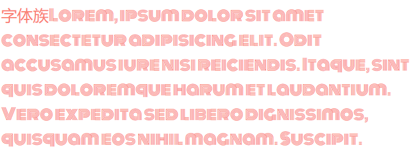

**Poiret One**

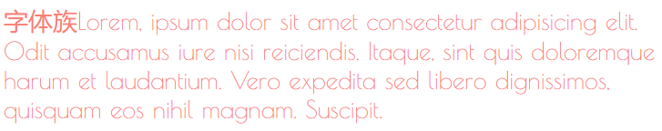

### [乱码](https://so.csdn.net/so/search?q=%E4%B9%B1%E7%A0%81&spm=1001.2101.3001.7020)字体

**MT Extra**

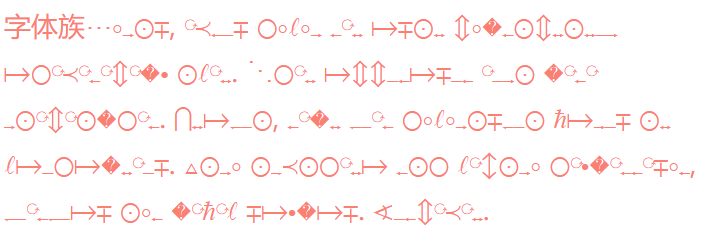

**Symbol**

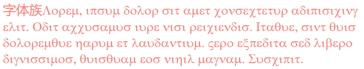

**Webdings**

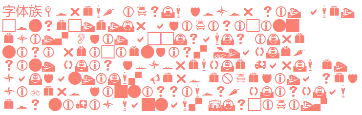

**Wingdings**

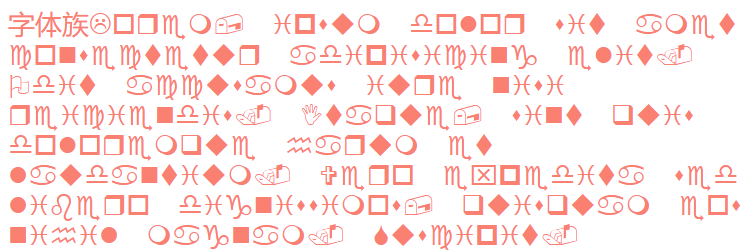

### 中文字体

**方正粗黑宋简体**

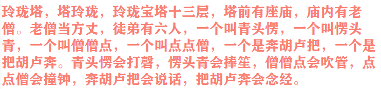

**微软雅黑**

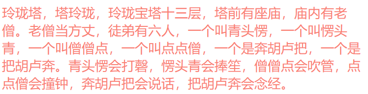

**黑体**

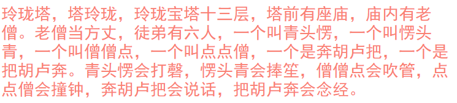

**楷体**

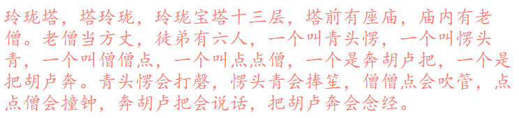

**宋体**

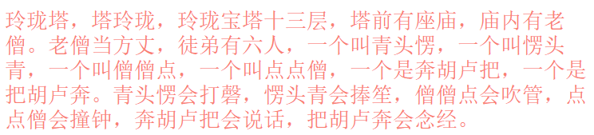

**仿宋**

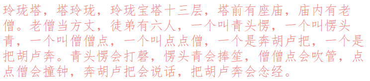

## 4\. @font-face

我们除了可以使用系统自带的字体样式外，还可以在服务器端自定义字体位置

`@font-face`可以将服务器中的字体直接提供给用户去使用

```css
@font-face {
    /* 指定字体名字 */
    font-family: 'myFont1';
    /* 服务器中字体路径 */
    src: url('/font/ZCOOLKuaiLe-Regular.woff'),
        url('/font/ZCOOLKuaiLe-Regular.otf'),
        url('/font/ZCOOLKuaiLe-Regular.ttf') format('truetype');/* 指定字体格式，一般不写 */
}

p {
    font-size: 30px;
    color: salmon;
    font-family: myFont1;
}
```

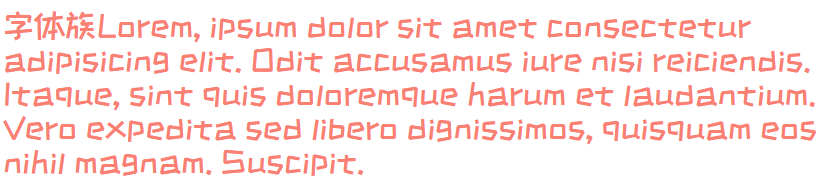

**问题**

1. 加载速度：受网络速度影响，可能会出现字体闪烁一下变成最终的字体
2. 版权：有些字体是商用收费的，需要注意
3. 字体格式：字体格式也有很多种（woff、otf、ttf），未必兼容，可能需要指定多个

## 5\. 图标字体（iconfont）

### 图标字体简介

在网页中经常需要使用一些图标，可以通过图片来引入图标但是图片大小本身比较大，并且非常的不灵活

所以在使用图标时，我们还可以将图标直接设置为字体，然后通过`@font-face`的形式来对字体进行引入

这样我们就可以通过使用字体的形式来使用图标

### fontawesome

官方网站：[https://fontawesome.com/](https://fontawesome.com/)

下载解压完毕之后，直接将css和webfonts移动到项目中即可使用

**示例**

```html
<link rel="stylesheet" href="/font/fontawesome/css/all.css">
<style>
    i {
        color: green;
    }

    .fa-venus-mars,
    .fa-mars-double {
        color: red;
    }

    .fa-html5 {
        color: #E34D22;
    }

    .fa-css3 {
        color: blue;
    }

    .fa-js {
        color: #D1B514;
    }
</style>

<!-- 大小 -->
<i class="fab fa-weixin fa-lg"></i>
<i class="fab fa-weixin fa-2x"></i>
<i class="fab fa-weixin fa-3x"></i>
<br>

<!-- 边框 -->
<i class="fab fa-weixin fa-2x fa-border"></i>
<br>

<!-- 旋转 -->
<i class="fab fa-weixin fa-2x  fa-rotate-90 "></i>
<!-- 水平对称 -->
<i class="fab fa-weixin fa-2x fa-flip-horizontal "></i>
<!-- 垂直对称 -->
<i class="fab fa-weixin fa-2x fa-flip-vertical "></i>
<br>

<!-- 动画 -->
<i class="fa fa-venus-mars fa-3x fa-spin"></i>
<i class="fa fa-mars-double  fa-3x fa-pulse"></i>
<br>

<!-- 列表 -->
<ul class="fa-ul">
    <li><i class="fa-li fa fa-check-square"></i>can be used</li>
    <li><i class="fa-li fa fa-spinner fa-spin"></i>as bullets</li>
    <li><i class="fa-li fa fa-square"></i>in lists</li>
</ul>
<br><br><br>

<!-- 组合 -->
<span class="fa-stack fa-lg">
    <i class="fab fa-html5 fa-stack-1x fa-10x"></i>
    <i class="fab fa-css3 fa-stack-1x fa-4x"></i>
    <i class="fab fa-js fa-stack-1x fa-2x"></i>
</span>
```

**效果**


其中`fas`/`fab`是免费的，其他是收费的

### 图标字体其他使用方式

#### 通过[伪元素](https://so.csdn.net/so/search?q=%E4%BC%AA%E5%85%83%E7%B4%A0&spm=1001.2101.3001.7020)设置

1. 找到要设置图标的元素通过`::before`或`::after`选中
2. 在`content`中设置字体的编码
3. 设置字体的样式
    - `fab`：`font-family: 'Font Awesome 5 Brands';`
    - `fas`：`font-family: 'Font Awesome 5 Free'; font-weight：900;`

**示例**

```html
<style>
    .poem {
        width: 200px;
        height: 300px;
        margin: auto;
    }

    li {
        list-style: none;
        margin-left: -40px;
    }

    li::before {
        content: '\f130';
        /* font-family: 'Font Awesome 5 Brands'; */
        font-family: 'Font Awesome 5 Free';
        font-weight: 900;
        margin-right: 10px;
        color: gray;
    }
</style>

<div class="poem">
    <h1>武陵春·春晚</h1>
    <p> [宋] 李清照</p>
    <ul>
        <li>风住尘香花已尽，</li>
        <li>日晚倦梳头。</li>
        <li>物是人非事事休，</li>
        <li>欲语泪先流。</li>
        <li>闻说双溪春尚好，</li>
        <li>也拟泛轻舟。</li>
        <li>只恐双溪舴艋舟，</li>
        <li>载不动、许多愁。</li>
    </ul>
</div>
```

**效果**


#### 通过实体设置

通过实体来使用图标字体：`&#x图标编码;`

**示例**

```html
<i class="fas">&#xf025;</i>
```

**效果**


### iconfont

官方网站：[https://www.iconfont.cn/](https://www.iconfont.cn/)

iconfont是阿里的一个图标字体库，海量图标库，图标字体非常丰富

但是版权有点模横两可，如果需要商用，最好联系作者

不过一般情况下，公司企业都会有自己的UI设计团队，会自己去进行设计

这里使用方式大同小异，不过

- iconfont需要添加购物车后再添加至项目然后下载，下载包中有demo.html，详细介绍了使用方式
- iconfont也提供了一种在线方式，直接在`我的项目`中选择`在线链接`可以复制出一份`@font-face`的css代码


后续步骤与前面介绍的一致

**示例**

```html
<!-- <link rel="stylesheet" href="/font/iconfont/iconfont.css"> -->
<style>
    i.iconfont {
        font-size: 100px;
    }

    p::before {
        content: '\e811';
        font-family: 'iconfont';
        font-size: 50px;
    }
    
    /* 3、通过在线连接：这里link和@font-face择其一即可  */
    @font-face {
        font-family: 'iconfont';
        /* Project id 2580407 */
        src: url('//at.alicdn.com/t/font_2580407_c0kpuhebb7r.woff2?t=1622373966454') format('woff2'),
            url('//at.alicdn.com/t/font_2580407_c0kpuhebb7r.woff?t=1622373966454') format('woff'),
            url('//at.alicdn.com/t/font_2580407_c0kpuhebb7r.ttf?t=1622373966454') format('truetype');
    }
</style>

<!-- 1、通过字符实体设置 -->
<i class="iconfont">&#xe810;</i>
<i class="iconfont">&#xe811;</i>
<i class="iconfont">&#xe812;</i>
<i class="iconfont">&#xe813;</i>

<!-- 2、通过伪元素设置 -->
<p>Lorem ipsum, dolor sit amet consectetur adipisicing elit. Totam deserunt tempore fugit quos eaque, ipsa rerum
    suscipit iure cumque aspernatur esse cupiditate nihil quas nulla odit? Sequi accusantium labore maiores.</p>
```

**效果**


## 6\. 行高

### 行高`line height`

文字占有的实际高度，可以通过`line-height`来设置行高

- 可以直接指定一个大小 `px`/`em`
- 也可以直接为行高设置一个小数（字体大小的倍数）

行高经常还用来设置文字的行间距：`行间距 = 行高 - 字体大小`

### 字体框

字体框就是字体存在的格子，设置`font-size`实际上就是在设置字体框的高度

行高会在字体框的上下平均分配


**示例**

```css
border: 1px black solid;
font-size: 100px;
/* line-height: 100px; */
```

不指定行高时，`content`高度`131.556px`：说明`line-height`默认值大约是`1.31` ~ `1.32`(倍数)


指定行高时，`content`高度`99.556px`：少了`0.444px`，并且字母`p`下面溢出


**存疑问题**

经测试，`line-height`大约比`100.444px`略大一点时，`content`高度才会大于`100px`，暂未知原因

### 字体的简写属性

`font` 可以设置字体相关的所有属性：

`font: font-style font-variant font-weight font-size/line-height font-family`

其中某些值可以不写，会用默认值

**默认值**

<div class="table-box"><table><thead><tr><th align="left">属性</th><th align="left">默认值</th><th align="left">其他常用值</th></tr></thead><tbody><tr><td align="left"><code>font-style</code></td><td align="left"><code>normal</code></td><td align="left"><code>italic</code></td></tr><tr><td align="left"><code>font-variant</code></td><td align="left"><code>normal</code></td><td align="left"><code>small-caps</code></td></tr><tr><td align="left"><code>font-weight</code></td><td align="left"><code>normal</code></td><td align="left"><code>bold</code></td></tr><tr><td align="left"><code>font-size</code></td><td align="left"><code>medium</code></td><td align="left"><code>small</code>、<code>large</code></td></tr><tr><td align="left"><code>line-height</code></td><td align="left"><code>normal</code></td><td align="left"></td></tr><tr><td align="left"><code>font-family</code></td><td align="left">取决于浏览器</td><td align="left"></td></tr></tbody></table></div>

**示例1**

```css
/* font-size: 50px;
font-family: 'Courier New', Courier, monospace; */
font: 50px 'Courier New', Courier, monospace;
```


**示例2**

```css
/* small-caps值设置小型大写字母字体，所有小写变大写，同时字体尺寸更小（了解即可） */
font: bold small-caps italic 50px 'Courier New', Courier, monospace;
```


**注意 Pay Attention：简写属性省略的值会使用默认值，所以会覆盖前面的非简写属性（不仅仅对于字体而言）**

## 7\. 文本对齐方式

### 水平对齐

`text-align` 文本的水平对齐

<div class="table-box"><table><thead><tr><th align="left"><code>text-align</code>属性值</th><th align="left">对齐方式说明</th></tr></thead><tbody><tr><td align="left"><code>left</code></td><td align="left">左侧对齐</td></tr><tr><td align="left"><code>right</code></td><td align="left">右侧对齐</td></tr><tr><td align="left"><code>center</code></td><td align="left">居中对齐</td></tr><tr><td align="left"><code>justify</code></td><td align="left">两端对齐</td></tr></tbody></table></div>

**`left` 左侧对齐**


**`right` 右侧对齐**


**`center` 居中对齐**


**`justify` 两端对齐**


### 垂直对齐

`vertical-align` 设置元素垂直对齐的方式

<div class="table-box"><table><thead><tr><th align="left"><code>vertical-align</code> 属性值</th><th align="left">对齐方式说明</th></tr></thead><tbody><tr><td align="left"><code>baseline</code></td><td align="left">基线对齐</td></tr><tr><td align="left"><code>top</code></td><td align="left">顶部对齐</td></tr><tr><td align="left"><code>bottom</code></td><td align="left">底部对齐</td></tr><tr><td align="left"><code>middle</code></td><td align="left">居中对齐</td></tr></tbody></table></div>

**`baseline` 基线对齐**


**`top` 顶部对齐**


**`bottom` 底部对齐**


**`middle` 居中对齐**


这里的居中对齐高度 = 基线高度 + x的高度 / 2

这种居中对齐并非实际上的居中对齐，一般也不会用这种方式对文字进行垂直方向的对齐

**`vertical-align` 还可以设置px值设置垂直对齐方式**

```css
vertical-align: 10px;
```


**图片的垂直对齐问题**

```html
<style>
    .imgDiv {
        border: 5px seagreen solid;
    }

    .imgDiv img {
        width: 400px;
        height: 300px;
    }
</style>

<div class="imgDiv">
    
</div>
```


明显默认情况下，图片底部有一定缝隙，我们稍作修改，给img元素添加`vertical-align`属性值

```css
/* 只要不是基线对齐，就能消除底部缝隙 */
vertical-align: top;
vertical-align: bottom;
vertical-align: middle;
```


**Q：为什么图片会有缝隙？**

A：图片属于替换元素，特点与文本一致，也有自己的基线，默认也是基线对齐。而基线位置不在最底部，所以会出现缝隙