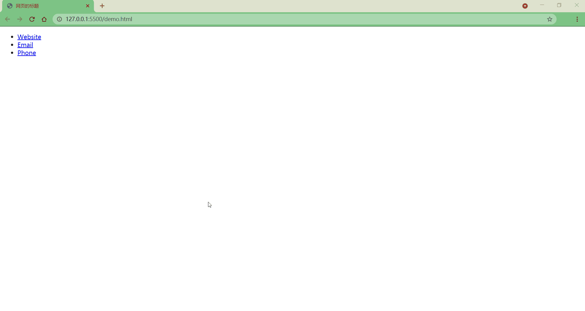
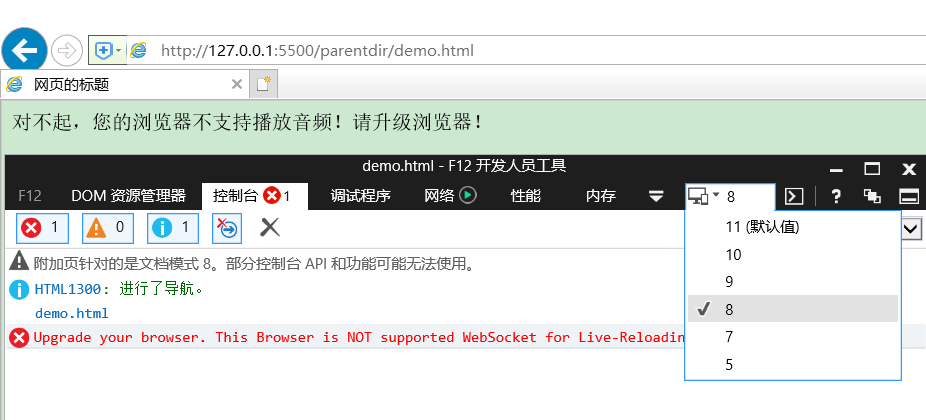

# 字符实体与语义标签

## 1\. 字符实体

有些时候，在HTML中不能直接书写一些特殊符号，如：

- 多个连续的空格（在网页中编写的多个空格默认情况会自动被浏览器解析为一个空格）
- 比如字母两侧的大于小于号（可能会被认为是标签并解析）

如果我们需要在网页中书写这些特殊的符号，则需要使用html中的实体（转义字符）实体的语法：`&实体的名字;`，如：

<div class="table-box"><table><thead><tr><th align="left">实体名称</th><th align="left">显示结果</th><th>描述</th></tr></thead><tbody><tr><td align="left"><mark><code>&amp;nbsp;</code></mark></td><td align="left"><code></code></td><td>空格</td></tr><tr><td align="left"><mark><code>&amp;gt;</code></mark></td><td align="left">&gt;</td><td>大于号</td></tr><tr><td align="left"><mark><code>&amp;lt;</code></mark></td><td align="left">&lt;</td><td>小于号</td></tr><tr><td align="left"><mark><code>&amp;amp;</code></mark></td><td align="left">&amp;</td><td>与</td></tr><tr><td align="left"><code>&amp;copy;</code></td><td align="left">©</td><td>版权</td></tr><tr><td align="left"><code>&amp;reg;</code></td><td align="left">®</td><td>注册商标</td></tr><tr><td align="left"><code>&amp;trade;</code></td><td align="left">™</td><td>商标</td></tr><tr><td align="left"><code>&amp;times;</code></td><td align="left">×</td><td>乘号</td></tr><tr><td align="left"><code>&amp;divide;</code></td><td align="left">÷</td><td>除号</td></tr><tr><td align="left"><code>&amp;iquest;</code></td><td align="left">¿</td><td>倒问号</td></tr></tbody></table></div>

更多的字符实体，可参考：[HTML 字符实体](https://www.w3school.com.cn/html/html_entities.asp)、[HTML ISO-8859-1 参考手册](https://www.w3school.com.cn/charsets/ref_html_8859.asp)

## 2\. meta标签

以京东网站为例，右键单击，选择`查看网页源代码`


```html
<meta charset="utf8" version='1'/>
<meta name="viewport" content="width=device-width, initial-scale=1.0, maximum-scale=1.0, user-scalable=yes"/>
<meta name="description" content="京东JD.COM-专业的综合网上购物商城,销售家电、数码通讯、电脑、家居百货、服装服饰、母婴、图书、食品等数万个品牌优质商品.便捷、诚信的服务，为您提供愉悦的网上购物体验!"/>
<meta name="Keywords" content="网上购物,网上商城,手机,笔记本,电脑,MP3,CD,VCD,DV,相机,数码,配件,手表,存储卡,京东"/>
```

meta主要用于设置网页中的一些元数据，元数据并不是给用户看的

- charset ：指定网页的字符集
  
- name ：指定的数据的名称
  
    - keywords：表示网站的关键字，可以同时指定多个关键字，关键字间使用`,`隔开
      
    - description：表示网站的描述信息
      
        
    
- content ：指定的数据的内容，会作为搜索结果的超链接上的文字显示

打开Zeal手册（前端开发准备中做过介绍）


发现除了`charset`、`name`、`content`之外，还有一个叫`http-equiv`的属性

```html
If the http-equiv attribute is set, the <meta> element is a pragma directive, providing information equivalent to what can be given by a similarly-named HTTP header.
```

如果设置了`http-equiv`属性，`<meta>`元素就是一个pragma指令，提供的信息相当于一个类似名称的HTTP头所能提供的信息。

点击`http-equiv`的链接，查看其更详细信息。


- `content-security-policy`：允许页面作者为当前页面定义一个内容策略。内容策略主要指定允许的服务器来源和脚本端点，这有助于防范跨站脚本攻击。
- `content-type`：声明文档的MIME类型和字符编码。如果指定，content属性必须有 "`text/html; charset=utf-8` "的值。这相当于一个指定了charset属性的`<meta>`元素，并对文档中的位置有同样的限制。注意：只能在使用`text/html`的文档中使用，不能在使用XML MIME类型的文档中使用。
- `default-style`：设置默认的CSS样式表集的名称。
- `x-ua-compatible`： 如果指定，内容属性必须有 "`IE=edge`"的值。用户代理被要求忽略这个pragma。
- `refresh`：该指令指定页面重新加载及重定向的方式
    - 直到页面应该被重新加载的秒数–只有当content属性包含一个正整数时。
    - 直到页面重定向到另一个页面的秒数–只有当内容属性包含一个正整数，后面跟着字符串’`;url=`’，以及一个有效的URL。

其中我们直接将Examples中的示例代码加入Demo.html中

```html
<meta charset="utf-8">
<!-- Redirect page after 3 seconds -->
<meta http-equiv="refresh" content="3;url=https://www.mozilla.org">
```

对`refresh`进行测试，发现过了3秒钟之后自动跳转到了指定的网站


## 3\. 语义标签

在网页中HTML专门用来负责网页的结构所以在使用html标签时，应该关注的是标签的语义，而不是它的样式

这里先介绍几个基本的语义标签，还有些常用的标签放在后面具体讲解

<div class="table-box"><table><thead><tr><th></th><th align="left">标签</th><th align="left">作用</th><th>描述</th></tr></thead><tbody><tr><td>块元素<br>Block Element</td><td align="left"><mark><code>&lt;h1&gt;</code></mark><br><mark><code>&lt;h2&gt;</code></mark><br><mark><code>&lt;h3&gt;</code></mark><br><mark><code>&lt;h4&gt;</code></mark><br><mark><code>&lt;h5&gt;</code></mark><br><mark><code>&lt;h6&gt;</code></mark></td><td align="left">标题</td><td>一共有六级标题<br>从<code>h1</code> ~ <code>h6</code>重要性递减，<code>h1</code>最重要，<code>h6</code>最不重要<br>h1在网页中的重要性仅次于<code>title</code>标签<br>一般情况下一个页面中只会有一个<code>h1</code><br>一般情况下标题标签只会使用到<code>h1</code> ～ <code>h3</code>，<code>h4</code> ～ <code>h6</code>很少用</td></tr><tr><td></td><td align="left"><code>&lt;hgroup&gt;</code></td><td align="left">标题组</td><td>多层次的标题。它将一组<code>&lt;h1&gt;</code> ～ <code>&lt;h6&gt;</code>元素分组</td></tr><tr><td></td><td align="left"><mark><code>&lt;p&gt;</code></mark></td><td align="left">段落</td><td>页面中的一个段落。由空行或第一行缩进将相邻的文本块分开</td></tr><tr><td></td><td align="left"><code>&lt;blockquote&gt;</code></td><td align="left">短引文</td><td>用缩进表示所包含文本。<br>可以用<code>cite</code>属性表示引文来源，用<code>&lt;cite&gt;</code>元素表示来源的文本表述</td></tr><tr><td>行内元素<br>Inline Element</td><td align="left"><code>&lt;q&gt;</code></td><td align="left">长引文</td><td>用一个简短的内联引号包围文本。<br>大多数浏览器通过在文本周围加上引号来实现。<br>该元素用于不需要段落分隔的短引文；</td></tr><tr><td></td><td align="left"><mark><code>&lt;br&gt;</code></mark></td><td align="left">换行</td><td></td></tr><tr><td></td><td align="left"><code>&lt;em&gt;</code></td><td align="left">强调</td><td>表示强调作用。<code>&lt;em&gt;</code>元素可以嵌套，每一级嵌套表示更高的强调程度<br><mark><code>&lt;i&gt;</code></mark>元素效果与它相同，不过<code>&lt;i&gt;</code>不属于语义标签</td></tr><tr><td></td><td align="left"><code>&lt;strong&gt;</code></td><td align="left">重要</td><td>表示重要性、严肃性或紧迫性。浏览器通常以粗体字呈现内容<br><mark><code>&lt;b&gt;</code></mark>元素效果与它相同，不过<code>&lt;b&gt;</code>不属于语义标签</td></tr></tbody></table></div>

**举例**

```html
<h1>Beetles</h1>
<h2>External morphology</h2>
<h3>Head</h3>
<h4>Mouthparts</h4>
<h3>Thorax</h3>
<h4>Prothorax</h4>
<h4>Pterothorax</h4>
```

**效果**


HTML5 提供的新语义元素有

<table><thead><tr><th align="left">标签</th><th align="left">作用</th><th>描述</th></tr></thead><tbody><tr><td align="left"><mark><code>&lt;header&gt;</code></mark></td><td align="left">页眉</td><td>介绍性的内容</td></tr><tr><td align="left"><mark><code>&lt;footer&gt;</code></mark></td><td align="left">页脚</td><td>通常包含有关作者的信息、版权或文件链接</td></tr><tr><td align="left"><mark><code>&lt;nav&gt;</code></mark></td><td align="left">导航链接</td><td>可以是当前文档内的，也可以是到其他文档的。常见例子是菜单、目录和索引</td></tr><tr><td align="left"><mark><code>&lt;main&gt;</code></mark></td><td align="left">文档主内容</td><td>中心主题直接相关或扩展的内容</td></tr><tr><td align="left"><code>&lt;article&gt;</code></td><td align="left">文章</td><td>自成一体，独立分发，可重复使用</td></tr><tr><td align="left"><code>&lt;section&gt;</code></td><td align="left">文档中的节</td><td>没有一个更具体的语义元素来代表</td></tr><tr><td align="left"><mark><code>&lt;aside&gt;</code></mark></td><td align="left">页面内容以外的内容</td><td>其内容与文档的主要内容只有间接的关系。经常以边栏或呼出框的形式出现</td></tr><tr><td align="left"><mark><code>&lt;mark&gt;</code></mark></td><td align="left">重要或强调的文本</td><td>为参考或记事目的而被标记或突出的文本，表明其相关性和重要性</td></tr><tr><td align="left"><code>&lt;summary&gt;</code></td><td align="left"><code>&lt;details&gt;</code> 标题</td><td>为<code>&lt;details&gt;</code>指定一个摘要、标题或图例。点击<code>&lt;summary&gt;</code>可以切换<code>&lt;details&gt;</code>打开和关闭</td></tr><tr><td align="left"><code>&lt;details&gt;</code></td><td align="left">用户能够查看或隐藏的额外细节</td><td>其中的信息只有被切换到 "打开 "状态时才可见。必须使用<code>&lt;summary&gt;</code>提供一个摘要或标签</td></tr><tr><td align="left"><code>&lt;figure&gt;</code></td><td align="left">自包含内容</td><td>独立的内容，用<code>&lt;figcaption&gt;</code>元素指定一个可选的标题。比如图示、图表、照片、代码清单等</td></tr><tr><td align="left"><code>&lt;figcaption&gt;</code></td><td align="left"><code>&lt;figure&gt;</code> 的标题</td><td>描述其父元素
    <figure>
     其余内容的标题或图例
    </figure></td></tr><tr><td align="left"><code>&lt;time&gt;</code></td><td align="left">定义日期/时间</td><td>可能包括<code>datetime</code>属性，将日期翻译成机器可读的格式，以便获得更好的搜索引擎结果或自定义功能。如提醒</td></tr></tbody></table>

这些新语义标签在视觉效果上基本上没有什么区别

## 4\. 块元素与行内元素

### 块元素（block element）

- 在网页中一般通过块元素来对页面进行布局

### 行内元素（inline element）

- 行内元素主要用来包裹文字
- 一般情况下会在块元素中放行内元素，而不会在行内元素中放块元素
    - 如`<p>`元素中不能放任何的块元素，不过

## 5\. 内容修正

浏览器在解析网页时，会自动对网页中不符合规范的内容进行修正，比如：

- 标签写在了根元素的外部
- `<p>`元素中嵌套了块元素
- 根元素中出现了除`head`和`body`以外的子元素

这个通过浏览器中的`查看网页源代码`并不能看到效果，但是使用F12进行`开发者调试`时是能够看到上述几种情况被修正的结果。

不过虽然浏览器能够对不规范的页面内容进行修正，还是不建议编写不规范的代码，因为这对后期代码维护或团队代码协作将是非常不好的后果和体验。

## 6\. 布局标签

**结构化语义标签**

- `header`表示网页的头部（页眉）
- `main`表示网页的主体部分（一个页面中只会有一个main）
- `footer`表示网页的底部（页脚）
- `nav`表示网页中的导航
- `aside`和主体相关的其他内容（侧边栏）
- `article`表示一个独立的文章
- `section`表示一个独立的区块，上边的标签都不能表示时使用section


- `div` 块元素，没有任何的语义，就用来表示一个区块。目前来讲，div还是主要的布局元素
- `span` 行内元素，没有任何的语义，一般用于在网页中`选中文字`

## 7\. 列表

在html中可以创建列表，html列表一共有三种：

- 有序列表，使用`ol`标签来创建有序列表，使用`li`表示列表项
  
    ```html
    <ol>
        <li>Mix flour, baking powder, sugar, and salt.</li>
        <li>In another bowl, mix eggs, milk, and oil.</li>
        <li>Stir both mixtures together.</li>
        <li>Fill muffin tray 3/4 full.</li>
        <li>Bake for 20 minutes.</li>
    </ol>
    ```
    
    
    
- 无序列表，使用`ul`标签来创建无序列表，使用`li`表示列表项
  
    ```html
    <ul>
        <li>Milk</li>
        <li>Cheese
            <ul>
                <li>Blue cheese
                    <ul>
                        <li>Sweet blue cheese</li>
                        <li>Sour blue cheese</li>
                    </ul>
                </li>
                <li>Feta</li>
            </ul>
        </li>
    </ul>
    ```
    
    
    
    可以看出，列表元素之间是可以互相嵌套的
    
- 定义列表，使用`dl`标签来创建定义列表，使用`dt`表示定义的内容，使用`dd`来对内容进行解释说明
  
    ```html
    <dl>
        <dt>Beast of Bodmin</dt>
        <dd>A large feline inhabiting Bodmin Moor.</dd>
    
        <dt>Morgawr</dt>
        <dd>A sea serpent.</dd>
    
        <dt>Owlman</dt>
        <dd>A giant owl-like creature.</dd>
    </dl>
    ```
    
    
    

## 8\. 超链接

超链接可以让我们从一个页面跳转到其他页面，或者是当前页面的其他的位置

使用`a`标签来定义超链接，`href`属性指定跳转的目标路径，值可以是一个外部网站的地址，也可以写一个内部页面的地址

超链接是也是一个行内元素，在`a`标签中可以嵌套除它自身外的任何元素

### 外部地址

- Linking to an absolute URL：链接一个绝对路径
- Linking to an email address：链接一个email地址
- Linking to telephone numbers：链接电话号码
- Using the download attribute to save a `<canvas>` as a PNG：下载图片

```html
<ul>
  <li><a href="https://www.baidu.com">Website</a></li>
  <li><a href="mailto:example@outlook.com">Email</a></li>
  <li><a href="tel:+123456789">Phone</a></li>
</ul>
```

**效果**



### 内部地址

当我们需要跳转一个服务器内部的页面时，一般我们都会使用相对路径，会以`./`或`../`开头

- `./` 表示当前文件所在目录，可以省略不写
- `../`表示当前文件所在目录的上一级目录

```html
<a href="./test1.html">超链接1</a><br>
<a href="../test2.html">超链接2</a><br>
<a href="./test3/test3.html">超链接3</a><br>
<a href="../test4/test4.html">超链接4</a>
```

**效果**


### 新建页面

`target`属性，用来指定超链接打开的位置可选值：

- `_self`在当前页面中打开超链接，默认值
- `_blank`在新建页面中打开超链接

```html
<a href="./test1.html">超链接1——默认</a><br>
<a href="./test1.html" target="_self">超链接1——当前页面</a><br>
<a href="./test1.html" target="_blank">超链接1——新建页面</a><br>
```


### 锚点跳转

可以使用`javascript:void(0);`来作为`href`的属性，此时点击这个超链接什么也不会发生

可以将`#`作为超链接的路径的占位符使用。

可以直接将超链接的`href`属性设置为`#`，这样点击超链接以后页面不会发生跳转，而是转到当前页面的顶部的位置

可以跳转到页面的指定位置（锚点），只需将`href`属性设置`#目标元素的id属性值`（唯一不重复）

```html
<p> 汉皇重色思倾国，御宇多年求不得。</p>
<p> 杨家有女初长成，养在深闺人未识。 </p>
<p> 天生丽质难自弃，一朝选在君王侧。 </p>
<p><a id="Anchor1" href="#Anchor2"> 回眸一笑百媚生，六宫粉黛无颜色。</a></p>
<p> 春寒赐浴华清池，温泉水滑洗凝脂。 </p>
<p> 侍儿扶起娇无力，始是新承恩泽时。 </p>
<p> 云鬓花颜金步摇，芙蓉帐暖度春宵。 </p>
<p> 春宵苦短日高起，从此君王不早朝。 </p>
<p> 承欢侍宴无闲暇，春从春游夜专夜。 </p>
<p><a id="Anchor2" href="#Anchor3"> 后宫佳丽三千人，三千宠爱在一身。</a></p>
<p> 金屋妆成娇侍夜，玉楼宴罢醉和春。 </p>
<p> 姊妹弟兄皆列土，可怜光彩生门户。 </p>
<p> 遂令天下父母心，不重生男重生女。 </p>
<p> 骊宫高处入青云，仙乐风飘处处闻。 </p>
<p> 缓歌慢舞凝丝竹，尽日君王看不足。 </p>
<p> 渔阳鼙鼓动地来，惊破霓裳羽衣曲。 </p>
<p> 九重城阙烟尘生，千乘万骑西南行。 </p>
<p> 翠华摇摇行复止，西出都门百余里。 </p>
<p> 六军不发无奈何，宛转蛾眉马前死。 </p>
<p> 花钿委地无人收，翠翘金雀玉搔头。 </p>
<p> 君王掩面救不得，回看血泪相和流。 </p>
<p> 黄埃散漫风萧索，云栈萦纡登剑阁。 </p>
<p> 峨嵋山下少人行，旌旗无光日色薄。 </p>
<p> 蜀江水碧蜀山青，圣主朝朝暮暮情。 </p>
<p> 行宫见月伤心色，夜雨闻铃肠断声。 </p>
<p> 天旋地转回龙驭，到此踌躇不能去。 </p>
<p> 马嵬坡下泥土中，不见玉颜空死处。 </p>
<p> 君臣相顾尽沾衣，东望都门信马归。 </p>
<p> 归来池苑皆依旧，太液芙蓉未央柳。 </p>
<p> 芙蓉如面柳如眉，对此如何不泪垂。 </p>
<p> 春风桃李花开夜，秋雨梧桐叶落时。 </p>
<p> 西宫南苑多秋草，落叶满阶红不扫。 </p>
<p> 梨园弟子白发新，椒房阿监青娥老。 </p>
<p> 夕殿萤飞思悄然，孤灯挑尽未成眠。 </p>
<p><a id="Anchor3" href="#Anchor4"> 迟迟钟鼓初长夜，耿耿星河欲曙天。 </a></p>
<p> 鸳鸯瓦冷霜华重，翡翠衾寒谁与共。 </p>
<p> 悠悠生死别经年，魂魄不曾来入梦。 </p>
<p> 临邛道士鸿都客，能以精诚致魂魄。 </p>
<p> 为感君王辗转思，遂教方士殷勤觅。 </p>
<p> 排空驭气奔如电，升天入地求之遍。 </p>
<p> 上穷碧落下黄泉，两处茫茫皆不见。 </p>
<p> 忽闻海上有仙山，山在虚无缥渺间。 </p>
<p> 楼阁玲珑五云起，其中绰约多仙子。 </p>
<p> 中有一人字太真，雪肤花貌参差是。 </p>
<p> 金阙西厢叩玉扃，转教小玉报双成。 </p>
<p> 闻道汉家天子使，九华帐里梦魂惊。 </p>
<p> 揽衣推枕起徘徊，珠箔银屏迤逦开。 </p>
<p> 云鬓半偏新睡觉，花冠不整下堂来。 </p>
<p><a id="Anchor4" href="#Anchor5"> 风吹仙袂飘飖举，犹似霓裳羽衣舞。 </a></p>
<p> 玉容寂寞泪阑干，梨花一枝春带雨。 </p>
<p> 含情凝睇谢君王，一别音容两渺茫。 </p>
<p> 昭阳殿里恩爱绝，蓬莱宫中日月长。 </p>
<p> 回头下望人寰处，不见长安见尘雾。 </p>
<p> 惟将旧物表深情，钿合金钗寄将去。 </p>
<p> 钗留一股合一扇，钗擘黄金合分钿。 </p>
<p> 但令心似金钿坚，天上人间会相见。 </p>
<p> 临别殷勤重寄词，词中有誓两心知。 </p>
<p> 七月七日长生殿，夜半无人私语时。 </p>
<p><a id="Anchor5" href="#Anchor6"> 在天愿作比翼鸟，在地愿为连理枝。 </a></p>
<p> 天长地久有时尽，此恨绵绵无绝期。 </p>

<!-- Heading to link to -->
<a href="#">回到顶部</a>
```

**效果**


## 9\. 图片

图片标签用于向当前页面中引入一个外部图片

`img`标签是一个自结束标签，这种元素属于替换元素（块和行内元素之间，具有两种元素的特点）

**属性**

- `src`：属性指定的是外部图片的路径（路径规则和超链接是一样的）
- `alt`：图片的描述，这个描述默认情况下不会显示，有些浏览器会在图片无法加载时显示，搜索引擎会根据alt中的内容来识别图片
- `width`：图片的宽度（单位是像素）
- `height` ：图片的高度（单位是像素）
- 宽度和高度中如果只修改了一个，则另一个会等比例缩放

**注意**

- 一般情况在pc端，不建议修改图片的大小，需要多大的图片就裁多大
- 但是在移动端，经常需要对图片进行缩放（大图缩小）

**举例**

```html


```

**效果**


### 图片格式

#### jpeg（jpg）

- 支持的颜色比较丰富
- 不支持透明效果
- 不支持动图
- 一般用来显示照片

#### gif

- 支持的颜色比较单一
- 支持简单透明
- 支持动图

#### png

- 支持的颜色丰富
- 支持复杂透明
- 不支持动图
- 专为网页而生

#### webp

- 这种格式是谷歌新推出的专门用来表示网页中的图片的一种格式
- 具备其他图片格式的所有优点，而且文件还特别的小
- 缺点：兼容性不好

#### base64

- 将图片使用base64编码，这样可以将图片转换为字符，通过字符的形式来引入图片
  
    ```html
    <img width="300" src="data:image/png;base64,AAABAAEAICAAAAEAIACoEAAAFgAAACgAAAAgAAAAQAAAAAEAIAAAAAAAABAAAAAAAAAAAAAAAAAAAAAAAAAxVfz/MVX8/zFV/P8xVfz/MVX8/zFV/P8xVfz/MVX8/zFV/P8xVfz/MVX8/zFV/P8xVfz/MVX8/zFV/P8xVfz/MVX8/zFV/P8xVfz/MVX8/zFV/P8xVfz/MVX8/zFV/P8xVfz/MVX8/zFV/P8xVfz/MVX8/zFV/P8xVfz/MVX8/zFV/P8xVfz/MVX8/zFV/P8xVfz/MVX8/zFV/P8xVfz/MVX8/zFV/P8xVfz/MVX8/zFV/P8xVfz/MVX8/zFV/P8xVfz/MVX8/zFV/P8xVfz/MVX8/zFV/P8xVfz/MVX8/zFV/P8xVfz/MVX8/zFV/P8xVfz/MVX8/zFV/P8xVfz/MVX8/zFV/P8xVfz/MVX8/zFV/P8xVfz/MVX8/zFV/P8xVfz/MVX8/zFV/P8xVfz/MVX8/zFV/P8xVfz/MVX8/zFV/P8xVfz/MVX8/zFV/P8xVfz/MVX8/zFV/P8xVfz/MVX8/zFV/P8xVfz/MVX8/zFV/P8xVfz/MVX8/zFV/P8xVfz/MVX8/zFV/P8xVfz/MVX8/zFV/P8xVfz/MVX8/zFV/P8xVfz/MVX8/zFV/P8xVfz/MVX8/zFV/P8xVfz/MVX8/zFV/P8xVfz/MVX8/zFV/P8xVfz/MVX8/zFV/P8xVfz/MVX8/zFV/P8xVfz/MVX8/zFV/P8xVfz/MVX8/zFV/P8xVfz/MVX8/zFV/P8xVfz/MVX8/zFV/P8xVfz/MVX8/zFV/P8xVfz/MVX8/zda/P9qhPz/mKr9/7bC/f/Fz/7/ydL+/8HM/v+tu/3/jaH9/156/P8zV/z/MVX8/zFV/P8xVfz/MVX8/zFV/P8xVfz/MVX8/zFV/P8xVfz/MVX8/zFV/P8xVfz/MVX8/zFV/P8xVfz/MVX8/zFV/P8xVfz/MVX8/z9h/P+gsP3/8fP+/+ru/v+Zqv3/PV/8/zFV/P8xVfz/MVX8/zFV/P8xVfz/MVX8/zFV/P8xVfz/MVX8/zFV/P8xVfz/MVX8/zFV/P8xVfz/MVX8/zFV/P9lgPz/6+/+///s7/7/Y378/zFV/P8xVfz/MVX8/zFV/P8xVfz/MVX8/zFV/P8xVfz/MVX8/zFV/P8xVfz/MVX8/zFV/P8xVfz/aoT8//r6/v///v7+/+Po/v/R2f7/y9T+/9rg/v/3+f7j6P7/MVX8/zFV/P8xVfz/MVX8/zFV/P8xVfz/MVX8/zFV/P8xVfz/MVX8/zFV/P8xVfz/MVX8/0Zm/P/w8/7/5+v+/4ab/f9AYvz/MVX8/zFV/P8xVfz/MVX8/zVY/P9kf/z/tsP9//39/vT2/v8xVfz/MVX8/zFV/P8xVfz/MVX8/zFV/P8xVfz/MVX8/zFV/P8xVfz/MVX8/zFV/P8xVfz/sL79/87W/v8/Yfz/MVX8/zFV/P8xVfz/MVX8/zFV/P8xVfz/MVX8/zFV/P8xVfz/ZYD8//L0/v//n7D9/zFV/P8xVfz/MVX8/zFV/P8xVfz/MVX8/zFV/P8xVfz/MVX8/zFV/P8xVfz/MVX8/0Bh/P/6+/7v8v7/QmP8/zFV/P8xVfz/MVX8/zFV/P8xVfz/MVX8/zFV/P8xVfz/MVX8/zFV/P8xVfz/TWz8/3GJ/P8yVvz/MVX8/zFV/P8xVfz/MVX8/zFV/P8xVfz/MVX8/zFV/P8xVfz/MVX8/zFV/P8xVfz/e5L8/5qr/f8xVfz/MVX8/zFV/P8xVfz/MVX8/zFV/P8xVfz/MVX8/zFV/P8xVfz/MVX8/zFV/P8xVfz/MVX8/zFV/P8xVfz/MVX8/zFV/P8xVfz/MVX8/zFV/P8xVfz/MVX8/zFV/P8xVfz/MVX8/zFV/P+mtv3/XHn8/zFV/P8xVfz/MVX8/zFV/P8xVfz/MVX8/zFV/P8xVfz/MVX8/zFV/P8xVfz/MVX8/zFV/P8xVfz/MVX8/zFV/P8xVfz/MVX8/zFV/P8xVfz/MVX8/zFV/P8xVfz/MVX8/zFV/P8xVfz/MVX8/7/L/f87Xfz/MVX8/zFV/P8xVfz/MVX8/zFV/P8xVfz/MVX8/zFV/P8xVfz/MVX8/zFV/P8xVfz/MVX8/zFV/P8xVfz/MVX8/zFV/P8xVfz/MVX8/zFV/P8xVfz/MVX8/zFV/P8xVfz/MVX8/zFV/P8xVfz/ydL++/v+/zFV/P8xVfz/MVX8/zFV/P8xVfz/MVX8/zFV/P8xVfz/MVX8/zFV/P8xVfz/MVX8/zFV/P8xVfz/MVX8/zFV/P8xVfz/MVX8/zFV/P8xVfz/MVX8/zFV/P8xVfz/MVX8/zFV/P8xVfz/MVX8/zFV/P/Ezv79/f7/M1b8/zFV/P8xVfz/MVX8/zFV/P8xVfz/MVX8/zFV/P8xVfz/MVX8/zFV/P8xVfz/MVX8/zFV/P8xVfz/MVX8/zFV/P8xVfz/MVX8/zFV/P8xVfz/MVX8/zFV/P8xVfz/MVX8/zFV/P8xVfz/MVX8/7G//f9HZ/z/MVX8/zFV/P8xVfz/MVX8/zFV/P8xVfz/MVX8/zFV/P8xVfz/MVX8/zFV/P8xVfz/MVX8/zFV/P8xVfz/MVX8/zFV/P8xVfz/MVX8/zFV/P8xVfz/MVX8/zFV/P8xVfz/MVX8/zFV/P8xVfz/kqX9/22H/P8xVfz/MVX8/zFV/P8xVfz/MVX8/zFV/P8xVfz/MVX8/zFV/P8xVfz/MVX8/zFV/P8xVfz/MVX8/zFV/P8xVfz/MVX8/zFV/P8xVfz/MVX8/zFV/P8xVfz/MVX8/zFV/P8xVfz/MVX8/zFV/P9kf/z/pbX9/zFV/P8xVfz/MVX8/zFV/P8xVfz/MVX8/zFV/P8xVfz/MVX8/zFV/P8xVfz/MVX8/zFV/P8xVfz/MVX8/zFV/P8xVfz/MVX8/zFV/P8xVfz/MVX8/zFV/P8xVfz/MVX8/zFV/P8xVfz/MVX8/zRX/P/v8v7s7/7/Nln8/zFV/P8xVfz/MVX8/zFV/P8xVfz/MVX8/zFV/P8xVfz/MVX8/zFV/P8xVfz/MVX8/zFV/P8xVfz/MVX8/zFV/P8xVfz/MVX8/zFV/P8xVfz/MVX8/zFV/P8xVfz/MVX8/zFV/P8xVfz/MVX8/6Ky/f+Inf3/MVX8/zFV/P8xVfz/MVX8/zFV/P8xVfz/MVX8/zFV/P8xVfz/MVX8/zFV/P8xVfz/MVX8/zFV/P8xVfz/MVX8/zFV/P8xVfz/MVX8/zFV/P8xVfz/MVX8/zFV/P8xVfz/MVX8/zFV/P8xVfz/RWb8//f4/vH0/v9Kafz/MVX8/zFV/P8xVfz/MVX8/zFV/P8xVfz/MVX8/zFV/P8xVfz/PV/8/1Jw/P8xVfz/MVX8/zFV/P8xVfz/MVX8/zFV/P8xVfz/MVX8/zFV/P8xVfz/MVX8/zFV/P8xVfz/MVX8/zFV/P8xVfz/kKT9/9vh/v9DZPz/MVX8/zFV/P8xVfz/MVX8/zFV/P8xVfz/MVX8/1Fv/P/m6/7//v7+/3aO/P8xVfz/MVX8/zFV/P8xVfz/MVX8/zFV/P8xVfz/MVX8/zFV/P8xVfz/MVX8/zFV/P8xVfz/MVX8/zFV/P8zVvz/xM79/+fr/v9viPz/MVX8/zFV/P8xVfz/MVX8/zRX/P+Emf3/8/X+xc/+/zFV/P8xVfz/MVX8/zFV/P8xVfz/MVX8/zFV/P8xVfz/MVX8/zFV/P8xVfz/MVX8/zFV/P8xVfz/MVX8/zFV/P87Xfz/ztf+///i5/7/sL79/5+w/f+ywP3/6u3+//+uvP3/MVX8/zFV/P8xVfz/MVX8/zFV/P8xVfz/MVX8/zFV/P8xVfz/MVX8/zFV/P8xVfz/MVX8/zFV/P8xVfz/MVX8/zFV/P83Wvz/sL79//7+/v//3OL+/0Vl/P8xVfz/MVX8/zFV/P8xVfz/MVX8/zFV/P8xVfz/MVX8/zFV/P8xVfz/MVX8/zFV/P8xVfz/MVX8/zFV/P8xVfz/MVX8/zFV/P8xVfz/aYP8/9Pb/v//9fb+/5yu/f84W/z/MVX8/zFV/P8xVfz/MVX8/zFV/P8xVfz/MVX8/zFV/P8xVfz/MVX8/zFV/P8xVfz/MVX8/zFV/P8xVfz/MVX8/zFV/P8xVfz/MVX8/zFV/P8xVfz/MVX8/1d0/P+Spf3/t8T9/8fR/v/Dzv7/qrn9/3uS/P88Xvz/MVX8/zFV/P8xVfz/MVX8/zFV/P8xVfz/MVX8/zFV/P8xVfz/MVX8/zFV/P8xVfz/MVX8/zFV/P8xVfz/MVX8/zFV/P8xVfz/MVX8/zFV/P8xVfz/MVX8/zFV/P8xVfz/MVX8/zFV/P8xVfz/MVX8/zFV/P8xVfz/MVX8/zFV/P8xVfz/MVX8/zFV/P8xVfz/MVX8/zFV/P8xVfz/MVX8/zFV/P8xVfz/MVX8/zFV/P8xVfz/MVX8/zFV/P8xVfz/MVX8/zFV/P8xVfz/MVX8/zFV/P8xVfz/MVX8/zFV/P8xVfz/MVX8/zFV/P8xVfz/MVX8/zFV/P8xVfz/MVX8/zFV/P8xVfz/MVX8/zFV/P8xVfz/MVX8/zFV/P8xVfz/MVX8/zFV/P8xVfz/MVX8/zFV/P8xVfz/MVX8/zFV/P8xVfz/MVX8/zFV/P8xVfz/MVX8/zFV/P8xVfz/MVX8/zFV/P8xVfz/MVX8/zFV/P8xVfz/MVX8/zFV/P8xVfz/MVX8/zFV/P8xVfz/MVX8/zFV/P8xVfz/MVX8/zFV/P8xVfz/MVX8/zFV/P8xVfz/MVX8/zFV/P8xVfz/MVX8/zFV/P8xVfz/MVX8/zFV/P8xVfz/MVX8/zFV/P8xVfz/MVX8/zFV/P8xVfz/MVX8/zFV/P8xVfz/MVX8/zFV/P8xVfz/MVX8/zFV/P8xVfz/MVX8/zFV/P8xVfz/MVX8/zFV/P8xVfz/AAAAAAAAAAAAAAAAAAAAAAAAAAAAAAAAAAAAAAAAAAAAAAAAAAAAAAAAAAAAAAAAAAAAAAAAAAAAAAAAAAAAAAAAAAAAAAAAAAAAAAAAAAAAAAAAAAAAAAAAAAAAAAAAAAAAAAAAAAAAAAAAAAAAAAAAAAAAAAAAAAAAAAAAAAA=" />
    ```
    
    图片格式的选择
    
- 图片效果一样的，选文件小的
  
- 图片效果不一样的，选图片效果好的
  
- 尽可能的兼顾和平衡图片效果和文件大小
  

## 10\. 内联格式

内联框架`iframe`，用于向当前页面中引入一个其他页面，

- `src`指定要引入的网页的路径
- `frameborder`指定内联框架的边框

**举例**

```html
<iframe src="https://www.qq.com" width="800" height="600" frameborder="0"></iframe>
```

**效果**


## 11\. 音视频

### 音频

`audio`标签用来向页面中引入一个外部的音频文件

音视频文件引入时，默认情况下不允许用户自己控制播放停止

**属性**：

- `controls`是否允许用户控制播放
- `autoplay`音频文件是否自动播放
    - 如果设置了`autoplay`，则音乐在打开页面时会自动播放
    - 但是目前来讲大部分浏览器都不会自动对音乐进行播放
- `loop`音乐是否循环播放

```html
<audio src="./source/audio.mp3" controls autoplay loop></audio>
```


### source

除了通过`src`属性来指定外部文件的路径以外，还可以通过`<source>`元素来指定文件的路径

```html
<audio controls autoplay loop>
    对不起，您的浏览器不支持播放音频！请升级浏览器！
	<source src="./source/audio.mp3">
	<source src="./source/audio.ogg">
</audio>
```

IE11下，能够正常播放


IE8下，出现我们自定义的提示信息



### embed

IE8下不支持`audio`元素，但是可以使用 `<embed>` 元素在文档中的指定位置嵌入外部内容。

这个内容是由外部应用程序或其他互动内容的来源提供的，如浏览器插件。

```html
<embed src="./source/audio.mp3">
```


### 视频

使用`video`标签来向网页中引入一个视频，使用方式和`audio`基本上是一样的

```html
<video controls>
    <source src="https://interactive-examples.mdn.mozilla.net/media/cc0-videos/flower.webm" type="video/webm">
    <source src="https://interactive-examples.mdn.mozilla.net/media/cc0-videos/flower.mp4" type="video/mp4">
    <embed src="https://interactive-examples.mdn.mozilla.net/media/cc0-videos/flower.mp4" type="video/mp4">
</video>
```

IE11下，能够正常播放


IE8下，也能正常播放


### 其他

通过`iframe`和`embed`的方式引入视频。以某艺为例，提供了视频链接的HTML代码和通用代码


```html
<iframe
        src="http://open.iqiyi.com/developer/player_js/coopPlayerIndex.html?vid=0c53ddd55f262c6d416afa9d1f49dc55&tvId=1008748400&accessToken=2.ef9c39d6c7f1d5b44768e38e5243157d&appKey=8c634248790d4343bcae1f66129c1010&appId=1368&height=100%&width=100%"
        frameborder="0" allowfullscreen="true" width="100%" height="100%"></iframe>
```

不过，`embed`需要flash的支持

```html
<embed
       src="//player.video.iqiyi.com/0c53ddd55f262c6d416afa9d1f49dc55/0/0/v_19rrcuh1jw.swf-albumId=1008748400-tvId=1008748400-isPurchase=0-cnId=undefined"
       allowFullScreen="true" quality="high" width="480" height="350" align="middle" allowScriptAccess="always"
       type="application/x-shockwave-flash"></embed>
```

# CSS语法与选择器

## 1\. CSS简介

### 层叠样式表

网页实际上是一个多层的结构，通过CSS可以分别为网页的每一个层来设置样式，而最终我们能看到只是网页的最上边一层

总之一句话，CSS用来设置网页中元素的样式

使用CSS来修改元素样式的方式大致可以分为3种

### 内联样式（行内样式）

在标签内部通过`style`属性来设置元素的样式

```html
<p style="color:red;font-size:60px;">内联样式（行内样式）</p>
```

问题：使用内联样式，样式只能对一个标签生效。如果希望影响到多个元素，必须在每一个元素中都复制一遍；并且当样式发生变化时，我们必须要一个一个的修改，非常的不方便。（注意：开发时绝对不要使用内联样式）

### 内部样式表

将样式编写到`head`中的`style`标签里然后通过css的选择器来选中元素并为其设置各种样式可以同时为多个标签设置样式，并且修改时只需要修改一处即可。内部样式表更加方便对样式进行复用

```css
<style>
p{
    color:green; 
    font-size:50px;
}
</style>
```

问题：我们的内部样式表只能对一个网页起作用，它里边的样式不能跨页面进行复用

### 外部样式表

可以将css样式编写到一个外部的CSS文件中，然后通过`link`标签来引入外部的CSS文件

```html
<link rel="stylesheet" href="./style.css">
```

外部样式表需要通过`link`标签进行引入，意味着只要想使用这些样式的网页都可以对其进行引用使样式，可以在不同页面之间进行复用

将样式编写到外部的CSS文件中，可以使用到浏览器的缓存机制，从而加快网页的加载速度，提高用户的体验。

## 2\. CSS基本语法

### 注释

#### css中的注释

只能使用`/*`和`*/`包裹。即不管是单行注释，还是多行注释，都是以`/*`开头，以`*/`结尾

```css
/* css中的单行注释 */

/* 
css中的多行注释
css中的多行注释
css中的多行注释
*/
```

我们对比下其他几种前端语言的注释

#### html中的注释

只能使用`<!--`和`-->`包裹。即不管是单行注释，还是多行注释，都是以`<!--`开头，以`-->`结尾

```html
<!-- html中的单行注释 -->

<!-- 
html中的多行注释
html中的多行注释
html中的多行注释
-->
```

#### JS(JavaScript)和JQuery中的注释

单行注释使用`//`。多行注释使用`/*`和`*/`包裹，以`<!--`开头，以`-->`结尾

```js
/* JS(JavaScript)和JQuery中的单行注释*/

/*
JS(JavaScript)和JQuery中的多行注释
JS(JavaScript)和JQuery中的多行注释
JS(JavaScript)和JQuery中的多行注释
*/
```

### 基本语法

`选择器 声明块`

#### 选择器

通过选择器可以选中页面中的指定元素

- 比如`p`的作用就是选中页面中所有的`p`元素声明块

#### 声明块

通过声明块来指定要为元素设置的样式

- 声明块由一个一个的声明组成，声明是一个名值对结构
  
- 一个样式名对应一个样式值，名和值之间以`:`连接，以`;`结尾
  

```css
h1{
    color: green;
}
```

## 3\. CSS选择器

### 通配选择器（Universal selector）

- 作用：选中页面中的所有元素
- 语法：`*`
- 例子：`*{}`

```css
*{
    color: red;
}
```

### 元素选择器（Type selector）

也叫类型选择器、标签选择器

- 作用：根据标签名来选中指定的元素
- 语法：`elementname{}`
- 例子：`p{}` `h1{}` `div{}`

```css
p{
    color: red; 
}

h1{
    color: green;
}
```

### 类选择器（Class selector）

- 作用：根据元素的class属性值选中一组元素
- 语法：`.classname`
- 例子：`.blue{}`

```css
.blue{
    color: blue;
}
.size{
    font-size: 20px;
}
```

`class`是一个标签的属性，它和`id`类似，不同的是`class`

- 可以重复使用，
- 可以通过`class`属性来为元素分组，
- 可以同时为一个元素指定多个`class`属性

```html
<p class="blue size"> 类选择器（Class selector）</p>
```

### ID选择器（ID selector）

- 作用：根据元素的`id`属性值选中一个元素
- 语法：`#idname{}`
- 例子：`#box{}` `#red{}`

```css
#red{
    color: red;
}
```

### 属性选择器（Attribute selector）

- 作用：根据元素的属性值选中一组元素
- 语法1：`[属性名]` 选择含有指定属性的元素
- 语法2：`[属性名=属性值]` 选择含有指定属性和属性值的元素
- 语法3：`[属性名^=属性值]` 选择属性值以指定值开头的元素
- 语法4：`[属性名$=属性值]` 选择属性值以指定值结尾的元素
- 语法5：`[属性名*=属性值]` 选择属性值中含有某值的元素
- 例子：`p[title]{}` `p[title=e]{}` `p[title^=e]{}` `p[title$=e]{}` `p[title*=e]{}`

```css
p[title]{
    color: orange;
}
p[title=e]{
    color: orange;
}
p[title^=e]{
    color: orange;
}
p[title$=e]{
    color: orange;
}
p[title*=e]{
    color: orange;
}
```

## 4\. 复合选择器

### 交集选择器

- 作用：选中同时复合多个条件的元素
- 语法：`选择器1选择器2选择器3选择器n{}`
- 注意点：交集选择器中如果有元素选择器，必须使用元素选择器开头

```css
div.red{
    font-size: 30px;
}

.a.b.c{
    color: blue;
}
```

### 并集选择器（选择器分组）

- 作用：同时选择多个选择器对应的元素
- 语法：`选择器1,选择器2,选择器3,选择器n{}`
- 例子：`#b1,.p1,h1,span,div.red{}`

```css
h1,span{
    color: green;
}
```

## 5\. 关系选择器

- 父元素：直接包含子元素的元素叫做父元素
- 子元素：直接被父元素包含的元素是子元素
- 祖先元素：直接或间接包含后代元素的元素叫做祖先元素；一个元素的父元素也是它的祖先元素
- 后代元素：直接或间接被祖先元素包含的元素叫做后代元素；子元素也是后代元素
- 兄弟元素：拥有相同父元素的元素是兄弟元素

### 子元素选择器（Child combinator）

- 作用：选中指定父元素的指定子元素
- 语法：`父元素 > 子元素`
- 例子：`A > B`

```css
div.box > p > span{
    color: orange;
}
```

### 后代元素选择器（Descendant combinator）

- 作用：选中指定元素内的指定后代元素
- 语法：`祖先 后代`
- 例子：`A B`

```css
div span{
    color: skyblue;
}
```

### 兄弟元素选择器（Sibling combinator）

- 作用：选择下一个兄弟
- 语法：`前一个 + 下一个` `前一个 + 下一组`
- 例子1：`A1 + A2`（Adjacent sibling combinator）
- 例子2： `A1 ~ An`（General sibling combinator）

```css
p + span{
    color: red;
}

p ~ span{
    color: red;
}
```

## 6\. 伪类选择器

伪类（不存在的类，特殊的类）

伪类用来描述一个元素的特殊状态，比如：第一个子元素、被点击的元素、鼠标移入的元素.…

伪类一般情况下都是使用`:`开头

- `:first-child` 第一个子元素
- `:last-child` 最后一个子元素
- `:nth-child()` 选中第n个子元素
    - n：第n个，n的范围0到正无穷
    - 2n或even：选中偶数位的元素
    - 2n+1或odd：选中奇数位的元素

以上这些伪类都是根据所有的子元素进行排序的

- `:first-of-type` 同类型中的第一个子元素
- `:last-of-type` 同类型中的最后一个子元素
- `:nth-of-type()` 选中同类型中的第n个子元素

这几个伪类的功能和上述的类似，不同点是他们是在同类型元素中进行排序的

- `:not()`否定伪类，将符合条件的元素从选择器中去除

```css
/* ul下所有li，黑色 */
ul>li {
    color: black;
}

/* ul下第偶数个li，黄色 */
ul>li:nth-child(2n) {
    color: yellow;
}

/* ul下第奇数个li，绿色 */
ul>li:nth-child(odd) {
    color: green;
}

/* ul下第一个li，红色 */
ul>li:first-child {
    color: red;
}

/* ul下最后一个li，黄色 */
ul>li:last-child {
    color: orange;
}
```


- `:link` 未访问的链接
- `:visited` 已访问的链接
    - 由于隐私的原因，所以`visited`这个伪类只能修改链接的颜色
- `:hover` 鼠标悬停的链接
- `:active` 鼠标点击的链接

```css
/* unvisited link */
a:link {
  color: red;
}

/* visited link */
a:visited {
  color: yellow;
}

/* mouse over link */
a:hover {
  color: green;
}

/* selected link */
a:active {
  color: blue;
}
```


## 7\. 伪元素选择器

伪元素，表示页面中一些特殊的并不真实的存在的元素（特殊的位置）

伪元素使用`::`开头

- `::first-letter` 表示第一个字母
- `::first-line` 表示第一行
- `::selection` 表示选中的内容
- `::before` 元素的开始
- `::after` 元素的最后
- `::before`和`::after` 必须结合`content`属性来使用

```css
/* 段落首字母设置大小为30px */
p::first-letter{
    font-size: 30px;
}

/* 段落第一行设置为黄色背景 */
p::first-line{
    background-color: yellow;
}

/* 段落选中的部分变绿色 */
p::selection{
    background-color: green；
}

/* div前加上内容 */
div::before{
    content: 'BEFORE';
    color: red;
}

/* div后加上内容 */
div::after{
    content: 'AFTER';
    color: blue;
}
```


## 8\. CSS Dinner游戏

官方地址：[CSS Diner - Where we feast on CSS Selectors!](https://flukeout.github.io/)

CSS Dinner是一个帮助初学者快速熟悉css各种选择器的网页游戏

# 样式继承与其他概念

## 1\. 继承

样式的继承，我们为一个元素设置的样式，同时也会应用到它的后代元素上

继承是发生在祖先后后代之间的，继承的设计是为了方便我们的开发

利用继承，我们可以将一些通用的样式，统一设置到共同的祖先元素上。这样只需设置一次即可让所有的元素都具有该样式

注意，并不是所有的样式都会被继承：

- 比如背景相关的，布局相关等的这些样式都不会被继承。


我们可以再Zeal手册中，搜索`background-color`属性，可以看到一个定义的表格。其中就说明了其不可被继承性


## 2\. 选择器的权重

当我们通过不同的选择器，选中相同的元素，并且为相同的样式设置不同的值时，此时就发生了样式的冲突。

发生样式冲突时，应用哪个样式由选择器的权重（优先级）决定选择器的权重


比较优先级时，需要将所有的选择器的优先级进行相加计算，最后优先级越高，则越优先显示（分组选择器是单独计算的）

选择器的累加不会超过其最大的数量级，类选择器再高也不会超过ID选择器

如果优先级计算后相同，此时则优先使用靠下的样式

可以在某一个样式的后边添加`!important`，则此时该样式会获取到最高的优先级，甚至超过内联样式，注意：在开发中一定要慎用！


```html
<style>
    #box1{
        /* ID选择器 */
        background-color: orange;
    }
    div{
        /* 元素选择器 */
        background-color: yellow;
    }
    .red{
        /* 类选择器 */
        background-color: red;
    }
</style>
<!-- 内联选择器 -->
<div id="box1" class="red" style="background-color: skyblue;">选择器的权重</div> 
```


## 3\. 长度单位
